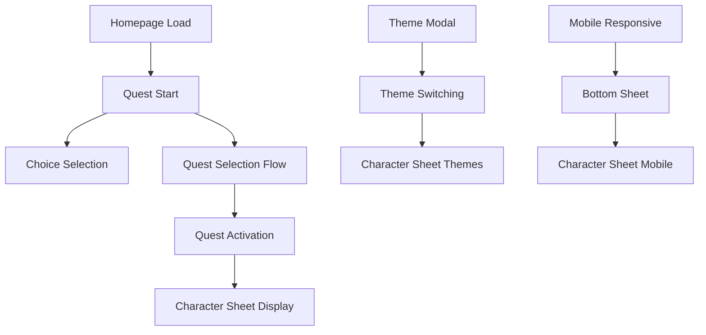

# Playwright E2E Testing Workflow

## Overview

End-to-end testing workflow using Playwright MCP for browser automation. This document codifies patterns and best practices for comprehensive E2E testing in agentic development workflows.

**Purpose**: Establish reliable, repeatable browser-based testing that complements unit tests and validates complete user journeys.

---

## When to Use E2E Testing

### Ideal Scenarios

| Scenario | Rationale |
|----------|-----------|
| **Critical User Flows** | Login, checkout, onboarding - flows that must work |
| **Multi-step Interactions** | Wizards, forms, game loops - stateful workflows |
| **Theme/Styling Verification** | Visual changes across themes, responsive design |
| **Mobile Experience** | Bottom sheets, touch targets, safe areas |
| **Integration Points** | SSE streaming, API responses, real-time updates |

### E2E vs Unit Tests

| Aspect | Unit Tests | E2E Tests |
|--------|------------|-----------|
| Speed | Fast (ms) | Slower (seconds) |
| Scope | Single function/component | Full user journey |
| Reliability | High (deterministic) | Medium (browser state) |
| Maintenance | Low | Medium |
| Value | Code correctness | User experience |

**Rule of Thumb**: 70% unit, 20% integration, 10% E2E (testing pyramid).

---

## Test Environment Setup

### Server Requirements

```bash
# Start test server on dedicated port
uv run uvicorn src.api.main:app --host 127.0.0.1 --port 8765

# Verify server is running
curl http://127.0.0.1:8765/health
```

### Playwright MCP Configuration

The Playwright MCP server provides browser automation capabilities:

| Tool | Purpose |
|------|---------|
| `browser_navigate` | Go to URL |
| `browser_snapshot` | Accessibility tree (preferred over screenshot) |
| `browser_click` | Click elements by ref |
| `browser_type` | Type text into inputs |
| `browser_resize` | Change viewport |
| `browser_take_screenshot` | Capture visual state |
| `browser_wait_for` | Wait for text/elements |
| `browser_evaluate` | Run JavaScript in page |

---

## Test Structure

### Test Scenario Template

```markdown
### [N]. [Test Name]

**Objective**: [What are we verifying?]

**Preconditions**:
- [Required state before test]

**Steps**:
1. [Action 1]
2. [Action 2]
3. [Verification]

**Expected Result**:
- [What should happen]
- [What should be visible]

**Screenshot**: `e2e-screenshots/[NN]-[name].png`
```

### Test Categories

#### 1. Smoke Tests (Critical Path)

**Run Always**: These validate core functionality works.

```markdown
| Test | Priority | Duration |
|------|----------|----------|
| Homepage Load | P0 | 2s |
| Login Flow | P0 | 5s |
| Primary Feature | P0 | 10s |
```

#### 2. Feature Tests (Functional Coverage)

**Run on Feature Changes**: Validate specific features.

```markdown
| Test | Feature | Duration |
|------|---------|----------|
| Quest Selection | Gameplay | 15s |
| Theme Switching | UI | 5s |
| Character Creation | Onboarding | 30s |
```

#### 3. Visual Tests (UI Consistency)

**Run on UI Changes**: Validate appearance.

```markdown
| Test | Viewport | Theme |
|------|----------|-------|
| Desktop Layout | 1280x720 | default |
| Mobile Layout | 390x844 | default |
| Dark Theme | 1280x720 | midnight |
```

---

## Test Patterns

### Pattern 1: Page Load Verification

```markdown
**Steps**:
1. Navigate to URL
2. Take snapshot
3. Verify key elements present
4. Check console for errors

**Implementation**:
1. `browser_navigate(url)`
2. `browser_snapshot()`
3. Look for expected refs in snapshot
4. `browser_console_messages(level="error")`
```

### Pattern 2: User Interaction Flow

```markdown
**Steps**:
1. Navigate to starting point
2. Perform user action (click/type)
3. Wait for response/change
4. Verify new state
5. Repeat for flow

**Implementation**:
1. `browser_navigate(url)`
2. `browser_click(element, ref)`
3. `browser_wait_for(text="Expected text")`
4. `browser_snapshot()`
5. Continue with next action
```

### Pattern 3: Responsive Testing

```markdown
**Steps**:
1. Test at desktop viewport
2. Resize to tablet
3. Verify layout adapts
4. Resize to mobile
5. Verify mobile-specific UI

**Implementation**:
1. Default viewport (1280x720)
2. `browser_resize(width=768, height=1024)`
3. `browser_snapshot()`
4. `browser_resize(width=390, height=844)`
5. `browser_snapshot()`
```

### Pattern 4: Theme Testing

```markdown
**Steps**:
1. Load page with default theme
2. Open theme selector
3. Switch to each theme
4. Verify CSS changes applied
5. Verify localStorage persisted

**Implementation**:
1. `browser_navigate(url)`
2. `browser_click(settings_button, ref)`
3. `browser_click(theme_option, ref)`
4. `browser_snapshot()`
5. `browser_evaluate("localStorage.getItem('theme')")`
```

### Pattern 5: SSE/Streaming Content

```markdown
**Steps**:
1. Trigger streaming action
2. Wait for initial content
3. Wait for streaming complete
4. Verify final state

**Implementation**:
1. `browser_click(action_button, ref)`
2. `browser_wait_for(text="Loading...")`
3. `browser_wait_for(time=5)` # Allow stream to complete
4. `browser_snapshot()`
```

---

## Mobile Testing Patterns

### Touch Targets

Verify minimum 48px touch targets (WCAG 2.1 AAA):

```markdown
**Verification**:
1. Resize to mobile viewport
2. Take snapshot
3. Verify buttons are accessible
4. Verify spacing between interactive elements
```

### Bottom Sheet Pattern

For mobile-optimized choice presentation:

```markdown
**Steps**:
1. Resize to mobile (390x844)
2. Trigger bottom sheet (game action)
3. Verify collapsed state shows hint
4. Click to expand
5. Verify full options visible
6. Click option to select
7. Verify sheet collapses
```

### iOS Safe Areas

Test notch/home indicator handling:

```markdown
**Verification**:
1. Resize to iPhone viewport
2. Verify content not obscured
3. Check header padding
4. Check bottom sheet clearance
```

---

## Error Handling

### Common Issues

| Issue | Solution |
|-------|----------|
| Element not found | Wait longer, check snapshot for correct ref |
| Timeout | Increase wait time, verify server is responding |
| Stale reference | Take new snapshot after page changes |
| Console errors | Check `browser_console_messages` for clues |
| Network failures | Verify server is running, check CORS |

### Recovery Patterns

```markdown
**If test fails**:
1. Take screenshot for debugging
2. Check console messages
3. Verify server logs
4. Reset browser state: `browser_navigate("about:blank")`
5. Retry with longer waits
```

---

## Screenshot Documentation

### Screenshot Naming Convention

```
docs/e2e-screenshots/
├── [NN]-[test-name].png           # Main test screenshot
├── [NN]a-[variant].png            # Sub-variant a
├── [NN]b-[variant].png            # Sub-variant b
└── ...
```

**Examples**:
```
01-homepage.png
02-quest-started.png
05-midnight-theme.png
06-mobile-view.png
13a-theme-midnight-minimal.png
13b-theme-monospace.png
14a-mobile-character-sheet.png
```

### Screenshot Best Practices

1. **Capture Key States**: Initial, interaction, result
2. **Include Context**: Full viewport for layout, element for detail
3. **Name Descriptively**: Test number + description
4. **Update When UI Changes**: Keep screenshots current
5. **Use Consistent Viewport**: Same dimensions for comparison

---

## Test Results Tracking

### Results Table Format

```markdown
## Test Results Summary

| Test | Status | Notes |
|------|--------|-------|
| Homepage Load | PASS | All elements render |
| Quest Start | PASS | SSE streaming works |
| Choice Selection | PASS | Turn counter updates |
| Theme Modal | PASS | All themes listed |
| Theme Switching | PASS | Persists to localStorage |
| Mobile Responsive | PASS | Bottom sheet works |
```

### Status Definitions

| Status | Meaning |
|--------|---------|
| PASS | Test completed successfully |
| FAIL | Test failed, needs investigation |
| SKIP | Test not run (reason documented) |
| FLAKY | Intermittent failures, needs stabilization |

---

## CI/CD Integration

### GitHub Actions Example

```yaml
name: E2E Tests
on:
  push:
    branches: [main]
  pull_request:

jobs:
  e2e:
    runs-on: ubuntu-latest
    steps:
      - uses: actions/checkout@v4
      - uses: actions/setup-python@v5
        with:
          python-version: '3.12'

      - name: Install dependencies
        run: |
          pip install uv
          uv sync

      - name: Install Playwright
        run: npx playwright install chromium

      - name: Start server
        run: |
          uv run uvicorn src.api.main:app --port 8765 &
          sleep 5

      - name: Run E2E tests
        run: npx playwright test

      - name: Upload screenshots
        uses: actions/upload-artifact@v4
        if: failure()
        with:
          name: e2e-screenshots
          path: docs/e2e-screenshots/
```

### Pre-commit E2E (Optional)

For critical paths, run smoke tests pre-commit:

```bash
#!/bin/bash
# .git/hooks/pre-push

# Start server in background
uv run uvicorn src.api.main:app --port 8765 &
SERVER_PID=$!
sleep 3

# Run smoke tests
npx playwright test --grep "@smoke"
RESULT=$?

# Cleanup
kill $SERVER_PID

exit $RESULT
```

---

## Example Test Suite

### Complete Test Catalog

```markdown
## Test Scenarios

### Smoke Tests (P0)
1. Homepage Load Test
2. Quest Start Test
3. Choice Selection Test

### Feature Tests (P1)
4. Theme Modal Test
5. Theme Switching Test
6. Quest Selection Flow Test
7. Quest Activation Test
8. Custom Action Input Test

### Mobile Tests (P1)
9. Mobile Responsive Test
10. Bottom Sheet Expansion Test
11. Character Sheet Mobile Test

### Visual Tests (P2)
12. Character Sheet Display Test
13. Character Sheet Collapse Test
14. Character Sheet Theme Integration Test
```

### Test Dependencies



---

## Playwright MCP Quick Reference

### Essential Commands

```markdown
| Action | Tool | Example |
|--------|------|---------|
| Navigate | `browser_navigate` | `url: "http://localhost:8765"` |
| Snapshot | `browser_snapshot` | (no params, returns accessibility tree) |
| Click | `browser_click` | `element: "Begin Quest button", ref: "E2"` |
| Type | `browser_type` | `element: "Action input", ref: "E5", text: "hello"` |
| Resize | `browser_resize` | `width: 390, height: 844` |
| Screenshot | `browser_take_screenshot` | `filename: "test.png"` |
| Wait | `browser_wait_for` | `text: "Loading"` or `time: 5` |
| Evaluate | `browser_evaluate` | `function: "() => localStorage.getItem('theme')"` |
```

### Snapshot vs Screenshot

- **Snapshot** (`browser_snapshot`): Returns accessibility tree, best for finding elements and verifying text content
- **Screenshot** (`browser_take_screenshot`): Captures visual image, best for documentation and visual regression

**Best Practice**: Use snapshot for interaction, screenshot for documentation.

---

## Related Documents

- **[feature-development.md](feature-development.md)** - Feature implementation workflow
- **[multi-agent-coordination.md](multi-agent-coordination.md)** - Agent handoff patterns
- **[../quality-gates/](../quality-gates/)** - Quality gate configurations
- **[task-management.md](task-management.md)** - Task tracking workflow
