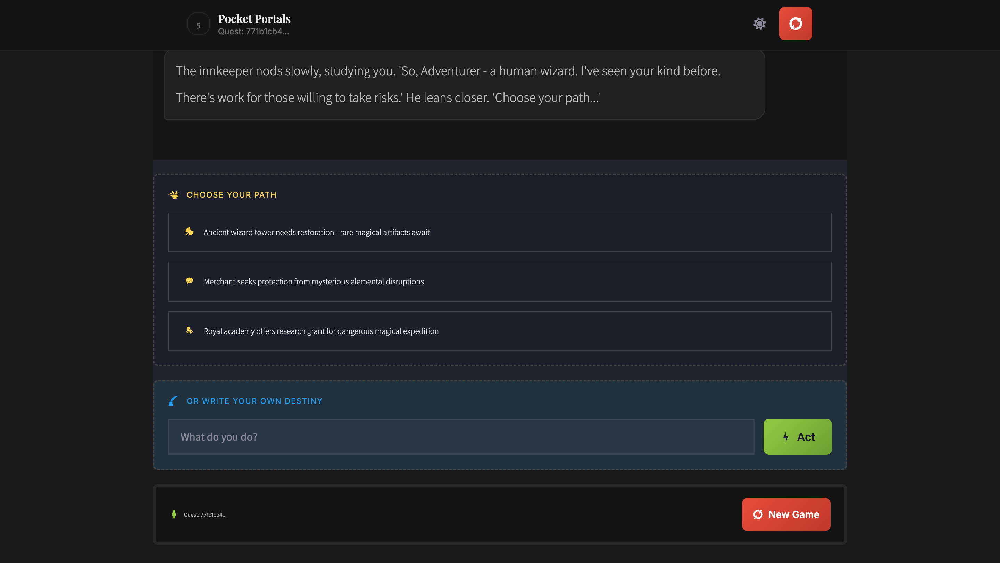
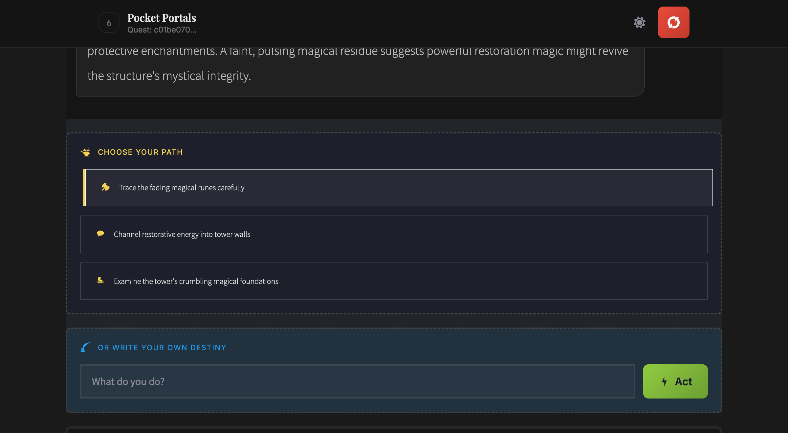
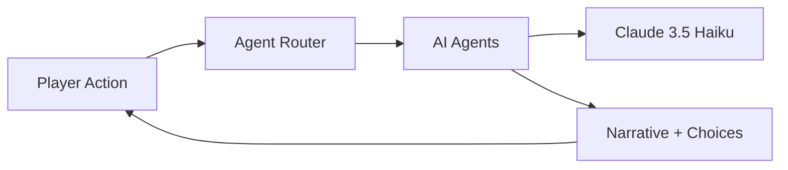

# Pocket Portals

> **Your character. Your choices. Your adventure.**

<p align="center">
  
  
  
  
</p>

---

A solo D&D adventure game powered by AI agents. Create your character, choose your quest, and shape your own story through an interactive text-based RPG experience.

No group needed. No scheduling. Just you and the portal.

---

## Meet the Innkeeper

<p align="center">
  
</p>

Step through the portal into a weathered tavern. The **Innkeeper** greets you with knowing eyes:

> *"Well now, another soul seeking adventure. Before I point you toward trouble, tell me — who are you, traveler?"*

Answer his questions, build your character, and choose from personalized quests tailored to your abilities.

---

## How It Works

### 1. Create Your Character
A 5-turn conversation builds your hero — class, background, motivations, and equipment. No forms, just storytelling.

### 2. Choose Your Quest
Three personalized adventures await. Rogues get stealth missions. Paladins get protection quests. Your character shapes your options.

### 3. Shape Your Story
Explore, fight, negotiate, flee. Every choice matters. The narrative adapts to your decisions.

### 4. Roll the Dice
Real D&D 5e mechanics. Initiative, attack rolls, HP tracking. Combat is deterministic — no AI randomness.

---

## Features

| Feature | Description |
|---------|-------------|
| **7 AI Agents** | Narrator, Keeper, Jester, Innkeeper, Interviewer, QuestDesigner, Epilogue |
| **Quest Selection** | 3 personalized quests based on your character |
| **D&D 5e Combat** | Real dice mechanics, initiative, HP tracking |
| **50-Turn Arcs** | Paced adventures with setup, climax, and resolution |
| **5 Themes** | RPG, Modern, Midnight, Mono, iOS Dark |
| **Mobile-First** | Haptic feedback, touch targets, responsive design |

---

## Screenshots

<p align="center">
  
  
</p>

<p align="center">
  <em>Choose Your Quest • Explore the World</em>
</p>

---

## Quick Start

```bash
git clone https://github.com/darth-dodo/pocket-portals.git
cd pocket-portals

cp .env.example .env
# Add your ANTHROPIC_API_KEY

make install
make dev
# Visit http://localhost:8888
```

---

## For Developers

<details>
<summary><strong>Tech Stack & Architecture</strong></summary>

### Tech Stack

| Component | Technology |
|-----------|------------|
| **Runtime** | Python 3.12 |
| **API** | FastAPI with SSE streaming (modular architecture) |
| **AI** | CrewAI + Anthropic Claude |
| **Frontend** | Vanilla JS + Modern CSS |
| **State** | Redis (prod) / Memory (dev) |
| **Security** | Rate limiting + configurable CORS |

### Codebase Health

| Metric | Value |
|--------|-------|
| **Python Tests** | 444 passing |
| **JS Tests** | 415 passing |
| **Coverage** | 77% |
| **Type Checking** | Strict mypy |
| **Linting** | Ruff + pre-commit |
| **Rate Limiting** | Privacy-first (session_id only) |

### Architecture



### AI Agents

- **Narrator** — Scene descriptions with phase-aware pacing
- **Keeper** — D&D 5e rules and dice mechanics
- **Jester** — Chaos injection (15% chance per turn)
- **Innkeeper** — Quest hooks and rumors
- **Interviewer** — Character creation interview
- **QuestDesigner** — Personalized quest generation
- **Epilogue** — Adventure conclusions

### Documentation

- [Architecture](docs/architecture.md) — System design
- [Quest System](docs/design/quest-system.md) — Quest generation & selection
- [Onboarding](docs/guides/ONBOARDING.md) — Developer setup
- [E2E Testing](docs/playwright-e2e-suite.md) — Playwright test scenarios

</details>

<details>
<summary><strong>Development Commands</strong></summary>

| Command | Description |
|---------|-------------|
| `make install` | Install dependencies |
| `make dev` | Start dev server |
| `make test` | Run Python tests |
| `npm test` | Run JS tests |
| `make lint` | Code quality checks |

</details>

---

## License

MIT License — see [LICENSE](LICENSE) for details.

---

<p align="center">
  <strong>Built with</strong><br/>
  <a href="https://crewai.com">CrewAI</a> •
  <a href="https://anthropic.com">Anthropic Claude</a> •
  <a href="https://fastapi.tiangolo.com">FastAPI</a>
</p>

<p align="center">
  <em>Step through the portal. Begin your quest.</em>
</p>
