# Agent Onboarding Guide

**Purpose**: Get AI agents productive quickly on Pocket Portals with clear workflows, quality standards, and task tracking.

**Quick Start**: Read → Verify → Track
1. Read `tasks.md` for current state
2. Run `make test` to verify environment
3. Update `tasks.md` with your work

---

## Table of Contents

- [Project Context](#project-context)
- [XP Principles (Core Philosophy)](#xp-principles-core-philosophy)
- [Agent Workflow](#agent-workflow)
- [Session Lifecycle](#session-lifecycle)
- [API Request Flow](#api-request-flow)
- [Development Commands](#development-commands)
- [Task Tracking](#task-tracking)
- [Code Patterns](#code-patterns)
- [Quality Gates](#quality-gates)
- [Git Workflow](#git-workflow)
- [Resources](#resources)

---

## Project Context

**What**: Solo D&D adventure generator using multi-agent AI
**Stack**: Python 3.12, FastAPI, CrewAI, Anthropic Claude
**Phase**: Spike/one-turn (proving the concept)
**Framework**: `.agentic-framework/` for workflows and quality gates

### Current State

**Completed**:
- ✅ FastAPI app with `/health` and `/action` endpoints
- ✅ NarratorAgent using CrewAI + Anthropic Claude
- ✅ Session management for multi-user support
- ✅ YAML-based agent configuration

**Next Steps** (check `tasks.md` for current priorities):
- Add more agents (Keeper, Jester, Theron)
- Implement conversation context passing to LLM
- Deploy to Render.com

---

## XP Principles (Core Philosophy)

**Follow these principles in all work**:

### Test-Driven Development (TDD)
```
Write failing test → Implement → Refactor → Repeat
```
- Red: Write failing test first
- Green: Minimal code to pass
- Refactor: Improve without breaking

### Simple Design
- Simplest solution that works
- No over-engineering
- Refactor when you understand more

### Small Steps
- Commit frequently (every working increment)
- Iterate quickly with feedback
- Ship small, working features

### YAGNI (You Aren't Gonna Need It)
- Don't build what isn't needed yet
- No speculative features
- Add complexity only when required

**These are non-negotiable**. Quality comes from following XP, not from elaborate planning.

---

## Agent Workflow

**Pattern**: Architect → Developer → QA (from `.agentic-framework/workflows/feature-development.md`)


### Agent Roles

| Agent | Focus | Duration | Outputs |
|-------|-------|----------|---------|
| **Architect** | System design, architecture | 30-60 min | Design document, implementation plan |
| **Developer** | TDD implementation | 1-4 hours | Working code, tests, documentation |
| **QA** | Testing, validation | 30-90 min | Test report, approval/rejection |

**Reference**: See `.agentic-framework/workflows/feature-development.md` for detailed workflow.

---

## Session Lifecycle

**Pattern**: Start → Work → Checkpoint → End


### Starting Work

```bash
# 1. Check current state
git status && git branch

# 2. Load context
cat tasks.md

# 3. Create feature branch
git checkout -b feature/descriptive-name

# 4. Verify environment
make test
```

### During Work

```bash
# TDD Cycle (repeat frequently)
uv run pytest -x              # Run tests, stop on first failure
# ... write code ...
uv run pytest -x              # Verify fix
make test                     # Full suite when ready

# Commit frequently (every working increment)
git add .
git commit -m "feat: add X"

# Update tasks.md every 30 minutes
# Mark tasks as 🔄 (in progress) or ✅ (done)
```

### Ending Work

```bash
# 1. Full validation
make test                     # All tests pass
make lint                     # No linting errors

# 2. Update task log
# Edit tasks.md with completed work

# 3. Final commit
git add .
git commit -m "feat: complete feature X

🤖 Generated with [Claude Code](https://claude.com/claude-code)

Co-Authored-By: Claude Opus 4.5 <noreply@anthropic.com>"

# 4. Push (if ready)
git push origin feature/name
```

---

## API Request Flow

**Pattern**: Request → Session → Agent → LLM → Response

```mermaid
sequenceDiagram
    participant Client
    participant FastAPI
    participant SessionMgr as Session Manager
    participant Agent as NarratorAgent
    participant CrewAI
    participant LLM as Anthropic Claude

    Client->>FastAPI: POST /action<br/>{action, session_id?}

    FastAPI->>SessionMgr: get_or_create_session(session_id)
    SessionMgr-->>FastAPI: session_id, context

    FastAPI->>Agent: respond(action, context)

    Agent->>CrewAI: Create Task with context
    CrewAI->>LLM: Execute with Anthropic API

    LLM-->>CrewAI: Generated narrative
    CrewAI-->>Agent: Task result

    Agent-->>FastAPI: narrative text

    FastAPI->>SessionMgr: update_context(session_id, narrative)

    FastAPI-->>Client: {narrative, session_id}

    Note over Client,LLM: Future: Multi-agent coordination<br/>Narrator → Keeper → Jester → Theron
```



### Request Example

```bash
# Health check
curl http://localhost:8888/health

# Generate narrative (new session)
curl -X POST http://localhost:8888/action \
  -H "Content-Type: application/json" \
  -d '{"action": "I enter the dark tavern"}'

# Continue session
curl -X POST http://localhost:8888/action \
  -H "Content-Type: application/json" \
  -d '{"action": "I order an ale", "session_id": "abc123"}'
```

### Response Format

```json
{
  "narrative": "The tavern keeper nods...",
  "session_id": "abc123-def456-ghi789"
}
```

---

## Development Commands

### Quick Reference

```bash
# Setup
make install          # Install dependencies with uv

# Development
make dev              # Run FastAPI server (port 8888)
make test             # Run pytest with coverage
make lint             # Run ruff check + format

# Quick checks
uv run pytest -x      # Stop on first failure
uv run pytest -v      # Verbose output
uv run pytest tests/test_api.py::test_name  # Run specific test
uv run ruff check .   # Lint only
uv run ruff format .  # Format only

# Coverage
uv run pytest --cov=src --cov-report=html
open htmlcov/index.html
```

### Makefile Targets

| Command | Description | Use When |
|---------|-------------|----------|
| `make install` | Install dependencies | First time, after dependency changes |
| `make dev` | Start development server | Testing API locally |
| `make test` | Run all tests with coverage | Before committing |
| `make lint` | Check and format code | Before committing |
| `make clean` | Remove build artifacts | After testing, before commit |

---

## Task Tracking

**CRITICAL**: Always update `tasks.md` with your work. This is our project memory.

### Format

```markdown
## YYYY-MM-DD

### [Section Name]

| Task | Status |
|------|--------|
| Description of work | ✅ |
| Another task | 🔄 |
| Blocked task | ❌ |
```

### Status Icons

- ✅ **Done** - Task completed and verified
- 🔄 **In Progress** - Currently working on this
- ❌ **Blocked** - Cannot proceed, needs attention

### Update Frequency

- **Start of session**: Read `tasks.md` to understand current state
- **Every 30 minutes**: Update progress on current tasks
- **End of session**: Mark completed tasks as ✅
- **When blocked**: Mark as ❌ and document blocker

### Example Entry

```markdown
## 2025-12-21

### Narrator Agent Integration

| Task | Status |
|------|--------|
| Connect NarratorAgent to /action endpoint | ✅ |
| Add session-based context management | ✅ |
| Test live LLM call via Swagger UI | ✅ |

**Verified**:
- Narrator initialized on app startup
- /action returns narrative with session_id
- Sessions isolated per user
- 7/7 tests passing, 73% coverage
```

---

## Code Patterns

### API Endpoints

**Location**: `src/api/main.py`

```python
@app.post("/endpoint", response_model=ResponseModel)
async def endpoint_name(request: RequestModel) -> ResponseModel:
    """
    Brief description.

    Args:
        request: Request model with required fields

    Returns:
        Response model with result
    """
    # Implementation
    return ResponseModel(...)
```

### Agents

**Location**: `src/agents/`

```python
from crewai import Agent, Task, LLM
from src.config.loader import load_agent_config

class AgentName:
    """Agent description."""

    def __init__(self) -> None:
        """Initialize agent with config."""
        config = load_agent_config("agent_name")
        self.llm = LLM(
            model="anthropic/claude-sonnet-4-20250514",
            api_key=os.getenv("ANTHROPIC_API_KEY")
        )
        self.agent = Agent(
            role=config["role"],
            goal=config["goal"],
            backstory=config["backstory"],
            llm=self.llm
        )

    def respond(self, input: str, context: str = "") -> str:
        """Generate response based on input."""
        task = Task(
            description=f"{context}\n\nUser: {input}",
            agent=self.agent,
            expected_output="Narrative response"
        )
        return str(task.execute_sync())
```

### Configuration

**Agent Definitions**: `src/config/agents.yaml`

```yaml
narrator:
  role: "Dungeon Master Narrator"
  goal: "Create immersive D&D narratives"
  backstory: "An experienced DM who brings worlds to life"
```

**Task Templates**: `src/config/tasks.yaml`

```yaml
narrate:
  description: "Generate narrative response"
  expected_output: "Immersive story text"
```

**Environment**: `.env` (copy from `.env.example`)

```bash
ANTHROPIC_API_KEY=your_key_here
LOG_LEVEL=INFO
```

---

## Quality Gates

**Reference**: `.agentic-framework/quality-gates/generic-gates.md`

### 8-Step Validation Cycle

Before committing, verify all gates pass:

1. **Syntax** ✅
   ```bash
   python -m py_compile src/**/*.py
   ```
   - All Python files parse correctly
   - No syntax errors

2. **Types** ✅
   ```bash
   uv run mypy src/
   ```
   - Type hints correct (when configured)
   - No type errors

3. **Lint** ✅
   ```bash
   uv run ruff check src/
   ```
   - Code style compliant
   - No linting errors

4. **Security** 🔒
   ```bash
   # Manual review for now
   # Check for hardcoded secrets, SQL injection, etc.
   ```
   - No hardcoded secrets
   - Input validation present
   - No obvious vulnerabilities

5. **Tests** ✅
   ```bash
   uv run pytest
   ```
   - All tests pass
   - Coverage ≥70% (current: 73%)

6. **Performance** ⚡
   ```bash
   # Manual check for now
   # API response times <2s
   ```
   - No obvious performance issues
   - API responds within SLA

7. **Accessibility** ♿
   ```bash
   # N/A for API-only project
   ```
   - Not applicable (no UI yet)

8. **Integration** 🔗
   ```bash
   make test
   ```
   - All components work together
   - No integration failures

### Pre-Commit Hooks

Configured in `.pre-commit-config.yaml`:

```yaml
repos:
  - repo: https://github.com/astral-sh/ruff-pre-commit
    hooks:
      - id: ruff        # Linting
      - id: ruff-format # Formatting
```

**These run automatically on `git commit`**.

---

## Git Workflow

### Branch Naming

```bash
feature/description   # New features
fix/description       # Bug fixes
spike/description     # Exploration/proof of concept
```

### Commit Messages

```
<type>: <description>

<optional body>

🤖 Generated with [Claude Code](https://claude.com/claude-code)

Co-Authored-By: Claude Opus 4.5 <noreply@anthropic.com>
```

**Types**: `feat`, `fix`, `refactor`, `test`, `docs`, `chore`

**Examples**:

```bash
# Good
git commit -m "feat: add Keeper agent with YAML config"
git commit -m "fix: handle missing session_id in /action endpoint"
git commit -m "test: add integration tests for session management"

# Bad
git commit -m "update stuff"
git commit -m "fix"
```

### Git Safety Rules

1. **Always check status first**
   ```bash
   git status && git branch
   ```

2. **Never work on main/master**
   ```bash
   git checkout -b feature/name
   ```

3. **Commit frequently**
   - Every working increment
   - Before risky changes
   - At end of session

4. **Verify before commit**
   ```bash
   git diff                    # Review changes
   make test && make lint      # Quality gates
   git add .
   git commit
   ```

---

## Resources

### Framework Documentation

- **`.agentic-framework/README.md`** - Framework overview
- **`.agentic-framework/workflows/feature-development.md`** - Feature workflow (Architect → Developer → QA)
- **`.agentic-framework/workflows/bug-fix.md`** - Bug fix workflow
- **`.agentic-framework/quality-gates/examples/python.md`** - Python quality gates

### Project Documentation

- **`tasks.md`** - Project task log (read first!)
- **`docs/adr/`** - Architecture decision records
- **`README.md`** - Project overview and setup

### Technology References

- **FastAPI**: [fastapi.tiangolo.com](https://fastapi.tiangolo.com)
- **CrewAI**: [docs.crewai.com](https://docs.crewai.com)
- **Anthropic**: [docs.anthropic.com](https://docs.anthropic.com)
- **Pytest**: [docs.pytest.org](https://docs.pytest.org)
- **Ruff**: [docs.astral.sh/ruff](https://docs.astral.sh/ruff)

### Quick Links

```bash
# API docs (when server running)
http://localhost:8888/docs        # Swagger UI
http://localhost:8888/redoc       # ReDoc

# Code coverage report
open htmlcov/index.html           # After running make test
```

---

## Questions?

**Read these in order**:

1. **`tasks.md`** - What's been done, what's next
2. **`.agentic-framework/README.md`** - Framework concepts
3. **`.agentic-framework/workflows/`** - Detailed workflows
4. **`docs/adr/`** - Architecture decisions

**Still stuck?** Document the question in `tasks.md` and mark it ❌ blocked.

---

**Remember**:
- ✅ Follow XP principles (TDD, Simple Design, Small Steps, YAGNI)
- ✅ Update `tasks.md` religiously
- ✅ Run `make test && make lint` before committing
- ✅ Use `.agentic-framework/` workflows for structure

**Happy coding! 🚀**
