# Agent Onboarding Guide

**Purpose**: Get AI agents productive quickly on Pocket Portals with clear workflows, quality standards, and task tracking.

---

## 🚀 Quick Start Checklist

**Do these 5 things first, in order**:

```bash
# 1. Verify environment (30 seconds)
make test

# 2. Read current state (2 minutes)
cat tasks.md

# 3. Check git status (10 seconds)
git status && git branch

# 4. Create feature branch (10 seconds)
git checkout -b feature/your-feature-name

# 5. Run server to verify API works (optional, 30 seconds)
make dev  # Then check http://localhost:8888/docs
```

**If any step fails, STOP and fix it before proceeding.**

| Step | Expected Result | If It Fails |
|------|-----------------|-------------|
| `make test` | All tests pass, coverage shown | Check `.env` has `ANTHROPIC_API_KEY` |
| `cat tasks.md` | See current tasks and status | File should exist in project root |
| `git status` | Clean working tree or known changes | Commit or stash pending changes |
| `git checkout -b` | New branch created | Already on branch? That's fine |
| `make dev` | Server starts on port 8888 | Check for port conflicts |

---

## 🧭 Decision Trees

### Which Approach Should I Use?

```
Start here: What are you doing?
│
├─► Adding a new feature?
│   └─► Use Architect → Developer → QA workflow
│       └─► See "Agent Workflow" section
│
├─► Fixing a bug?
│   └─► Is it obvious what's wrong?
│       ├─► YES → Direct fix with TDD
│       │   1. Write test that reproduces bug
│       │   2. Fix code
│       │   3. Verify test passes
│       └─► NO → Investigate first
│           1. Read related tests
│           2. Add debug logging
│           3. Write reproduction test
│           4. Fix with TDD
│
├─► Understanding the codebase?
│   └─► Read in this order:
│       1. tasks.md (current state)
│       2. docs/xp.md (development philosophy)
│       3. src/api/main.py (API structure)
│       4. tests/test_api.py (behavior specs)
│
├─► Continuing previous work?
│   └─► See "Session Recovery" section below
│
└─► Not sure what to do?
    └─► Read tasks.md → Pick a task → Ask if unclear
```

### TDD or BDD?

```
What are you implementing?
│
├─► User-facing behavior (user stories)?
│   └─► BDD: Write Gherkin scenarios first
│       Given/When/Then → Implementation
│
├─► Internal logic (functions, algorithms)?
│   └─► TDD: Write unit tests first
│       test_function_does_x() → Implementation
│
├─► API endpoint?
│   └─► Both: BDD for user scenarios, TDD for logic
│       1. BDD: Given API call, When X, Then Y
│       2. TDD: test_validation_rejects_invalid()
│
└─► Not sure?
    └─► Start with TDD (simpler, faster)
        Add BDD later if user behavior matters
```

### Which Agent Role Am I?

```
What phase is the task in?
│
├─► Just starting? No design doc exists?
│   └─► You are the ARCHITECT
│       - Create docs/design/{feature}.md
│       - Define interfaces and data structures
│       - Plan implementation steps
│
├─► Design exists? Need to write code?
│   └─► You are the DEVELOPER
│       - Follow TDD: Red → Green → Refactor
│       - Commit after each working increment
│       - Update tasks.md as you go
│
└─► Code complete? Need validation?
    └─► You are the QA AGENT
        - Run full test suite
        - Check coverage meets target
        - Verify design requirements met
```

---

## ⚠️ Common Pitfalls

**These mistakes will slow you down. Avoid them.**

### ❌ DON'T: Jump straight to coding

```python
# BAD: Writing implementation without a test
def new_feature():
    # implementation...
```

```python
# GOOD: Write the test first
def test_new_feature_does_x():
    result = new_feature()
    assert result == expected
```

### ❌ DON'T: Skip reading tasks.md

```bash
# BAD: Start working without context
git checkout -b feature/something

# GOOD: Read tasks.md first
cat tasks.md
# Then understand what's done and what's next
```

### ❌ DON'T: Work on main/master branch

```bash
# BAD: Commit directly to main
git add . && git commit -m "changes"

# GOOD: Always create a feature branch
git checkout -b feature/descriptive-name
git add . && git commit -m "feat: specific change"
```

### ❌ DON'T: Make giant commits

```bash
# BAD: One commit with everything
git commit -m "implement entire feature"

# GOOD: Small, frequent commits
git commit -m "feat: add request model"
git commit -m "feat: add response model"
git commit -m "feat: add endpoint handler"
git commit -m "test: add endpoint tests"
```

### ❌ DON'T: Ignore failing tests

```bash
# BAD: "I'll fix it later"
# Tests failing, but proceeding anyway

# GOOD: Stop and fix immediately
# Red → Green → Refactor (never skip Green)
```

### ❌ DON'T: Over-engineer

```python
# BAD: Adding features "just in case"
class AbstractSessionManagerFactory:
    def create_manager(self, strategy: Strategy) -> Manager:
        ...

# GOOD: Simplest thing that works (YAGNI)
sessions: dict[str, list] = {}
```

### ❌ DON'T: Forget to update tasks.md

```markdown
# BAD: Complete work but don't record it
# Next agent has no idea what happened

# GOOD: Update tasks.md with every completion
| Add choice system | ✅ | FR-07 & FR-08 from product.md |
```

### ❌ DON'T: Skip quality gates before commit

```bash
# BAD: Commit without testing
git add . && git commit

# GOOD: Always run quality gates
make test && make lint
git add . && git commit
```

---

## 🔄 Session Recovery

**Resuming work after interruption or handoff to another agent.**

### Step 1: Understand Current State

```bash
# What's the git status?
git status && git branch

# What was last committed?
git log --oneline -5

# Are there uncommitted changes?
git diff --stat
```

### Step 2: Read Project Memory

```bash
# Current task state
cat tasks.md

# Look for "In Progress" or "Recently Completed"
grep -A 5 "In Progress\|🔄" tasks.md
```

### Step 3: Verify Environment Still Works

```bash
# Run tests to confirm nothing is broken
make test

# If tests fail, check last changes
git diff HEAD~1
```

### Step 4: Resume Work

**If tests pass**: Continue from where you left off
```bash
# Check what needs to be done next
cat tasks.md | grep "⏳\|pending"
```

**If tests fail**: Fix before continuing
```bash
# See what broke
uv run pytest -x  # Stop on first failure
# Fix the issue, then continue
```

### Step 5: Document Your Session

Before ending your session:
```bash
# Update tasks.md with progress
# Commit with clear message
git add . && git commit -m "checkpoint: description of progress"
```

### Recovery Checklist

| Check | Command | Expected |
|-------|---------|----------|
| Git clean? | `git status` | Working tree clean OR known changes |
| Tests pass? | `make test` | All green, coverage shown |
| On feature branch? | `git branch` | Not on main/master |
| tasks.md updated? | `cat tasks.md` | Recent work documented |

---

## 📊 Success Metrics

**How do you know you're doing well?**

### Code Quality Metrics

| Metric | Target | Check Command |
|--------|--------|---------------|
| Test Coverage | ≥70% | `make test` (shows coverage) |
| All Tests Pass | 100% | `uv run pytest` |
| Lint Errors | 0 | `make lint` |
| Type Errors | 0 | `uv run mypy src/` (if configured) |

### Process Metrics

| Metric | Target | How to Verify |
|--------|--------|---------------|
| Commit Frequency | Every working increment | `git log --oneline` |
| Task Updates | Every 30 minutes | Check timestamps in tasks.md |
| TDD Compliance | Tests before code | Review commit history |
| Small Commits | <50 lines changed | `git log --stat` |

### Session Success Indicators

**✅ Good Session**:
- Started by reading tasks.md
- Created feature branch
- Wrote tests before code
- Committed frequently (3+ commits per feature)
- Updated tasks.md at end
- All tests passing before push

**⚠️ Needs Improvement**:
- Skipped reading tasks.md
- Worked on main branch
- Large commits (>100 lines)
- Tests written after code
- Forgot to update tasks.md

**❌ Problem Session**:
- Left tests failing
- No commits
- tasks.md not updated
- Broke existing functionality

### Quality Gate Scorecard

Run this before ending your session:

```bash
# Create a quick scorecard
echo "=== Session Scorecard ==="
echo -n "Tests: " && (make test > /dev/null 2>&1 && echo "✅ PASS" || echo "❌ FAIL")
echo -n "Lint:  " && (make lint > /dev/null 2>&1 && echo "✅ PASS" || echo "❌ FAIL")
echo -n "Git:   " && (git branch | grep -v main > /dev/null && echo "✅ Feature branch" || echo "⚠️ On main")
echo "========================"
```

---

## Table of Contents

- [Quick Start Checklist](#-quick-start-checklist)
- [Decision Trees](#-decision-trees)
- [Common Pitfalls](#️-common-pitfalls)
- [Session Recovery](#-session-recovery)
- [Success Metrics](#-success-metrics)
- [Project Context](#project-context)
- [XP Principles](#xp-principles-core-philosophy)
- [Agent Workflow](#agent-workflow)
- [Session Lifecycle](#session-lifecycle)
- [API Request Flow](#api-request-flow)
- [Development Commands](#development-commands)
- [Task Tracking](#task-tracking)
- [Code Patterns](#code-patterns)
- [Quality Gates](#quality-gates)
- [Git Workflow](#git-workflow)
- [Resources](#resources)

---

## Project Context

**What**: Solo D&D adventure generator using multi-agent AI
**Stack**: Python 3.12, FastAPI, CrewAI, Anthropic Claude
**Phase**: Spike/one-turn (proving the concept)
**Framework**: `.agentic-framework/` for workflows and quality gates

### Current State

**Completed**:
- ✅ FastAPI app with `/health`, `/start`, and `/action` endpoints
- ✅ NarratorAgent using CrewAI + Anthropic Claude
- ✅ Session management for multi-user support
- ✅ YAML-based agent configuration
- ✅ Conversation context passing to LLM
- ✅ Choice system (3 options + free text input)
- ✅ Starter choices with shuffle from pool of 9 adventure hooks
- ✅ Retro RPG web UI with NES.css styling
- ✅ Docker containerization with multi-stage build
- ✅ Improved UI readability with proper newline rendering

**Next Steps** (check `tasks.md` for current priorities):
- Add more agents (Keeper, Jester, Theron)
- Deploy to Render.com

---

## XP Principles (Core Philosophy)

**Follow these principles in all work**:

For comprehensive XP documentation, see **`docs/xp.md`**.

### Test-Driven Development (TDD)
```
Write failing test → Implement → Refactor → Repeat
```
- Red: Write failing test first
- Green: Minimal code to pass
- Refactor: Improve without breaking

### Simple Design
- Simplest solution that works
- No over-engineering
- Refactor when you understand more

### Small Steps
- Commit frequently (every working increment)
- Iterate quickly with feedback
- Ship small, working features

### YAGNI (You Aren't Gonna Need It)
- Don't build what isn't needed yet
- No speculative features
- Add complexity only when required

**These are non-negotiable**. Quality comes from following XP, not from elaborate planning.

---

## Agent Workflow

**Pattern**: Architect → Developer → QA (from `.agentic-framework/workflows/feature-development.md`)


### Agent Roles

| Agent | Focus | Duration | Outputs |
|-------|-------|----------|---------|
| **Architect** | System design, architecture | 30-60 min | Design document, implementation plan |
| **Developer** | TDD implementation | 1-4 hours | Working code, tests, documentation |
| **QA** | Testing, validation | 30-90 min | Test report, approval/rejection |

**Reference**: See `.agentic-framework/workflows/feature-development.md` for detailed workflow.

---

## Session Lifecycle

**Pattern**: Start → Work → Checkpoint → End


### Starting Work

```bash
# 1. Check current state
git status && git branch

# 2. Load context
cat tasks.md

# 3. Create feature branch
git checkout -b feature/descriptive-name

# 4. Verify environment
make test
```

### During Work

```bash
# TDD Cycle (repeat frequently)
uv run pytest -x              # Run tests, stop on first failure
# ... write code ...
uv run pytest -x              # Verify fix
make test                     # Full suite when ready

# Commit frequently (every working increment)
git add .
git commit -m "feat: add X"

# Update tasks.md every 30 minutes
# Mark tasks as 🔄 (in progress) or ✅ (done)
```

### Ending Work

```bash
# 1. Full validation
make test                     # All tests pass
make lint                     # No linting errors

# 2. Update task log
# Edit tasks.md with completed work

# 3. Final commit
git add .
git commit -m "feat: complete feature X

🤖 Generated with [Claude Code](https://claude.com/claude-code)

Co-Authored-By: Claude Opus 4.5 <noreply@anthropic.com>"

# 4. Push (if ready)
git push origin feature/name
```

---

## API Request Flow

**Pattern**: Request → Session → Agent → LLM → Response

```mermaid
sequenceDiagram
    participant Client
    participant FastAPI
    participant SessionMgr as Session Manager
    participant Agent as NarratorAgent
    participant CrewAI
    participant LLM as Anthropic Claude

    Client->>FastAPI: POST /action<br/>{action, session_id?, choice_index?}

    FastAPI->>SessionMgr: get_or_create_session(session_id)
    SessionMgr-->>FastAPI: session_id, history

    FastAPI->>FastAPI: build_context(history)

    FastAPI->>Agent: respond(action, context)

    Agent->>CrewAI: Create Task with context
    CrewAI->>LLM: Execute with Anthropic API

    LLM-->>CrewAI: Generated narrative
    CrewAI-->>Agent: Task result

    Agent-->>FastAPI: narrative text

    FastAPI->>SessionMgr: update_history(session_id, action, narrative)

    FastAPI-->>Client: {narrative, session_id, choices}

    Note over Client,LLM: Future: Multi-agent coordination<br/>Narrator → Keeper → Jester → Theron
```



### Request Example

```bash
# Health check
curl http://localhost:8888/health

# Start new adventure with starter choices (recommended)
curl http://localhost:8888/start

# Start with shuffled choices (randomizes which 3 from pool of 9)
curl "http://localhost:8888/start?shuffle=true"

# Generate narrative (new session - direct action)
curl -X POST http://localhost:8888/action \
  -H "Content-Type: application/json" \
  -d '{"action": "I enter the dark tavern"}'

# Continue session
curl -X POST http://localhost:8888/action \
  -H "Content-Type: application/json" \
  -d '{"action": "I order an ale", "session_id": "abc123"}'

# Select a choice (1-3)
curl -X POST http://localhost:8888/action \
  -H "Content-Type: application/json" \
  -d '{"choice_index": 2, "session_id": "abc123"}'
```

### Response Format

```json
{
  "narrative": "The tavern keeper nods...",
  "session_id": "abc123-def456-ghi789",
  "choices": [
    "Investigate further",
    "Talk to someone nearby",
    "Move to a new location"
  ]
}
```

---

## Development Commands

### Quick Reference

```bash
# Setup
make install          # Install dependencies with uv

# Development
make dev              # Run FastAPI server (port 8888)
make dev-reload       # Run with auto-reload

# Docker (alternative approach)
make docker-build     # Build Docker image
make docker-run       # Run in container (port 8888)
make docker-dev       # Run with live code reload

# Testing (TDD workflow)
make test             # Full test suite with coverage
make test-fast        # Stop on first failure (TDD cycle)
make test-cov         # Generate HTML coverage report

# Quality
make lint             # Check code style (ruff)
make format           # Auto-fix code style
make check            # Run all quality gates

# Quick checks
uv run pytest -x      # Stop on first failure
uv run pytest -v      # Verbose output
uv run pytest tests/test_api.py::test_name  # Run specific test

# Coverage
uv run pytest --cov=src --cov-report=html
open htmlcov/index.html
```

### Makefile Targets

| Command | Description | Use When |
|---------|-------------|----------|
| `make install` | Install dependencies | First time, after dependency changes |
| `make dev` | Start development server | Testing API locally |
| `make docker-build` | Build Docker image | Containerized development |
| `make docker-run` | Run in container | Testing Docker deployment |
| `make docker-dev` | Docker with live reload | Alternative to `make dev` |
| `make test` | Run all tests with coverage | Before committing |
| `make test-fast` | Stop on first failure | During TDD cycle |
| `make lint` | Check and format code | Before committing |
| `make check` | Run all quality gates | Final verification |
| `make clean` | Remove build artifacts | After testing, before commit |

**Note**: Docker provides an alternative development approach with isolated dependencies and consistent environments across machines. Use native `make dev` for faster iteration, Docker for deployment testing.

---

## Task Tracking

**CRITICAL**: Always update `tasks.md` with your work. This is our project memory.

### Format

```markdown
## YYYY-MM-DD

### [Section Name]

| Task | Status |
|------|--------|
| Description of work | ✅ |
| Another task | 🔄 |
| Blocked task | ❌ |
```

### Status Icons

- ✅ **Done** - Task completed and verified
- 🔄 **In Progress** - Currently working on this
- ⏳ **Pending** - Not started yet
- ❌ **Blocked** - Cannot proceed, needs attention

### Update Frequency

- **Start of session**: Read `tasks.md` to understand current state
- **Every 30 minutes**: Update progress on current tasks
- **End of session**: Mark completed tasks as ✅
- **When blocked**: Mark as ❌ and document blocker

### Example Entry

```markdown
## 2025-12-21

### Narrator Agent Integration

| Task | Status |
|------|--------|
| Connect NarratorAgent to /action endpoint | ✅ |
| Add session-based context management | ✅ |
| Test live LLM call via Swagger UI | ✅ |

**Verified**:
- Narrator initialized on app startup
- /action returns narrative with session_id
- Sessions isolated per user
- 7/7 tests passing, 73% coverage
```

---

## Code Patterns

### API Endpoints

**Location**: `src/api/main.py`

```python
@app.post("/endpoint", response_model=ResponseModel)
async def endpoint_name(request: RequestModel) -> ResponseModel:
    """
    Brief description.

    Args:
        request: Request model with required fields

    Returns:
        Response model with result
    """
    # Implementation
    return ResponseModel(...)
```

### Request/Response Models

```python
from pydantic import BaseModel, Field, model_validator

class ActionRequest(BaseModel):
    """Request model for player actions."""
    action: str | None = Field(default=None)
    choice_index: int | None = Field(default=None, ge=1, le=3)
    session_id: str | None = Field(default=None)

    @model_validator(mode="after")
    def validate_action_or_choice(self) -> "ActionRequest":
        """Ensure either action or choice_index is provided."""
        if self.action is None and self.choice_index is None:
            raise ValueError("Either 'action' or 'choice_index' must be provided")
        return self

class NarrativeResponse(BaseModel):
    """Response model containing narrative text."""
    narrative: str
    session_id: str
    choices: list[str] = Field(default_factory=lambda: ["Look around", "Wait", "Leave"])
```

### Agents

**Location**: `src/agents/`

```python
from crewai import Agent, Task, LLM
from src.config.loader import load_agent_config

class AgentName:
    """Agent description."""

    def __init__(self) -> None:
        """Initialize agent with config."""
        config = load_agent_config("agent_name")
        self.llm = LLM(
            model="anthropic/claude-sonnet-4-20250514",
            api_key=os.getenv("ANTHROPIC_API_KEY")
        )
        self.agent = Agent(
            role=config["role"],
            goal=config["goal"],
            backstory=config["backstory"],
            llm=self.llm
        )

    def respond(self, input: str, context: str = "") -> str:
        """Generate response based on input."""
        task = Task(
            description=f"{context}\n\nUser: {input}",
            agent=self.agent,
            expected_output="Narrative response"
        )
        return str(task.execute_sync())
```

### Configuration

**Agent Definitions**: `src/config/agents.yaml`

```yaml
narrator:
  role: "Dungeon Master Narrator"
  goal: "Create immersive D&D narratives"
  backstory: "An experienced DM who brings worlds to life"
```

**Task Templates**: `src/config/tasks.yaml`

```yaml
narrate:
  description: "Generate narrative response"
  expected_output: "Immersive story text"
```

**Environment**: `.env` (copy from `.env.example`)

```bash
ANTHROPIC_API_KEY=your_key_here
LOG_LEVEL=INFO
```

---

## Quality Gates

**Reference**: `.agentic-framework/quality-gates/generic-gates.md`

### 8-Step Validation Cycle

Before committing, verify all gates pass:

1. **Syntax** ✅
   ```bash
   python -m py_compile src/**/*.py
   ```
   - All Python files parse correctly
   - No syntax errors

2. **Types** ✅
   ```bash
   uv run mypy src/
   ```
   - Type hints correct (when configured)
   - No type errors

3. **Lint** ✅
   ```bash
   uv run ruff check src/
   ```
   - Code style compliant
   - No linting errors

4. **Security** 🔒
   ```bash
   # Manual review for now
   # Check for hardcoded secrets, SQL injection, etc.
   ```
   - No hardcoded secrets
   - Input validation present
   - No obvious vulnerabilities

5. **Tests** ✅
   ```bash
   uv run pytest
   ```
   - All tests pass
   - Coverage ≥70% (current: 75%)

6. **Performance** ⚡
   ```bash
   # Manual check for now
   # API response times <2s
   ```
   - No obvious performance issues
   - API responds within SLA

7. **Accessibility** ♿
   ```bash
   # N/A for API-only project
   ```
   - Not applicable (no UI yet)

8. **Integration** 🔗
   ```bash
   make test
   ```
   - All components work together
   - No integration failures

### Pre-Commit Hooks

Configured in `.pre-commit-config.yaml`:

```yaml
repos:
  - repo: https://github.com/astral-sh/ruff-pre-commit
    hooks:
      - id: ruff        # Linting
      - id: ruff-format # Formatting
```

**These run automatically on `git commit`**.

---

## Git Workflow

### Branch Naming

```bash
feature/description   # New features
fix/description       # Bug fixes
spike/description     # Exploration/proof of concept
```

### Commit Messages

```
<type>: <description>

<optional body>

🤖 Generated with [Claude Code](https://claude.com/claude-code)

Co-Authored-By: Claude Opus 4.5 <noreply@anthropic.com>
```

**Types**: `feat`, `fix`, `refactor`, `test`, `docs`, `chore`

**Examples**:

```bash
# Good
git commit -m "feat: add Keeper agent with YAML config"
git commit -m "fix: handle missing session_id in /action endpoint"
git commit -m "test: add integration tests for session management"

# Bad
git commit -m "update stuff"
git commit -m "fix"
```

### Git Safety Rules

1. **Always check status first**
   ```bash
   git status && git branch
   ```

2. **Never work on main/master**
   ```bash
   git checkout -b feature/name
   ```

3. **Commit frequently**
   - Every working increment
   - Before risky changes
   - At end of session

4. **Verify before commit**
   ```bash
   git diff                    # Review changes
   make test && make lint      # Quality gates
   git add .
   git commit
   ```

---

## Resources

### Project Documentation

- **`tasks.md`** - Project task log (read first!)
- **`docs/xp.md`** - Comprehensive XP guide with TDD/BDD
- **`docs/adr/`** - Architecture decision records
- **`README.md`** - Project overview and setup

### Framework Documentation

- **`.agentic-framework/README.md`** - Framework overview
- **`.agentic-framework/workflows/feature-development.md`** - Feature workflow (Architect → Developer → QA)
- **`.agentic-framework/workflows/bug-fix.md`** - Bug fix workflow
- **`.agentic-framework/quality-gates/examples/python.md`** - Python quality gates

### Technology References

- **FastAPI**: [fastapi.tiangolo.com](https://fastapi.tiangolo.com)
- **CrewAI**: [docs.crewai.com](https://docs.crewai.com)
- **Anthropic**: [docs.anthropic.com](https://docs.anthropic.com)
- **Pytest**: [docs.pytest.org](https://docs.pytest.org)
- **Ruff**: [docs.astral.sh/ruff](https://docs.astral.sh/ruff)

### Quick Links

```bash
# API docs (when server running)
http://localhost:8888/docs        # Swagger UI
http://localhost:8888/redoc       # ReDoc

# Code coverage report
open htmlcov/index.html           # After running make test
```

---

## Questions?

**Read these in order**:

1. **`tasks.md`** - What's been done, what's next
2. **`docs/xp.md`** - Development philosophy and practices
3. **`.agentic-framework/README.md`** - Framework concepts
4. **`.agentic-framework/workflows/`** - Detailed workflows
5. **`docs/adr/`** - Architecture decisions

**Still stuck?** Document the question in `tasks.md` and mark it ❌ blocked.

---

## TL;DR Checklist

**Before starting**:
- [ ] `make test` passes
- [ ] Read `tasks.md`
- [ ] On feature branch (not main)

**While working**:
- [ ] Tests before code (TDD)
- [ ] Commit every working increment
- [ ] Update tasks.md every 30 min

**Before ending**:
- [ ] `make test && make lint` passes
- [ ] tasks.md updated
- [ ] Final commit with good message

**Remember**: ✅ Follow XP → 📋 Update tasks.md → 🧪 Test first → 📦 Commit often

**Happy coding! 🚀**
