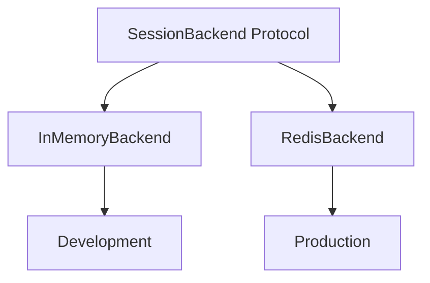

# Pocket Portals Documentation

Technical documentation for the multi-agent AI adventure system.

## Quick Navigation

| Guide | Description |
|-------|-------------|
| [Onboarding](guides/ONBOARDING.md) | Developer setup and workflow |
| [Architecture](architecture.md) | System design and patterns |
| [Blueprint](guides/BLUEPRINT.md) | Comprehensive implementation guide |
| [Crews & Flows](guides/CREWS-AND-FLOWS.md) | CrewAI patterns and agent orchestration |

## Documentation Structure

```
docs/
├── README.md                    # This index
├── architecture.md              # System architecture (65K)
├── architecture-diagrams.md     # Visual system diagrams
├── product.md                   # Product requirements
├── improvements.md              # Enhancement backlog
│
├── guides/
│   ├── ONBOARDING.md           # Developer quickstart
│   ├── BLUEPRINT.md            # Implementation reference
│   ├── CREWS-AND-FLOWS.md      # CrewAI patterns
│   └── CRASH-COURSE.md         # Original spike docs
│
├── reference/
│   ├── conversation-engine.md  # Turn mechanics
│   ├── creative-writing.md     # Narrative guidelines
│   ├── testing-mocks.md        # LLM mocking strategy
│   └── xp.md                   # XP methodology
│
├── design/
│   ├── choice-system.md        # Choice mechanics
│   ├── conversation-context.md # Context management
│   ├── mobile-ux-improvement-plan.md  # Mobile UX design
│   └── 2025-12-*.md            # Design documents
│
├── adr/
│   └── 001-agent-service-pattern.md
│
└── api/
    └── insomnia-collection.json
```

## Key Concepts

### Multi-Agent Architecture

Five specialized agents coordinate to generate adventures:

| Agent | Role | When Invoked |
|-------|------|--------------|
| Narrator | Scene descriptions | Every turn |
| Keeper | D&D 5e mechanics | Combat/skill checks |
| Jester | Chaos injection | 15% probability |
| Innkeeper | Quest hooks | Session start |
| Interviewer | Character creation | First 5 turns |

### Hybrid Design Pattern

- **LLM for narrative**: Rich, contextual storytelling
- **Deterministic combat**: D&D 5e rules, real dice
- **Result**: 25x cost reduction, instant mechanics

### Session Management



## For New Contributors

1. **Start with [Onboarding](guides/ONBOARDING.md)** - Environment setup
2. **Read [Architecture](architecture.md)** - System overview
3. **Review [Blueprint](guides/BLUEPRINT.md)** - Implementation details

## Project Status

- **Backend**: 296+ Python tests passing (pytest)
- **Frontend**: Vitest + jsdom test suite
- **Coverage**: 70%+ on critical paths
- **Pre-commit hooks** enforced (ruff, mypy)
- **CI/CD**: Frontend and backend tests run on push/PR to main

---

*Updated January 2025*
