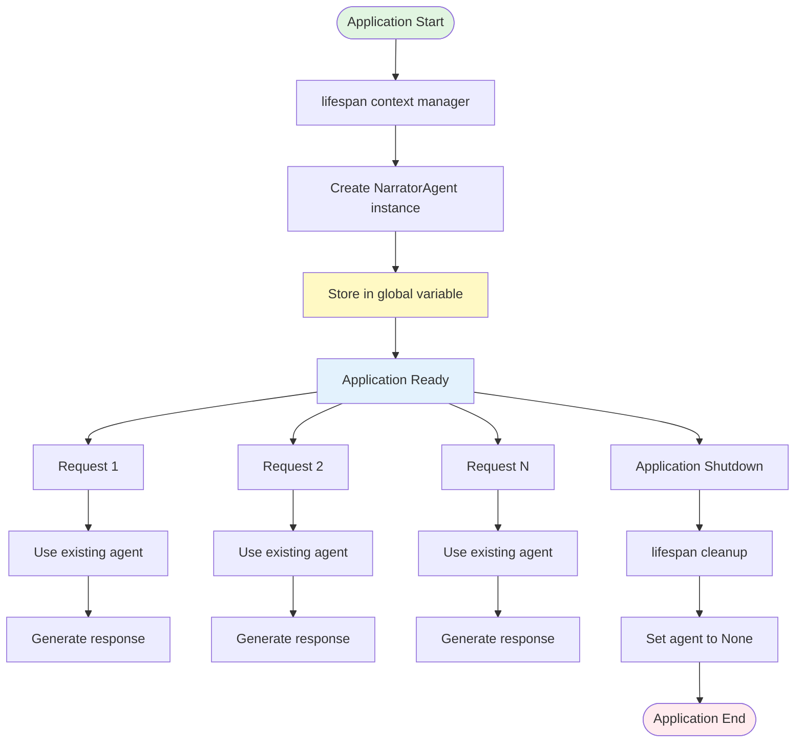
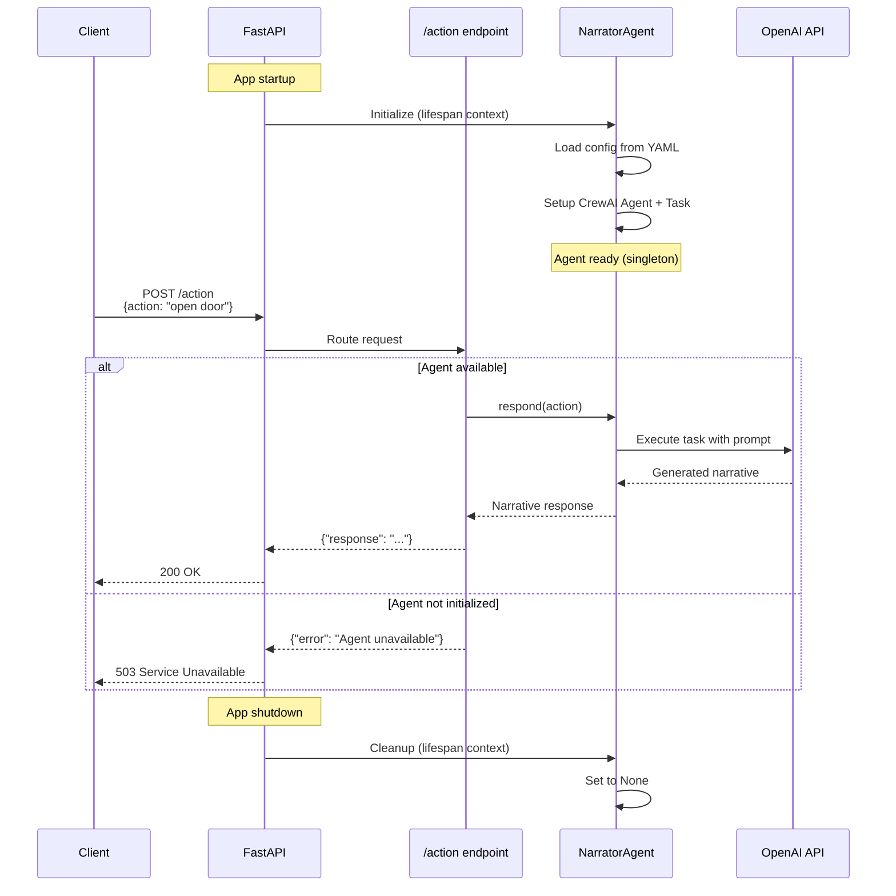

# ADR-001: Agent Integration Pattern

**Date**: 2025-12-21
**Status**: Accepted
**Context**: Spike/one-turn - FastAPI + CrewAI integration
**Decider(s)**: Developer Persona

## Summary

Define the pattern for integrating CrewAI agents with FastAPI endpoints, balancing simplicity for a hobby project with clean architecture principles that support future growth.

## Problem Statement

### The Challenge

CrewAI agents require initialization (LLM connections, configuration loading) and are stateful. We need a pattern to:

1. Manage agent lifecycle within FastAPI's async context
2. Provide clean separation between HTTP handling and agent logic
3. Enable testability without requiring live LLM calls

### Why This Matters

Poor agent integration leads to:

- Difficult testing (agents require API keys)
- Slow startup (agent init on every request)
- Unclear error handling
- Tight coupling between API and agent implementation

### Success Criteria

- [x] Agent initialized once at app startup
- [x] Graceful handling when API key unavailable
- [x] Clear separation of concerns
- [x] Tests can run without LLM calls

## Context

### Current State

**Existing Architecture**:

- FastAPI app with `/health` and `/action` endpoints
- YAML-based agent configuration (`src/config/agents.yaml`)
- NarratorAgent class wrapping CrewAI Agent + Task

**Technical Constraints**:

- Hobby project: minimize complexity
- Single developer: no over-engineering
- Spike phase: may be rewritten

### Requirements

**Functional Requirements**:

- `/action` endpoint calls NarratorAgent
- Response contains generated narrative

**Non-Functional Requirements**:

- **Startup**: Agent initialized once
- **Testability**: API tests work without LLM
- **Maintainability**: Easy to add more agents later

## Architecture Diagrams

### Agent Lifecycle Pattern



### Request Flow Sequence



## Options Considered

### Option A: Global Singleton with Lifespan ✅

**Description**: Initialize agent as module-level variable during FastAPI lifespan startup.

**Implementation**:

```python
narrator: NarratorAgent | None = None

@asynccontextmanager
async def lifespan(app: FastAPI):
    global narrator
    narrator = NarratorAgent()
    yield
    narrator = None
```

**Pros**:

- Simple, minimal code
- Uses FastAPI's built-in lifecycle management
- Easy to understand

**Cons**:

- Global state (acceptable for spike)
- Type checker warnings on None

**Estimated Effort**: 30 minutes

### Option B: Dependency Injection with Service Layer

**Description**: Create service layer with protocol interface, inject via FastAPI Depends().

**Implementation**:

```python
class AgentProtocol(Protocol):
    def respond(self, action: str) -> str: ...

def get_narrator() -> AgentProtocol:
    return app.state.narrator
```

**Pros**:

- Full testability with mocks
- Clean architecture
- Supports multiple agent types

**Cons**:

- More files and abstraction
- Overkill for spike phase

**Estimated Effort**: 2 hours

### Option C: Factory Pattern with Lazy Initialization

**Description**: Create agent on first request, cache for subsequent calls.

**Pros**:

- Deferred initialization
- No startup delay if unused

**Cons**:

- First request is slow
- Race conditions in async context
- Complex error handling

**Estimated Effort**: 1 hour

## Comparison Matrix

| Criteria            | Weight | Option A | Option B | Option C |
|---------------------|--------|----------|----------|----------|
| Simplicity          | High   | 5        | 3        | 3        |
| Testability         | Medium | 3        | 5        | 4        |
| Maintainability     | Medium | 3        | 5        | 3        |
| Implementation Time | High   | 5        | 2        | 3        |
| **Total Score**     | -      | **16**   | 15       | 13       |

## Decision

### Chosen Option

**Selected**: Option A - Global Singleton with Lifespan

**Rationale**:

For a hobby spike, simplicity wins. The global singleton pattern:

- Works immediately
- Uses FastAPI idioms
- Can evolve to Option B if needed

**Trade-offs Accepted**:

- Global state (acceptable for single-agent spike)
- Tests require mocking at module level

## Consequences

### Positive Outcomes

- Fast implementation (30 minutes)
- Easy to understand and modify
- Clear upgrade path to DI if needed
- Leverages FastAPI lifespan event system

### Negative Outcomes

- Tests require patching global variable
- Adding agents requires more globals (or refactor)
- Type checker warnings for optional agent

### Migration Path

If the project outgrows this pattern:

1. **Phase 1**: Move agent to `app.state` (minimal change)
2. **Phase 2**: Implement Protocol interface (testability)
3. **Phase 3**: Full dependency injection (scalability)

## Implementation Plan

### Phase 1: Basic Integration

- [x] Add narrator import to main.py
- [x] Initialize in lifespan context
- [x] Update /action endpoint to call agent
- [x] Handle missing API key gracefully

### Validation

- [x] Manual test via Swagger UI
- [x] Verify agent response quality
- [x] Check startup/shutdown logs

## Related Decisions

**Informs**:

- Future ADR on multi-agent orchestration pattern
- Future ADR on agent caching and session management

## References

### Code References

- `src/api/main.py` - FastAPI app with lifespan
- `src/agents/narrator.py` - NarratorAgent implementation
- `src/config/agents.yaml` - Agent configuration

### External Resources

- [FastAPI Lifespan Events](https://fastapi.tiangolo.com/advanced/events/)
- [CrewAI Documentation](https://docs.crewai.com/)

## Metadata

**ADR Number**: 001
**Created**: 2025-12-21
**Version**: 1.0

**Authors**: Developer Persona
**Tags**: architecture, agents, fastapi, crewai, lifecycle, singleton

**Project Phase**: Spike
**Next Review**: After spike validation
