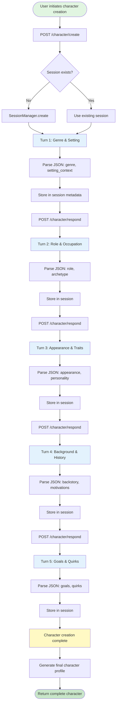
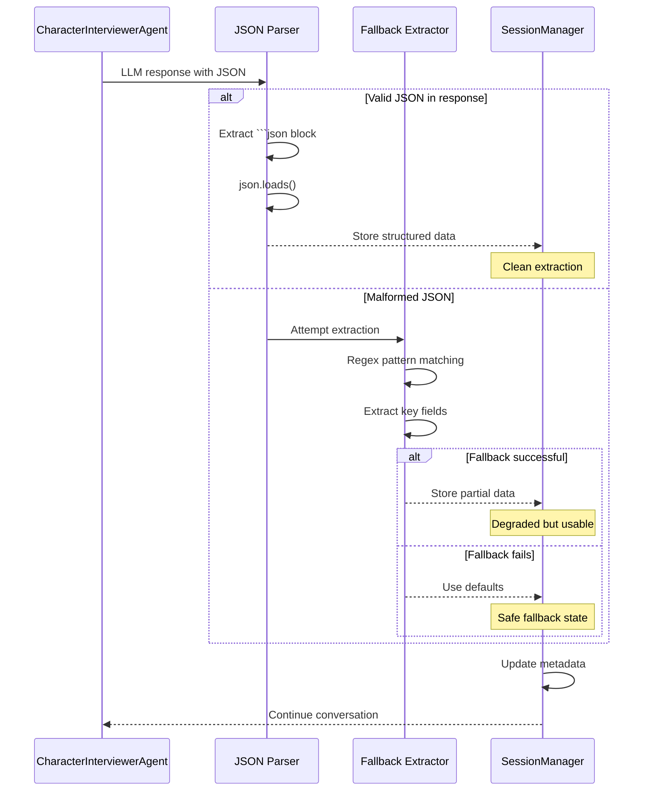

# ADR-002: Dynamic Character Creation System

**Date**: 2025-12-24
**Status**: Accepted
**Context**: Spike/one-turn - Interactive character creation with genre flexibility
**Decider(s)**: Developer Persona

## Summary

Implement a conversational character creation system using CharacterInterviewerAgent that dynamically adapts to different genres (fantasy, sci-fi, western, etc.) through a structured 5-turn interview flow with JSON-formatted responses.

## Problem Statement

### The Challenge

Creating compelling game characters requires gathering contextual information while:

1. Adapting to different narrative genres and settings
2. Guiding users through structured character development
3. Maintaining conversation flow across multiple turns
4. Extracting structured data from free-form LLM responses
5. Integrating with existing session management system

### Why This Matters

Static character creation forms lead to:

- Generic, uninspired characters lacking narrative depth
- Poor genre coherence (fantasy names in sci-fi settings)
- Missed opportunities for world-building integration
- Disconnection between character and setting

### Success Criteria

- [x] Genre-adaptive character creation (fantasy, sci-fi, western, etc.)
- [x] Structured 5-turn interview with progressive information gathering
- [x] Reliable JSON response parsing with fallback handling
- [x] Session-aware conversation tracking
- [x] Integration with existing FastAPI endpoints

## Context

### Current State

**Existing Architecture**:

- FastAPI app with session management (`SessionManager`)
- Agent service pattern established (ADR-001)
- YAML-based agent configuration (`src/config/agents.yaml`)
- NarratorAgent providing basic interaction

**Technical Constraints**:

- Hobby project: balance sophistication with simplicity
- Single developer: avoid over-engineering
- Spike phase: validate approach before full implementation
- LLM unpredictability: need robust parsing strategies

### Requirements

**Functional Requirements**:

- `/character/create` endpoint initiates character creation
- `/character/respond` endpoint handles user responses
- Dynamic genre detection and adaptation
- Progressive data gathering across 5 interview turns
- Final character profile generation

**Non-Functional Requirements**:

- **Response Format**: Structured JSON with consistent schema
- **Error Handling**: Graceful fallback for malformed LLM responses
- **Session Persistence**: Track conversation state across turns
- **Genre Flexibility**: Support arbitrary genres without code changes

## Architecture Diagrams

### Character Creation Flow



### JSON Response Parsing Strategy



## Options Considered

### Option A: Multi-Turn Interview with JSON Responses ✅

**Description**: CharacterInterviewerAgent conducts 5-turn interview, expecting structured JSON responses with genre-specific questions.

**Implementation**:

```python
class CharacterInterviewerAgent:
    def __init__(self):
        self.turns = 5
        self.current_turn = 0

    def ask_question(self, turn: int, context: dict) -> str:
        # Genre-adaptive prompting
        genre = context.get("genre", "fantasy")
        return self._generate_question(turn, genre)

    def parse_response(self, response: str) -> dict:
        # JSON extraction with fallbacks
        try:
            return extract_json(response)
        except:
            return fallback_extract(response)
```

**Pros**:

- Structured data extraction
- Genre flexibility through dynamic prompting
- Progressive information gathering
- Clear conversation state tracking

**Cons**:

- LLM response inconsistency
- Requires robust parsing logic
- 5 turns may feel long for some users

**Estimated Effort**: 4 hours

### Option B: Single-Turn Form-Based Generation

**Description**: Single LLM call generates complete character from user-provided genre and brief description.

**Implementation**:

```python
def create_character(genre: str, description: str) -> Character:
    prompt = f"Generate a {genre} character: {description}"
    response = llm.generate(prompt)
    return parse_character(response)
```

**Pros**:

- Fast user experience
- Simple implementation
- No conversation state management

**Cons**:

- Less interactive and engaging
- No opportunity for user refinement
- Generic results without contextual guidance
- All-or-nothing parsing strategy

**Estimated Effort**: 1 hour

### Option C: Hybrid: Quick Generation + Refinement

**Description**: Generate initial character in one turn, then offer optional refinement interview.

**Pros**:

- Flexible user experience
- Combines speed with depth

**Cons**:

- Complex state management
- Unclear UX flow (when to refine?)
- More endpoints and logic paths

**Estimated Effort**: 6 hours

## Comparison Matrix

| Criteria                | Weight | Option A | Option B | Option C |
|------------------------|--------|----------|----------|----------|
| User Engagement        | High   | 5        | 2        | 4        |
| Character Quality      | High   | 5        | 3        | 4        |
| Genre Flexibility      | High   | 5        | 4        | 4        |
| Implementation Time    | Medium | 3        | 5        | 2        |
| Parsing Robustness     | High   | 4        | 3        | 3        |
| **Total Score**        | -      | **22**   | 17       | 17       |

## Decision

### Chosen Option

**Selected**: Option A - Multi-Turn Interview with JSON Responses

**Rationale**:

Interactive character creation provides:

- Higher quality, contextually-aware characters
- Natural conversation flow that feels game-like
- Progressive refinement of character details
- Genre adaptation through conversation context
- Better narrative integration with game world

**Trade-offs Accepted**:

- Longer interaction time (5 turns vs 1)
- Complex JSON parsing with fallback strategies
- More conversation state to track
- Potential for LLM response inconsistency

## Consequences

### Positive Outcomes

- **Engaging Experience**: Interactive interview feels like part of the game
- **Genre Coherence**: Characters naturally fit their narrative setting
- **Progressive Detail**: Each turn builds on previous responses
- **Flexible Architecture**: Easy to adjust turn count or questions
- **Structured Data**: JSON format enables future features (character sheets, stats)

### Negative Outcomes

- **Parsing Complexity**: Requires robust JSON extraction with fallbacks
- **LLM Variability**: Responses may not always follow JSON format
- **Longer Sessions**: 5 turns may feel slow for impatient users
- **Session Dependency**: Requires reliable session management

### Mitigation Strategies

**JSON Parsing Robustness**:
- Primary: Extract from ```json code blocks
- Secondary: Regex-based field extraction
- Tertiary: Default values with logging

**Session Reliability**:
- Leverage existing SessionManager (proven in ADR-001)
- Store interview state in session metadata
- Support session recovery after interruptions

**User Experience**:
- Clear turn indicators ("Question 2 of 5")
- Allow skipping turns with defaults
- Provide example responses for guidance

### Migration Path

If the pattern needs evolution:

1. **Phase 1**: Reduce to 3 turns for faster flow
2. **Phase 2**: Add optional deep-dive questions
3. **Phase 3**: Implement character templates for quick starts
4. **Phase 4**: Add character import from external sources

## Implementation Plan

### Phase 1: Core Interview System

- [x] Create CharacterInterviewerAgent class
- [x] Define 5-turn interview structure
- [x] Implement genre-adaptive question generation
- [x] Add JSON response parsing with fallbacks
- [x] Integrate with SessionManager

### Phase 2: API Endpoints

- [x] POST /character/create - Initialize interview
- [x] POST /character/respond - Handle user responses
- [x] GET /character/{session_id} - Retrieve character profile

### Phase 3: Testing & Refinement

- [ ] Test across multiple genres (fantasy, sci-fi, western)
- [ ] Validate JSON parsing robustness
- [ ] Measure user engagement and completion rates
- [ ] Refine prompts based on response quality

### Validation

- [x] Manual testing via Swagger UI
- [x] Genre coherence validation (character fits setting)
- [x] JSON parsing success rate monitoring
- [ ] User acceptance testing with real players

## Related Decisions

**Builds On**:
- ADR-001: Agent Service Pattern (session management, agent lifecycle)

**Informs**:
- Future ADR on character stat generation system
- Future ADR on character-to-world relationship modeling
- Future ADR on conversation memory and context management

## References

### Code References

- `src/agents/character_interviewer.py` - CharacterInterviewerAgent implementation
- `src/api/character.py` - Character creation endpoints
- `src/config/agents.yaml` - Agent configuration
- `src/models/session.py` - Session management

### External Resources

- [CrewAI Agent Configuration](https://docs.crewai.com/core-concepts/agents/)
- [JSON Schema for Character Data](https://json-schema.org/understanding-json-schema/)
- [Conversation Design Best Practices](https://www.nngroup.com/articles/chatbot-design/)

## Metadata

**ADR Number**: 002
**Created**: 2025-12-24
**Version**: 1.0

**Authors**: Developer Persona
**Tags**: architecture, agents, character-creation, conversational-ai, json-parsing, genre-flexibility

**Project Phase**: Spike
**Next Review**: After user testing with multiple genres
