# Pocket Portals Architecture Diagrams

Comprehensive Mermaid diagrams documenting the system architecture, game flows, and component interactions.

---

## Table of Contents

1. [System Architecture](#1-system-architecture-diagram)
2. [Complete Game Flow](#2-complete-game-flow)
3. [Agent Routing Decision Flow](#3-agent-routing-decision-flow)
4. [Turn Execution Flow (CrewAI)](#4-turn-execution-flow-crewai-flow)
5. [State Management Architecture](#5-state-management-architecture)
6. [Combat System Flow](#6-combat-system-flow)
7. [Streaming Response Flow](#7-streaming-response-flow)
8. [Configuration-Driven Agent Architecture](#8-configuration-driven-agent-architecture)

---

## 1. System Architecture Diagram

High-level view of all system components and their relationships.

```mermaid
flowchart TB
    subgraph Client["🌐 Client Layer"]
        Browser["Browser<br/>NES.css Frontend"]
        SSE["SSE Stream<br/>Real-time Updates"]
    end

    subgraph API["⚡ API Layer (FastAPI)"]
        Main["main.py"]
        Endpoints["Endpoints"]

        subgraph Routes["Routes"]
            Start["/start"]
            Action["/action"]
            ActionStream["/action/stream"]
            CombatStart["/combat/start"]
            CombatAction["/combat/action"]
        end
    end

    subgraph Engine["🎮 Engine Layer"]
        Router["AgentRouter<br/>• MECHANICAL_KEYWORDS<br/>• JESTER_PROBABILITY<br/>• JESTER_COOLDOWN"]
        Executor["TurnExecutor"]
        Flow["ConversationFlow<br/>CrewAI Flow"]
        CombatMgr["CombatManager<br/>• Initiative<br/>• Attack/Defend/Flee<br/>• Turn Order"]
    end

    subgraph Agents["🤖 Agent Layer (CrewAI)"]
        Narrator["NarratorAgent<br/>40-80 words"]
        Keeper["KeeperAgent<br/><10 words"]
        Jester["JesterAgent<br/>15% chance"]
        Innkeeper["InnkeeperAgent<br/>30-50 words"]
        Interviewer["CharacterInterviewer<br/>5-turn flow"]
    end

    subgraph State["💾 State Layer"]
        SessionMgr["SessionManager"]

        subgraph Backends["Pluggable Backends"]
            Memory["InMemoryBackend<br/>Development"]
            Redis["RedisBackend<br/>Production"]
        end

        subgraph Models["Pydantic Models"]
            GameState["GameState"]
            CombatState["CombatState"]
            CharSheet["CharacterSheet"]
            FlowState["ConversationFlowState"]
        end
    end

    subgraph Config["⚙️ Configuration"]
        AgentsYAML["agents.yaml<br/>• Personalities<br/>• Word limits<br/>• Temperature"]
        TasksYAML["tasks.yaml<br/>Task templates"]
        Settings["settings.py<br/>Environment"]
    end

    subgraph Data["📊 Data Layer"]
        Enemies["ENEMY_TEMPLATES<br/>• Goblin<br/>• Bandit<br/>• Skeleton<br/>• Wolf<br/>• Orc"]
        Dice["DiceRoller<br/>• roll()<br/>• advantage<br/>• disadvantage"]
    end

    subgraph External["☁️ External"]
        Claude["Anthropic Claude<br/>Haiku 3.5"]
    end

    Browser --> Main
    SSE --> ActionStream

    Main --> Routes
    Routes --> Engine

    Router --> Flow
    Executor --> Flow
    Flow --> Agents
    CombatMgr --> Dice

    Agents --> Claude
    Agents --> Config

    SessionMgr --> Backends
    Backends --> Models

    CombatMgr --> Enemies
    CombatMgr --> Models
```

---

## 2. Complete Game Flow

Full player journey from app start through character creation, exploration, and combat.

---

## 3. Agent Routing Decision Flow

How the AgentRouter determines which agents handle each player action.

---

## 4. Turn Execution Flow (CrewAI Flow)

Detailed flow of how CrewAI orchestrates multi-agent turn execution.

---

## 5. State Management Architecture

Backend protocol pattern and data model relationships.

```mermaid
flowchart TB
    subgraph Models["Pydantic Models"]
        GameState["GameState<br/>• session_id<br/>• conversation_history[20]<br/>• current_choices<br/>• character_sheet<br/>• health_current/max<br/>• phase: GamePhase<br/>• creation_turn: 0-5<br/>• recent_agents[5]<br/>• turns_since_jester<br/>• combat_state"]

        CharSheet["CharacterSheet<br/>• name<br/>• race: CharacterRace<br/>• character_class<br/>• stats: StatBlock<br/>• current_hp/max_hp<br/>• backstory"]

        CombatState["CombatState<br/>• is_active<br/>• phase: CombatPhaseEnum<br/>• round_number<br/>• combatants[]<br/>• turn_order[]<br/>• current_turn_index<br/>• enemy_template<br/>• combat_log[]<br/>• player_defending"]

        GameState --> CharSheet
        GameState --> CombatState
    end

    subgraph Enums["Enums"]
        GamePhase["GamePhase<br/>• CHARACTER_CREATION<br/>• EXPLORATION<br/>• COMBAT<br/>• DIALOGUE"]

        CombatPhase["CombatPhaseEnum<br/>• INITIATIVE<br/>• PLAYER_TURN<br/>• ENEMY_TURN<br/>• RESOLUTION"]

        CombatAction["CombatAction<br/>• ATTACK<br/>• DEFEND<br/>• FLEE"]
    end

    subgraph Backend["Backend Protocol"]
        Protocol["SessionBackend (Protocol)<br/>• create(id, state)<br/>• get(id) -> state<br/>• update(id, state)<br/>• delete(id) -> bool<br/>• exists(id) -> bool"]

        Memory["InMemoryBackend<br/>dict[str, GameState]"]
        Redis["RedisBackend<br/>• redis_url<br/>• ttl: 24h<br/>• JSON serialization"]

        Protocol --> Memory
        Protocol --> Redis
    end

    subgraph Factory["Backend Factory"]
        Create["create_backend()"] --> Check{SESSION_BACKEND<br/>setting?}
        Check -->|memory| ReturnMemory[Return InMemoryBackend]
        Check -->|redis| TryRedis[Try Redis Connection]
        TryRedis --> Ping{Ping OK?}
        Ping -->|Yes| ReturnRedis[Return RedisBackend]
        Ping -->|No| Fallback[Log Warning<br/>Fallback to Memory]
        Fallback --> ReturnMemory
    end

    subgraph SessionManager["SessionManager"]
        SM["SessionManager(backend)"]
        SM --> Methods["Methods:<br/>• create_session()<br/>• get_session(id)<br/>• get_or_create_session(id)<br/>• add_exchange(id, action, narrative)<br/>• update_health(id, damage)<br/>• set_character_sheet(id, sheet)<br/>• set_phase(id, phase)<br/>• set_choices(id, choices)<br/>• update_recent_agents(id, agents)<br/>• set_combat_state(id, state)"]
    end

    Factory --> SM
    SM --> Backend
```

---

## 6. Combat System Flow

D&D 5e-inspired combat mechanics with initiative, actions, and resolution.

---

## 7. Streaming Response Flow

Server-Sent Events (SSE) sequence for real-time narrative delivery.

---

## 8. Configuration-Driven Agent Architecture

How YAML configuration drives agent behavior at runtime.

---

## Component Summary

| Layer | Components | Responsibility |
|-------|------------|----------------|
| **Client** | Browser, SSE | User interface, real-time updates |
| **API** | FastAPI, Routes | HTTP endpoints, request handling |
| **Engine** | Router, Executor, Flow, CombatManager | Orchestration, game logic |
| **Agents** | Narrator, Keeper, Jester, Innkeeper, Interviewer | LLM-powered content generation |
| **State** | SessionManager, Backends, Models | Persistence, data validation |
| **Config** | YAML files, Settings | Behavior configuration |
| **Data** | Enemy templates, Dice utilities | Static game data |
| **External** | Anthropic Claude | LLM inference |

---

## Key Design Patterns

1. **Protocol-based Backend** - Pluggable storage with graceful fallback
2. **Configuration-driven Behavior** - Agent personalities in YAML, not code
3. **CrewAI Flow Orchestration** - Declarative multi-agent coordination
4. **Explicit Context Accumulation** - Each agent sees previous responses
5. **Controlled Randomness** - Probability and cooldown for emergent behavior
6. **Minimize LLM Calls** - Mechanics computed, narrative generated
7. **Type-safe State** - Pydantic models for all game state
8. **SSE Streaming** - Character-by-character real-time delivery
