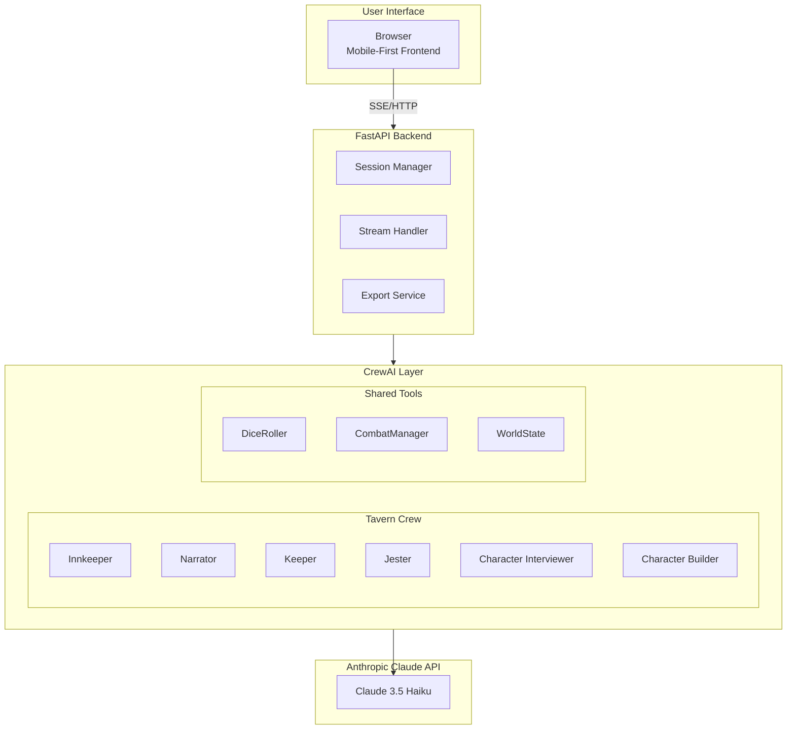
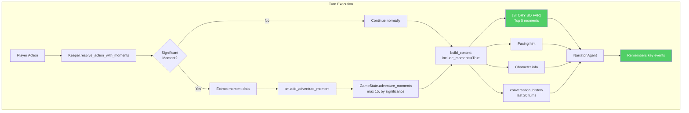

# Pocket Portals Architecture

**Version 1.0 | Extreme Programming + BDD Edition**

---

## XP Principles Applied

This architecture embraces Extreme Programming values throughout:

| XP Value | Application |
|----------|-------------|
| **Simplicity** | Do the simplest thing that could possibly work. No speculative features. |
| **Feedback** | Fast cycles: user input → agent response → user choice. Continuous learning. |
| **Communication** | Agents communicate intent via annotations. Code communicates via tests. |
| **Courage** | Delete code that isn't working. Refactor mercilessly. Ship early. |
| **Respect** | Respect user time (60s to adventure). Respect token budgets. Respect constraints. |

---

## BDD Principles Applied

Behavior-Driven Development ensures we build what users actually need:

| BDD Concept | Application |
|-------------|-------------|
| **Ubiquitous Language** | "Adventure", "Quest", "Tavern" — domain terms used everywhere |
| **Outside-In** | Start with user behavior, work inward to implementation |
| **Living Documentation** | Feature files ARE the specification |
| **Three Amigos** | User story, agent behavior, and test all align |
| **Given-When-Then** | Every scenario follows this structure |

---

## 1. System Overview



---

## 1.1 Multi-Agent System

The Pocket Portals architecture employs a multi-agent system built on CrewAI, where each agent serves a distinct role in the adventure experience.

### Agent Roles and Responsibilities

| Agent | Role | LLM Usage | Key Responsibilities |
|-------|------|-----------|---------------------|
| **Narrator** | Scene description, combat summaries | Yes | Generates immersive scene descriptions, adapts narrative tone, provides dramatic combat summaries at encounter end |
| **Keeper** | D&D 5e rules enforcement, combat mechanics | Minimal | Validates mechanics, orchestrates dice rolls, enforces D&D 5e rules. Uses pure Python for combat. |
| **Jester** | Comic relief | Yes (15% random) | Injects unexpected complications and humor. Randomly appears in 15% of eligible interactions. |
| **Innkeeper** | Session management | Yes | Welcomes adventurers, introduces quests, delivers session bookends and epilogue reflections |
| **Character Interviewer** | Character creation flow | Yes | Guides players through 5-turn conversational character creation interview |
| **Character Builder** | Stat generation | Yes (once) | Analyzes interview conversation, generates intelligent D&D stats using CrewAI Pydantic output |

### Agent Interaction Pattern

```
User Input
    │
    ▼
┌─────────────────────────────────────────────────────────────────┐
│                      ROUTING LOGIC                               │
│  (Determines which agent(s) handle the request based on phase)  │
└─────────────────────────────────────────────────────────────────┘
    │
    ├── CHARACTER_CREATION phase ──► Character Interviewer (5 turns)
    │                                    └──► Character Builder (turn 5, generates stats)
    │
    ├── EXPLORATION phase ──► Narrator (primary) + Jester (15% chance)
    │
    ├── COMBAT phase ──► Keeper (mechanics) + Narrator (summary at end)
    │
    └── DIALOGUE phase ──► Narrator + relevant NPC context
```

### Jester Injection Logic

The Jester agent uses probabilistic injection to keep adventures unpredictable:

- **Trigger Probability**: 15% per eligible turn
- **Cooldown Tracking**: `turns_since_jester` counter prevents over-saturation
- **Context Awareness**: Only injects when narratively appropriate
- **Output Style**: Fourth-wall adjacent, uses `:)` unironically

---

## 1.2 Combat System Architecture

The combat system prioritizes cost efficiency through a "Batched Summary" approach, using pure Python mechanics during combat with a single LLM call for narrative summary at the end.

### Combat Engine Components

```
src/
├── engine/
│   └── combat_manager.py    # CombatManager: Pure Python combat logic
├── utils/
│   └── dice.py              # DiceRoller: D&D notation parser
└── data/
    └── enemies.py           # Enemy templates (Goblin, Bandit, etc.)
```

### DiceRoller (`src/utils/dice.py`)

Parses and executes D&D dice notation with full modifier support.

**Supported Notations:**
- Basic rolls: `1d20`, `2d6`, `1d8`
- With modifiers: `1d20+5`, `2d6+3`, `1d8-2`
- Advantage: Roll 2d20, take higher
- Disadvantage: Roll 2d20, take lower

**Example Usage:**
```python
from src.utils.dice import DiceRoller

# Basic roll
result = DiceRoller.roll("1d20+5")
print(f"{result.notation}: {result.rolls} + {result.modifier} = {result.total}")

# Advantage roll (for attack with advantage)
adv_result = DiceRoller.roll_with_advantage()
print(f"Rolls: {adv_result.rolls}, Taking: {adv_result.total}")
```

### CombatManager (`src/engine/combat_manager.py`)

Orchestrates turn-based combat with D&D 5e mechanics.

**Core Methods:**

| Method | Purpose |
|--------|---------|
| `start_combat(character_sheet, enemy_type)` | Initialize combat, roll initiative, set turn order |
| `roll_initiative(combatants, dex_modifiers)` | Roll 1d20 + DEX modifier for all combatants |
| `execute_player_attack(combat_state, character_sheet)` | Resolve player attack action |
| `execute_enemy_turn(combat_state)` | Process enemy AI turn |
| `execute_defend(combat_state, character_sheet)` | Set defending stance (enemy gets disadvantage) |
| `execute_flee(combat_state, character_sheet)` | DEX check vs DC 12, enemy gets advantage attack on failure |
| `resolve_attack(attacker, defender, ...)` | Core attack resolution with dice rolls |
| `check_combat_end(combat_state)` | Detect victory, defeat, or escape conditions |

**Combat Action Types:**
```python
class CombatAction(str, Enum):
    ATTACK = "attack"   # Roll to hit, deal damage
    DEFEND = "defend"   # Enemy gets disadvantage next turn
    FLEE = "flee"       # DEX check vs DC 12
```

### Enemy Templates (`src/data/enemies.py`)

Pre-defined enemy stat blocks for common encounters:

| Enemy | HP | AC | Attack Bonus | Damage | Description |
|-------|----|----|--------------|--------|-------------|
| Goblin Raider | 7 | 13 | +4 | 1d6+2 | Small, green-skinned with wicked grin |
| Bandit Outlaw | 11 | 12 | +3 | 1d6+1 | Rough human with scarred face |
| Skeleton Warrior | 13 | 13 | +4 | 1d6+2 | Animated skeleton with rusty sword |
| Dire Wolf | 11 | 13 | +5 | 2d4+3 | Large wolf with glowing yellow eyes |
| Orc Warrior | 15 | 13 | +5 | 1d12+3 | Muscular gray-skinned with tusks |

### Cost-Efficient Design (Batched Summary)

**During Combat (Pure Python - No LLM Calls):**
1. Initiative rolling (1d20 + DEX modifier)
2. Attack resolution (1d20 + attack bonus vs AC)
3. Damage calculation (weapon dice + modifiers)
4. Defend action (sets disadvantage flag)
5. Flee action (DEX check vs DC 12)
6. HP tracking and combat state updates

**At Combat End (Single LLM Call):**
- Narrator generates dramatic summary of the entire battle
- References key moments from `combat_log`
- Describes final blow or escape
- Transitions back to exploration phase

**Cost Comparison:**
| Approach | Cost per Combat |
|----------|-----------------|
| Batched Summary (current) | ~$0.002 |
| Full LLM per Turn | ~$0.05 (25x more expensive) |

---

## 1.3 Session Backend Architecture

The session management system uses CrewAI's Flow pattern with pluggable persistence, enabling type-safe state management with automatic persistence after each operation.

### GameSessionFlow (`src/engine/game_session.py`)

The core session management uses CrewAI's `Flow[GameState]` pattern for type-safe state handling:

```python
from crewai.flow.flow import Flow, start

class GameSessionFlow(Flow[GameState]):
    """CrewAI Flow for game session with automatic persistence."""

    def _save(self) -> GameState:
        """Helper that persists state and returns it for chaining."""
        self.persistence.save_state(
            flow_uuid=self.state.session_id,
            state=self.state.model_dump(),
        )
        return self.state

    @start()
    def initialize(self) -> GameState:
        if not self.state.session_id:
            self.state.session_id = str(uuid.uuid4())
        return self._save()
```

**Key Pattern: `_save()` Helper**
- Each state-mutating method calls `_save()` to persist immediately
- Returns `self.state` for method chaining
- Ensures state is never lost between operations
- Works with any `FlowPersistence` implementation

### InMemoryFlowPersistence (`src/engine/flow_persistence.py`)

Implements CrewAI's `FlowPersistence` interface for development/testing:

```python
from crewai.flow.persistence import FlowPersistence

class InMemoryFlowPersistence(FlowPersistence):
    """In-memory persistence for CrewAI Flows."""

    def __init__(self) -> None:
        self._states: dict[str, dict[str, Any]] = {}

    def save_state(self, flow_uuid: str, state: dict[str, Any]) -> None:
        self._states[flow_uuid] = state

    def load_state(self, flow_uuid: str) -> dict[str, Any] | None:
        return self._states.get(flow_uuid)
```

**Characteristics:**
- Zero external dependencies
- Fast reads/writes (O(1) dictionary operations)
- Compatible with CrewAI Flow reconstruction pattern
- Singleton instance shared across requests

### GameSessionService (`src/engine/game_session_service.py`)

Async service wrapper for FastAPI route integration:

```python
class GameSessionService:
    """Async service for game session management via GameSessionFlow."""

    @staticmethod
    async def create_session() -> GameState:
        """Create new session with persistence."""
        flow = GameSessionFlow()
        flow.kickoff()
        return flow.state

    @staticmethod
    async def get_session(session_id: str) -> GameState | None:
        """Reconstruct flow from persisted state."""
        state_dict = _persistence.load_state(session_id)
        if state_dict is None:
            return None
        return GameState.model_validate(state_dict)

    @staticmethod
    async def set_phase(session_id: str, phase: GamePhase) -> None:
        """Update game phase with persistence."""
        state = await GameSessionService.get_session(session_id)
        if state is None:
            raise ValueError(f"Session {session_id} not found")
        flow = GameSessionFlow(state=state, persistence=_persistence)
        flow.state.phase = phase
        flow._save()
```

**Flow Reconstruction Pattern:**
- Load state from persistence via `load_state(session_id)`
- Create new Flow instance with loaded state (no `kickoff_async()`)
- Mutate state directly, then call `_save()`
- Avoids re-running initialization logic for existing sessions

### Architecture Diagram

```
┌──────────────────┐     ┌───────────────────────────────────────┐
│   FastAPI        │────▶│        GameSessionService             │
│   Routes         │     │   (async wrapper for routes)          │
└──────────────────┘     └───────────────────────────────────────┘
                                          │
                                          ▼
                         ┌───────────────────────────────────────┐
                         │          GameSessionFlow              │
                         │   Flow[GameState] with _save()        │
                         │                                       │
                         │  ┌─────────────────────────────────┐  │
                         │  │           GameState             │  │
                         │  │   (Pydantic model, type-safe)   │  │
                         │  └─────────────────────────────────┘  │
                         │                 │                     │
                         │                 ▼                     │
                         │  ┌─────────────────────────────────┐  │
                         │  │    InMemoryFlowPersistence      │  │
                         │  │   (CrewAI FlowPersistence)      │  │
                         │  └─────────────────────────────────┘  │
                         └───────────────────────────────────────┘
```

### SessionBackend Protocol (Legacy)

For reference, the previous Protocol-based backend system is documented in [2025-12-26-distributed-session-management.md](coordination/distributed-session-management.md). The new Flow-based approach supersedes it with better CrewAI integration.

### Configuration via pydantic-settings (`src/config/settings.py`)

Environment-driven configuration for backend selection:

```python
class Settings(BaseSettings):
    # Redis Configuration (for future distributed deployments)
    redis_url: str = "redis://localhost:6379/0"
    redis_session_ttl: int = 86400  # 24 hours

    # Session Backend Selection
    session_backend: Literal["memory", "redis"] = "redis"

    @property
    def is_redis_enabled(self) -> bool:
        return self.session_backend == "redis"
```

**Environment Variables:**
| Variable | Default | Description |
|----------|---------|-------------|
| `SESSION_BACKEND` | `"redis"` | Backend type: `"memory"` or `"redis"` |
| `REDIS_URL` | `"redis://localhost:6379/0"` | Redis connection URL |
| `REDIS_SESSION_TTL` | `86400` | Session TTL in seconds (24 hours) |

### Backend Selection Matrix

| Environment | Recommended Backend | Reason |
|-------------|---------------------|--------|
| Development | InMemoryFlowPersistence | Zero setup, CrewAI Flow integration |
| Testing | InMemoryFlowPersistence | Isolated, deterministic, fast |
| Production (single server) | InMemoryFlowPersistence | Sufficient for single-process |
| Production (multi-server) | RedisFlowPersistence (future) | Distributed session sharing |

---

## 1.4 Adventure Moments (Narrator Memory)

The narrator can forget early story details because `conversation_history` is truncated to 20 turns. Adventure Moments provide persistent story memory by capturing significant events throughout the adventure.

### Problem: Context Window Limitation

```
Turn 21: Turns 1-10 permanently deleted
Turn 30: Quest introduction lost (turns 1-20 gone)
Turn 50: Only turns 31-50 remain - 60% of story forgotten
```

**What gets forgotten:**
- NPC names and dialogue from early game
- Quest introduction and objectives
- World-building details (locations, factions)
- Character backstory context from creation

### Solution: KeeperResponse with Moment Detection

The Keeper agent returns structured moment metadata alongside mechanical resolution using Pydantic `output_pydantic`:



### KeeperResponse Model (`src/agents/keeper.py`)

```python
class KeeperResponse(BaseModel):
    """Structured response with optional moment detection."""
    resolution: str = Field(
        description="Numbers-first mechanical resolution. Under 10 words."
    )
    moment_type: str | None = Field(
        default=None,
        description="Significant moment type: 'combat_victory', 'discovery', etc."
    )
    moment_summary: str | None = Field(
        default=None,
        description="Brief 5-10 word summary of what happened."
    )
    moment_significance: float = Field(
        default=0.5, ge=0.0, le=1.0,
        description="How significant: 0.0=routine, 1.0=climactic"
    )
```

### Moment Types

| Type | Description | Typical Significance |
|------|-------------|---------------------|
| `combat_victory` | Player defeats enemy | 0.8 |
| `combat_defeat` | Player falls in battle | 0.9 |
| `critical_success` | Exceptional roll/outcome | 0.9 |
| `critical_failure` | Dramatic failure | 0.8 |
| `discovery` | Major revelation | 0.7 |
| `achievement` | Goal/objective completed | 0.8 |
| `turning_point` | Significant story shift | 0.85 |

### Storage and Selection

**Storage Limits:**
- Maximum 15 moments stored in `GameState.adventure_moments`
- When cap exceeded, lowest significance moments are removed

**Context Selection:**
- Top 5 most significant moments included in narrator context
- Selected moments sorted chronologically for narrative coherence

### Context Output Example

After turn 20+, narrator context includes:
```
[STORY SO FAR]
- Turn 5 (combat_victory): Defeated the cave goblin after fierce battle
- Turn 12 (discovery): Uncovered the secret passage behind the waterfall
- Turn 18 (achievement): Retrieved the ancient artifact from the temple
```

### Related Files

| File | Purpose |
|------|---------|
| `src/agents/keeper.py` | `KeeperResponse` model, `resolve_action_with_moments()` |
| `src/engine/moments.py` | `format_moments_for_context()`, `build_moment_from_keeper()` |
| `src/state/session_manager.py` | `add_adventure_moment()` with capping logic |
| `src/api/dependencies.py` | `build_context()` with `include_moments` parameter |
| `docs/design/2026-01-09-adventure-moments.md` | Full design document |

---

## 1.5 API Layer

FastAPI-based API with SSE streaming support for real-time narrative delivery.

### API Module Structure (Modular Architecture)

```
src/api/
├── main.py              # Entry point (5 lines)
├── app.py               # App factory, lifespan, CORS middleware
├── rate_limiting.py     # Privacy-first rate limiter (session_id only)
├── dependencies.py      # Shared dependencies (get_session_manager, build_context)
├── constants.py         # Narrative text, fallback choices
├── content_safety.py    # BLOCKED_PATTERNS, filter_content
├── models/
│   ├── __init__.py
│   ├── requests.py      # ActionRequest, ResolveRequest, etc.
│   └── responses.py     # NarrativeResponse, etc.
├── routes/
│   ├── __init__.py
│   ├── adventure.py     # /start, /action, /action/stream
│   ├── combat.py        # /combat/start, /combat/action
│   ├── agents.py        # /innkeeper, /keeper, /jester
│   └── health.py        # /health
└── handlers/
    ├── __init__.py
    ├── character.py     # Character creation logic
    ├── quest.py         # Quest selection logic
    └── combat.py        # Combat action logic
```

### Rate Limiting

Privacy-first rate limiting using **session_id only** (no IP tracking):

| Tier | Limit | Endpoints |
|------|-------|-----------|
| LLM | 20/min | /action, /action/stream, /keeper/resolve, /jester/complicate |
| Combat | 60/min | /combat/start, /combat/action |
| Default | 100/min | /start, /health |

### CORS Configuration

Configurable via `src/config/settings.py`:
- **Development**: Permissive (all origins)
- **Production**: Restrictive (configured allow-list)

### Core Endpoints

**Session Management:**
| Endpoint | Method | Description |
|----------|--------|-------------|
| `/session/new` | POST | Create new game session |
| `/session/{id}` | GET | Retrieve session state |
| `/session/{id}/action` | POST | Submit player action |

**Combat Endpoints:**
| Endpoint | Method | Description |
|----------|--------|-------------|
| `/combat/start` | POST | Initiate combat encounter with enemy type |
| `/combat/action` | POST | Execute player combat action (attack/defend/flee) |

### SSE Streaming

Real-time narrative delivery via Server-Sent Events:

**Event Types:**
| Event | Purpose |
|-------|---------|
| `agent_chunk` | Character-by-character streaming for narrative text |
| `agent_complete` | Signals end of agent response |
| `choices` | Available player choices |
| `combat_update` | Combat state changes (HP, turn order, etc.) |

**Example SSE Flow:**
```
Client                    Server
  │                         │
  │  POST /session/action   │
  │ ─────────────────────►  │
  │                         │
  │  SSE: agent_chunk       │
  │ ◄─────────────────────  │  "The goblin..."
  │  SSE: agent_chunk       │
  │ ◄─────────────────────  │  " snarls..."
  │  SSE: agent_complete    │
  │ ◄─────────────────────  │
  │  SSE: choices           │
  │ ◄─────────────────────  │  ["Attack", "Flee", "Negotiate"]
  │                         │
```

### Combat API Details

**POST /combat/start**
```json
// Request
{
    "session_id": "abc-123",
    "enemy_type": "goblin"
}

// Response
{
    "combat_state": {
        "is_active": true,
        "phase": "player_turn",
        "round_number": 1,
        "combatants": [...],
        "turn_order": ["player", "enemy"]
    },
    "initiative_results": [
        {"id": "player", "roll": 15, "modifier": 2, "total": 17},
        {"id": "enemy", "roll": 10, "modifier": 0, "total": 10}
    ]
}
```

**POST /combat/action**
```json
// Request
{
    "session_id": "abc-123",
    "action": "attack"  // "attack" | "defend" | "flee"
}

// Response
{
    "action_result": {
        "hit": true,
        "total_attack": 18,
        "damage_dealt": 7,
        "defender_hp": 0,
        "defender_alive": false
    },
    "combat_state": {...},
    "combat_ended": true,
    "result": "victory"
}
```

---

## 2. XP Practice: Simple Design

### The Simplest Thing That Works

**What we build:**
- Single FastAPI application (monolith)
- In-memory session state (dict per session)
- SSE (Server-Sent Events) streaming for real-time narrative delivery
- CrewAI for agent orchestration
- Character-by-character streaming via `agent_chunk` SSE events
- SQLite for adventure logs (if persistence needed)

**What we DON'T build (yet):**
- Microservices
- WebSocket complexity
- User accounts/auth
- Database for session state (using Redis for production, in-memory for dev)
- Frontend JavaScript framework

### Four Rules of Simple Design

1. **Passes all tests** → Every agent output validated by Keeper
2. **Reveals intention** → Agent annotations explain reasoning
3. **No duplication** → Shared tools, single source of truth for world state
4. **Fewest elements** → Minimal agent count that delivers value

---

## 3. XP Practice: Incremental Design

### Walking Skeleton (Week 1)

The thinnest possible slice through all layers:

```
User Input → FastAPI → Single Agent (Narrator) → Streaming Response → UI
```

**Deliverable:** User types "A grumpy dwarf fighter" → Gets narrative response streamed to screen.

**No:**
- Character sheet generation
- Multiple agents
- Dice rolling
- Choices/branching

### Iteration 1: Character Creation (Week 2)

```
User Input → Character Interviewer Agent → Character Sheet → UI Review
```

**Add:**
- Character Interviewer agent (interactive character creation)
- Character sheet Pydantic model
- Accept/modify UI flow
- Session state integration for character data

### Iteration 2: Quest Generation (Week 3)

```
Character Sheet → Innkeeper Agent → Quest Hook → Narrator Agent → Scene 1
```

**Add:**
- Innkeeper agent
- Quest personalization from backstory
- World state initialization

### Iteration 3: Gameplay Loop (Week 4)

```
Scene → Choices → User Input → Narrator Response → Consequence Tracking
```

**Add:**
- Branching choices
- World state updates
- Jester interventions

### Iteration 4: Combat & Resolution (Week 5)

```
Combat Trigger → Initiative → Turn Loop → Resolution → Epilogue
```

**Add:**
- Dice tools
- HP tracking
- Combat state machine
- Epilogue generation

---

## 4. XP Practice: Test-First Development

### Test Pyramid for AI Agents

```
         ╱╲
        ╱  ╲         E2E Tests (few)
       ╱────╲        Full adventure playthrough
      ╱      ╲
     ╱────────╲      Integration Tests (some)
    ╱          ╲     Agent → Tools → Output validation
   ╱────────────╲
  ╱              ╲   Unit Tests (many)
 ╱────────────────╲  Tools, schemas, state management
```

### Test Categories

**Unit Tests (fast, many):**
```python
# test_dice.py
def test_roll_d20_returns_valid_range():
    result = dice_roller.roll("1d20")
    assert 1 <= result.total <= 20

def test_character_sheet_validates_stats():
    with pytest.raises(ValidationError):
        CharacterSheet(strength=25)  # Max is 20
```

**Integration Tests (medium speed, some):**
```python
# test_agents.py
def test_chronicler_validates_combat_action():
    action = CombatAction(type="attack", target="goblin", roll=15)
    result = chronicler.validate(action, character_sheet)
    assert result.is_valid
    assert result.damage > 0

def test_dm_generates_scene_with_character_context():
    character = CharacterSheet(name="Grimlock", backstory="Lost his clan")
    scene = dm.generate_scene(character, quest_hook)
    assert "clan" in scene.lower() or "loss" in scene.lower()
```

**E2E Tests (slow, few):**
```python
# test_adventure.py
def test_complete_adventure_flow():
    session = create_session()

    # Character creation
    character = session.create_character("A vengeful tiefling warlock")
    assert character.class_ == "Warlock"

    # Quest hook
    quest = session.get_quest_hook()
    assert quest.relates_to(character.backstory)

    # Make choices through adventure
    for _ in range(5):
        choices = session.get_choices()
        session.choose(choices[0])

    # Epilogue
    epilogue = session.get_epilogue()
    assert epilogue.references_choices_made()
```

### Mocking Strategy

```python
# Expensive: Real Claude API calls
# Cheap: Recorded responses for deterministic tests

@pytest.fixture
def mock_claude():
    with vcr.use_cassette("character_creation.yaml"):
        yield

def test_character_creation_with_recorded_response(mock_claude):
    result = character_crew.analyze("A sneaky halfling rogue")
    assert result.class_ == "Rogue"
```

---

## 5. BDD Practice: Feature Specifications

### Gherkin Feature Files

All user-facing behavior is specified in Gherkin before implementation:

```gherkin
# features/character_creation.feature

Feature: Character Creation
  As a solo adventurer
  I want to describe my character in plain English
  So that I can start an adventure without complex forms

  Background:
    Given I am at the tavern entrance
    And the Innkeeper is ready to greet me

  @P0 @happy-path
  Scenario: Create character from description
    When I describe my character as "A grumpy dwarf fighter who lost his clan to orcs"
    Then the Keeper should generate a character sheet
    And the character class should be "Fighter"
    And the character race should be "Dwarf"
    And the backstory should reference "clan" and "orcs"
    And I should see the character sheet within 30 seconds

  @P0 @validation
  Scenario: Character stats are valid D&D 5e
    When I describe my character as "An elderly wizard"
    Then all ability scores should be between 3 and 18
    And the total ability score points should follow standard array or point buy
    And the character level should be 1

  @P0 @modification
  Scenario: Modify generated character
    Given the Keeper has generated my character sheet
    When I modify my character name to "Grimlock Stonefist"
    And I accept the character
    Then my adventure should begin with that name
    And the Innkeeper should address me as "Grimlock"

  @P1 @edge-case
  Scenario: Handle vague character description
    When I describe my character as "someone cool"
    Then the Keeper should ask clarifying questions
    And I should see suggested character concepts
```

```gherkin
# features/quest_generation.feature

Feature: Personalized Quest Generation
  As a solo adventurer
  I want quests tailored to my character's backstory
  So that my adventure feels personal and meaningful

  @P0 @personalization
  Scenario: Quest hooks into backstory
    Given I have a character with backstory "Seeking revenge for my murdered sister"
    When the Innkeeper introduces a quest
    Then the quest should reference family, loss, or revenge
    And an NPC should have connection to my backstory

  @P0 @variety
  Scenario Outline: Different backstories get different quests
    Given I have a character with backstory "<backstory>"
    When the Innkeeper introduces a quest
    Then the quest theme should match "<expected_theme>"

    Examples:
      | backstory                          | expected_theme     |
      | Exiled from my homeland            | redemption/return  |
      | Hunting a legendary monster        | hunt/tracking      |
      | Searching for a lost artifact      | discovery/treasure |
      | Fleeing from a dark past           | pursuit/secrets    |

  @P0 @npcs
  Scenario: Quest introduces memorable NPC
    Given I have accepted a quest
    When I meet the quest-giver NPC
    Then the NPC should have a distinct personality
    And the NPC should have a name
    And the NPC should remember my character's name
```

```gherkin
# features/gameplay_loop.feature

Feature: Interactive Adventure Gameplay
  As a solo adventurer
  I want meaningful choices that affect my story
  So that my adventure feels like real D&D

  @P0 @choices
  Scenario: Branching narrative choices
    Given I am in an active scene
    When the Narrator presents a decision point
    Then I should see 3-4 predefined choices
    And I should have an option for custom input
    And each choice should have visible consequences

  @P0 @consequences
  Scenario: Choices have lasting effects
    Given I chose to "spare the bandit leader"
    When I encounter related NPCs later
    Then they should reference my earlier choice
    And the world state should reflect my decision

  @P0 @custom-input
  Scenario: Handle unexpected player actions
    Given the Narrator presents choices: Attack, Negotiate, Flee
    When I type "I try to seduce the dragon"
    Then the Narrator should acknowledge my creative choice
    And the Keeper should determine if a roll is needed
    And the narrative should continue coherently

  @P1 @jester
  Scenario: Jester adds complications
    Given I am progressing smoothly through the adventure
    When a scene has been calm for 3 exchanges
    Then the Jester may introduce a complication
    And I should see a Jester annotation
    And the complication should be narratively appropriate
```

```gherkin
# features/combat.feature

Feature: Turn-Based Combat
  As a solo adventurer
  I want tactical combat with real dice rolls
  So that battles feel exciting and consequential

  @P0 @initiative
  Scenario: Combat begins with initiative
    Given I encounter hostile enemies
    When combat begins
    Then the Keeper should roll initiative for all combatants
    And I should see the turn order displayed
    And the highest initiative should act first

  @P0 @dice-rolls
  Scenario: Attack with dice mechanics
    Given it is my turn in combat
    When I choose to attack an enemy
    Then the Keeper should roll a d20 for attack
    And I should see the dice result with animation
    And if the roll meets or exceeds AC, damage should be rolled
    And the Narrator should narrate the outcome

  @P0 @damage
  Scenario: Track HP and damage
    Given I have 25 HP
    When an enemy hits me for 8 damage
    Then my HP should be reduced to 17
    And I should see my updated HP displayed
    And the Narrator should describe the hit narratively

  @P0 @death
  Scenario: Character reaches 0 HP
    Given I have 3 HP
    When an enemy hits me for 10 damage
    Then I should fall unconscious
    And the Keeper should explain death saving throws
    And the adventure should handle defeat gracefully

  @P2 @battlefield
  Scenario: ASCII battlefield visualization
    Given combat has multiple combatants
    When I view the battlefield
    Then I should see an ASCII grid showing positions
    And my character should be marked distinctly
    And enemies should show remaining HP indicators
```

```gherkin
# features/epilogue.feature

Feature: Adventure Conclusion
  As a solo adventurer
  I want a personalized ending that reflects my journey
  So that my adventure feels complete and memorable

  @P0 @epilogue
  Scenario: Generate personalized epilogue
    Given I have completed the main quest
    When the adventure concludes
    Then the Narrator should generate an epilogue
    And the epilogue should reference my key choices
    And the epilogue should mention NPCs I befriended or opposed
    And the tone should match my adventure's outcome

  @P0 @character-sheet
  Scenario: Final character sheet with achievements
    Given the adventure has concluded
    When I view my final character sheet
    Then I should see any XP or level gains
    And I should see notable achievements listed
    And I should see key relationships formed

  @P1 @export
  Scenario: Download adventure log
    Given the adventure has concluded
    When I click "Download Adventure Log"
    Then I should receive a markdown file
    And the file should contain the full narrative
    And the file should include my character sheet
    And the file should list my choices and outcomes
```

### Step Definitions Structure

```python
# tests/bdd/steps/character_steps.py

from behave import given, when, then
from pocket_portals.schemas import CharacterSheet


@given("I am at the tavern entrance")
def step_at_tavern(context):
    context.session = create_test_session()
    context.location = "tavern_entrance"


@when('I describe my character as "{description}"')
def step_describe_character(context, description):
    context.character_input = description
    context.character = context.session.create_character(description)


@then("the Keeper should generate a character sheet")
def step_chronicler_generates(context):
    assert context.character is not None
    assert isinstance(context.character, CharacterSheet)


@then('the character class should be "{expected_class}"')
def step_verify_class(context, expected_class):
    assert context.character.class_ == expected_class


@then('the backstory should reference "{keyword1}" and "{keyword2}"')
def step_backstory_references(context, keyword1, keyword2):
    backstory = context.character.backstory.lower()
    assert keyword1.lower() in backstory or keyword2.lower() in backstory
```

```python
# tests/bdd/steps/combat_steps.py

from behave import given, when, then


@given("I encounter hostile enemies")
def step_encounter_enemies(context):
    context.enemies = context.session.spawn_enemies(count=2)


@when("combat begins")
def step_combat_begins(context):
    context.combat = context.session.start_combat(context.enemies)
    context.initiative_order = context.combat.roll_initiative()


@then("the Keeper should roll initiative for all combatants")
def step_initiative_rolled(context):
    assert len(context.initiative_order) == len(context.enemies) + 1


@then("I should see the turn order displayed")
def step_turn_order_visible(context):
    for combatant in context.initiative_order:
        assert combatant.initiative_roll is not None
        assert combatant.name is not None
```

### BDD Test Organization

```
tests/
├── bdd/
│   ├── features/
│   │   ├── character_creation.feature
│   │   ├── quest_generation.feature
│   │   ├── gameplay_loop.feature
│   │   ├── combat.feature
│   │   └── epilogue.feature
│   │
│   ├── steps/
│   │   ├── __init__.py
│   │   ├── character_steps.py
│   │   ├── quest_steps.py
│   │   ├── gameplay_steps.py
│   │   ├── combat_steps.py
│   │   └── epilogue_steps.py
│   │
│   ├── environment.py          # Behave hooks
│   └── behave.ini              # Behave configuration
│
├── unit/                       # XP unit tests
├── integration/                # XP integration tests
└── e2e/                        # XP E2E tests
```

### Running BDD Tests

```bash
# Run all BDD scenarios
make bdd

# Run specific feature
uv run behave tests/bdd/features/combat.feature

# Run by tag
uv run behave --tags=@P0           # Must-have features only
uv run behave --tags=@happy-path   # Happy path scenarios
uv run behave --tags=~@P2          # Exclude nice-to-have

# Generate living documentation
uv run behave --format html --outfile docs/features.html
```

### BDD + Agent Alignment

Each agent's behavior maps to specific Gherkin scenarios:

| Agent | Primary Features | Key Scenarios |
|-------|-----------------|---------------|
| Character Interviewer | character_creation.feature | Interactive character creation, backstory elicitation |
| Innkeeper | quest_generation.feature | Quest hooks, NPC introductions |
| Narrator | gameplay_loop.feature, epilogue.feature | Scene generation, choices, endings |
| Keeper | combat.feature | Dice rolls, mechanics validation |
| Jester | gameplay_loop.feature | Complications, foreshadowing |

---

## 6. XP Practice: Continuous Integration

### CI Pipeline (Every Push)

```yaml
# .github/workflows/ci.yml
name: CI

on:
  push:
    branches: [main]
  pull_request:
    branches: [main]

jobs:
  test-frontend:
    name: Frontend Tests
    runs-on: ubuntu-latest
    steps:
      - uses: actions/checkout@v4
      - uses: actions/setup-node@v4
        with:
          node-version: '20'
          cache: 'npm'
      - run: npm ci
      - run: npm run test:coverage

  lint:
    name: Lint
    runs-on: ubuntu-latest
    steps:
      - uses: actions/checkout@v4
      - uses: astral-sh/setup-uv@v4
      - uses: actions/setup-python@v5
        with:
          python-version: "3.12"
      - run: uv sync --extra dev
      - run: uv run ruff check src/ tests/
      - run: uv run ruff format --check src/ tests/

  test:
    name: Backend Tests
    runs-on: ubuntu-latest
    steps:
      - uses: actions/checkout@v4
      - uses: astral-sh/setup-uv@v4
      - uses: actions/setup-python@v5
        with:
          python-version: "3.12"
      - run: uv sync --extra dev
      - run: uv run pytest --cov=src --cov-report=term-missing --cov-fail-under=70
        env:
          ANTHROPIC_API_KEY: test-key-for-ci
```

### Ten-Minute Build

**Target:** All tests complete in <10 minutes

**Strategy:**
- Parallel test execution
- Mock expensive API calls in unit tests
- Real API calls only in integration suite (with VCR recording)
- Skip E2E in CI (run nightly)

---

## 6. XP Practice: Pair Programming (Agent Edition)

### Agent Pairing Strategy

Every significant output involves two agents:

| Primary Agent | Pair Agent | Purpose |
|--------------|------------|---------|
| Narrator | Jester | Narrator writes scene, Jester adds complications |
| Keeper | Narrator | Keeper validates mechanics, Narrator narrates outcome |
| Innkeeper | Narrator | Innkeeper hooks quest, Narrator develops it |

### Review Agent Pattern

```python
class AgentPair:
    """XP Pair Programming applied to AI agents."""

    def __init__(self, driver: Agent, navigator: Agent):
        self.driver = driver      # Generates content
        self.navigator = navigator # Reviews/validates

    def execute(self, task: Task) -> Output:
        draft = self.driver.execute(task)
        review = self.navigator.review(draft)

        if review.needs_revision:
            return self.driver.revise(draft, review.feedback)
        return draft
```

---

## 7. XP Practice: Collective Code Ownership

### Shared Components

No agent "owns" code. All agents share:

```
src/pocket_portals/
├── agents/           # Agent definitions (all can modify)
│   ├── innkeeper.py
│   ├── narrator.py
│   ├── chronicler.py
│   └── jester.py
│
├── tools/            # Shared tools (any agent can use)
│   ├── dice.py
│   ├── character_sheet.py
│   ├── world_state.py
│   └── combat.py
│
├── schemas/          # Shared data models
│   ├── character.py
│   ├── quest.py
│   ├── scene.py
│   └── combat.py
│
├── crew/             # Crew orchestration
│   ├── character_crew.py
│   └── adventure_crew.py
│
└── api/              # FastAPI endpoints
    ├── routes.py
    └── streaming.py
```

### Tool Ownership Matrix

| Tool | Primary User | Can Also Use |
|------|-------------|--------------|
| DiceRoller | Keeper | Narrator (narrative rolls) |
| WorldState | Narrator | All (read), Narrator (write) |
| CharacterSheet | Keeper | All (read) |
| CombatManager | Keeper | Narrator (narration) |

---

## 8. XP Practice: Sustainable Pace

### Token Budget Per Session

Sustainable API costs = sustainable development:

```python
class TokenBudget:
    """Enforce sustainable token usage per adventure."""

    MAX_TOKENS_PER_SESSION = 50_000  # ~$0.50 per adventure

    ALLOCATION = {
        "character_creation": 5_000,   # 10%
        "quest_generation": 5_000,     # 10%
        "narrative_scenes": 25_000,    # 50%
        "combat": 10_000,              # 20%
        "epilogue": 5_000,             # 10%
    }

    def check_budget(self, phase: str, tokens_used: int) -> bool:
        return tokens_used <= self.ALLOCATION[phase]
```

### Model Selection Strategy

| Task | Model | Why |
|------|-------|-----|
| All agents | Claude 3.5 Haiku | Fast, cost-effective, consistent quality |
| Narrative generation | claude-3-5-haiku-20241022 | Optimized for speed and storytelling |
| Character creation | claude-3-5-haiku-20241022 | Interactive dialogue with low latency |
| Mechanics validation | claude-3-5-haiku-20241022 | Quick dice rolls and rule checks |
| Jester commentary | claude-3-5-haiku-20241022 | Rapid witty interjections |

**Note**: Current implementation uses Claude 3.5 Haiku (claude-3-5-haiku-20241022) for all agents to optimize for response speed and cost efficiency while maintaining narrative quality.

---

## 9. XP Practice: On-Site Customer (Feedback Loops)

### Feedback Integration Points

```
User Input ──────────────────────────────────────────────────────┐
     │                                                           │
     ▼                                                           │
Character Sheet ──[ACCEPT/MODIFY]──────────────────────────────┐ │
     │                                                         │ │
     ▼                                                         │ │
Quest Hook ──[BEGIN ADVENTURE]─────────────────────────────────┼─┤
     │                                                         │ │
     ▼                                                         │ │
Scene ──[CHOICE 1/2/3/CUSTOM]──────────────────────────────────┼─┤
     │                                                         │ │
     ▼                                                         │ │
Combat ──[ACTION/FLEE/TALK]────────────────────────────────────┼─┤
     │                                                         │ │
     ▼                                                         │ │
Epilogue ──[EXPORT/NEW ADVENTURE]──────────────────────────────┘ │
                                                                  │
                    [Every interaction is feedback] ◄─────────────┘
```

### Agent Transparency

Users see agent thinking (XP: Communication):

```html
<div class="agent-annotation jester">
    <span class="agent-icon">🎲</span>
    <span class="agent-name">Jester</span>
    <span class="agent-thought">
        "Ooh, a paladin with a dark secret?
        This is going to be FUN. :)"
    </span>
</div>
```

---

## 10. XP Practice: Coding Standards

### Python Standards

```python
# ruff.toml
[lint]
select = [
    "E",    # pycodestyle errors
    "W",    # pycodestyle warnings
    "F",    # Pyflakes
    "I",    # isort
    "B",    # flake8-bugbear
    "C4",   # flake8-comprehensions
    "UP",   # pyupgrade
    "ARG",  # flake8-unused-arguments
    "SIM",  # flake8-simplify
]

[format]
quote-style = "double"
indent-style = "space"
```

### Naming Conventions

```python
# Agents: Personality in name
barkeep_mordecai = Agent(...)
chaos_goblin = Agent(...)

# Tools: Verb + noun
roll_dice(...)
update_world_state(...)
validate_action(...)

# Schemas: Noun, singular
class CharacterSheet(BaseModel): ...
class QuestHook(BaseModel): ...
class CombatAction(BaseModel): ...
```

### Docstring Standard

```python
def generate_quest_hook(character: CharacterSheet) -> QuestHook:
    """Generate personalized quest based on character backstory.

    XP: Simple Design - hooks into ONE backstory element, not all.

    Args:
        character: The player's character sheet with backstory.

    Returns:
        QuestHook with personalized connection to character.

    Example:
        >>> character = CharacterSheet(backstory="Lost my family to orcs")
        >>> hook = generate_quest_hook(character)
        >>> "orc" in hook.description.lower()
        True
    """
```

---

## 11. XP Practice: Refactoring

### Refactoring Triggers

Refactor when you see:

| Smell | Refactoring |
|-------|-------------|
| Agent doing too much | Extract responsibilities to new agent |
| Duplicate tool logic | Extract shared utility |
| Complex conditionals | Replace with state machine |
| Long method | Extract smaller methods |
| Hardcoded values | Extract to configuration |

### Safe Refactoring Checklist

```markdown
□ All tests pass before refactoring
□ Make ONE structural change
□ Run tests
□ Commit
□ Repeat
```

### Example: Extract Combat Manager

**Before (in Narrator agent):**
```python
class Narrator:
    def handle_combat(self, action, enemies, character):
        initiative = self.roll_initiative(enemies, character)
        while enemies_alive(enemies) and character.hp > 0:
            for combatant in initiative:
                # 50 lines of combat logic
                ...
```

**After (extracted):**
```python
class CombatManager:
    """Single Responsibility: Combat resolution."""

    def __init__(self, dice_roller, chronicler):
        self.dice = dice_roller
        self.chronicler = chronicler

    def run_combat(self, combatants: list[Combatant]) -> CombatResult:
        initiative = self._roll_initiative(combatants)
        return self._combat_loop(initiative)

class DungeonMaster:
    def handle_combat(self, action, enemies, character):
        result = self.combat_manager.run_combat([character] + enemies)
        return self.narrate_combat_result(result)
```

---

## 12. Project Structure

```
pocket-portals/
├── src/
│   ├── __init__.py
│   │
│   ├── api/                    # Modular API layer
│   │   ├── __init__.py
│   │   ├── main.py             # Entry point (5 lines)
│   │   ├── app.py              # App factory, lifespan, CORS
│   │   ├── rate_limiting.py    # Privacy-first rate limiter
│   │   ├── dependencies.py     # Shared dependencies
│   │   ├── constants.py        # Narrative text
│   │   ├── content_safety.py   # Content filtering
│   │   ├── models/             # Request/response models
│   │   │   ├── requests.py
│   │   │   └── responses.py
│   │   ├── routes/             # API endpoints
│   │   │   ├── adventure.py    # /start, /action, /action/stream
│   │   │   ├── combat.py       # /combat/*
│   │   │   ├── agents.py       # /innkeeper, /keeper, /jester
│   │   │   └── health.py       # /health
│   │   └── handlers/           # Business logic
│   │       ├── character.py
│   │       ├── quest.py
│   │       └── combat.py
│   │
│   ├── agents/
│   │   ├── __init__.py
│   │   ├── character_interviewer.py  # Character creation
│   │   ├── innkeeper.py          # Quest introduction
│   │   ├── narrator.py           # Narrative generation
│   │   ├── keeper.py             # Mechanics validation
│   │   └── jester.py             # Complications
│   │
│   ├── crews/
│   │   ├── __init__.py
│   │   ├── character_crew.py   # Parallel character analysis
│   │   └── adventure_crew.py   # Sequential adventure flow
│   │
│   ├── tools/
│   │   ├── __init__.py
│   │   ├── dice.py             # Dice rolling
│   │   ├── character.py        # Sheet management
│   │   ├── world_state.py      # State tracking
│   │   └── combat.py           # Combat mechanics
│   │
│   ├── schemas/
│   │   ├── __init__.py
│   │   ├── character.py        # CharacterSheet model
│   │   ├── quest.py            # QuestHook model
│   │   ├── scene.py            # Scene, Choice models
│   │   └── combat.py           # CombatAction, Result models
│   │
│   ├── config/
│   │   ├── agents.yaml         # Agent definitions
│   │   └── tasks.yaml          # Task definitions
│   │
│   └── templates/
│       ├── base.html           # Layout
│       ├── tavern.html         # Entry screen
│       ├── character.html      # Character review
│       ├── adventure.html      # Main gameplay
│       └── components/
│           ├── agent_annotation.html
│           ├── choice_buttons.html
│           └── dice_roll.html
│
├── tests/
│   ├── __init__.py
│   ├── conftest.py             # Fixtures
│   ├── unit/                   # XP: Fast, many
│   │   ├── test_dice.py
│   │   ├── test_character.py
│   │   └── test_world_state.py
│   ├── integration/            # XP: Medium, some
│   │   ├── test_agents.py
│   │   └── test_crews.py
│   ├── e2e/                    # XP: Slow, few
│   │   └── test_adventure.py
│   └── bdd/                    # BDD: Living documentation
│       ├── features/
│       │   ├── character_creation.feature
│       │   ├── quest_generation.feature
│       │   ├── gameplay_loop.feature
│       │   ├── combat.feature
│       │   └── epilogue.feature
│       ├── steps/
│       │   ├── character_steps.py
│       │   ├── quest_steps.py
│       │   ├── gameplay_steps.py
│       │   ├── combat_steps.py
│       │   └── epilogue_steps.py
│       ├── environment.py
│       └── behave.ini
│
├── static/                    # Frontend (vanilla JS + CSS)
│   ├── index.html             # Single-page application
│   ├── css/
│   │   ├── themes.css         # 5 themes with CSS custom properties
│   │   ├── responsive.css     # Mobile-first, iOS safe areas
│   │   ├── combat.css         # Combat HUD styles
│   │   └── ...                # Component-specific styles
│   └── js/
│       ├── api.js             # SSE streaming, API calls
│       ├── combat.js          # Combat UI logic
│       ├── themes.js          # Theme system (localStorage)
│       ├── haptics.js         # Mobile haptic feedback
│       └── __tests__/         # Vitest frontend tests
│
├── docs/
│   ├── architecture.md        # This file
│   └── adr/                   # Architecture Decision Records
│
├── pyproject.toml
├── package.json               # Frontend test dependencies (Vitest)
├── vitest.config.js           # Frontend test configuration
├── Makefile
├── Dockerfile
├── fly.toml
└── README.md
```

---

## 13. Architecture Decision Records

### ADR-001: Vanilla JavaScript Over React

**Status:** Accepted (Updated January 2025)

**Context:** Need interactive UI for streaming narrative and choices.

**Decision:** Use vanilla JavaScript with modular CSS instead of React/Vue.

**Consequences:**
- No build step for frontend (simple static files)
- SSE streaming works naturally with EventSource API
- Progressive enhancement with mobile-first design
- Modular JS files: `api.js`, `combat.js`, `themes.js`, `haptics.js`
- CSS organized by component: `themes.css`, `responsive.css`, `combat.css`
- Testable with Vitest + jsdom

**Frontend Stack:**
- Vanilla JS with ES modules
- CSS custom properties for theming (5 themes)
- Mobile-first responsive design with iOS safe areas
- Haptic feedback via Vibration API
- No external CSS frameworks (NES.css removed)

### ADR-002: Swappable Session Backends

**Status:** Superseded (updated from in-memory only)

**Context:** Need to track adventure state per user session with flexibility for different deployment environments.

**Decision:** Implement Protocol-based SessionBackend with InMemoryBackend (development) and RedisBackend (production).

**Consequences:**
- ✅ InMemoryBackend for fast development (zero infrastructure)
- ✅ RedisBackend for production (persistence, TTL expiration, horizontal scaling)
- ✅ Easy backend swapping via environment variable
- ✅ Protocol pattern enables future backends (PostgreSQL, DynamoDB, etc.)
- ⚠️ Redis requires infrastructure setup for production

See [Section 1.3: Session Backend Architecture](#13-session-backend-architecture) for implementation details.

### ADR-003: Model Tiering

**Status:** Accepted

**Context:** Balance quality vs. cost for LLM calls.

**Decision:** Sonnet for narrative, Haiku for mechanics.

**Consequences:**
- ✅ ~60% cost reduction
- ✅ Faster mechanical operations
- ✅ Quality maintained where it matters
- ⚠️ Two models to maintain

---

## 14. The Tavern Crew: Agent Personalities

### Character Interviewer

**Role:** Interactive character creation, backstory elicitation

**Personality:** Friendly, curious, encouraging. A skilled conversationalist who draws out character details naturally.

**Responsibilities:**
- Guide players through character creation via conversation
- Ask targeted questions to elicit character backstory, personality, and goals
- Generate complete D&D 5e character sheets from conversational input
- Ensure character details are internally consistent and campaign-ready
- Integrate with session management to store character data

**Character Creation Flow:**
1. Greet player and explain the character creation process
2. Ask about character concept (race, class, general idea)
3. Elicit backstory through targeted questions
4. Clarify personality traits, ideals, bonds, and flaws
5. Generate complete character sheet with D&D 5e stats
6. Present character for review and refinement
7. Store finalized character in session state

**Integration with Session Management:**
- Character data stored in session state for access by other agents
- Character backstory hooks passed to Innkeeper for quest personalization
- Character stats and abilities available to Keeper for mechanics validation
- Character personality traits inform Narrator's tone and scene adaptation

### Innkeeper Theron

**Role:** Quest introduction, NPC broker, session bookends

**Personality:** Ancient, knowing, cryptic. Speaks in implications.

**Responsibilities:**
- Welcome adventurers to the tavern
- Sense character backstory hooks from Character Interviewer's output
- Introduce quest-giver NPCs
- Deliver epilogue reflections

### Narrator

**Role:** Narrative generation, world state, scene description

**Personality:** Dramatic, evocative, adaptive to player tone.

**Responsibilities:**
- Generate immersive scene descriptions
- Maintain world state consistency
- Adapt narrative tone to player choices and character personality
- Orchestrate story pacing

### Keeper

**Role:** Scorekeeper for dice, health, and game state

**Personality:** Quick, clear, stays out of the way.

**Responsibilities:**
- Handle dice rolls when needed
- Track health and resources using character data from session
- Report results without slowing the story
- Keep the game honest

### Jester

**Role:** Complications, foreshadowing, meta-commentary

**Personality:** Gleefully chaotic, fourth-wall adjacent, uses :) unironically.

**Responsibilities:**
- Add unexpected complications
- Drop foreshadowing hints
- Provide meta-commentary annotations
- Keep adventures from becoming predictable

---

## 15. Character Creation Flow

### Overview

The Character Interviewer agent manages the entire character creation process through a conversational interface. This approach aligns with the XP value of simplicity - players describe their character naturally instead of filling out complex forms.

### Flow Diagram

```
┌──────────────────────────────────────────────────────────────┐
│                    CHARACTER CREATION FLOW                    │
└──────────────────────────────────────────────────────────────┘

User arrives at tavern
        │
        ▼
┌─────────────────────┐
│ Character           │ → "Welcome! Tell me about your character..."
│ Interviewer greets  │
└─────────────────────┘
        │
        ▼
┌─────────────────────┐
│ Ask about character │ → "What kind of hero are you imagining?"
│ concept (race/class)│ ← User: "A grumpy dwarf fighter"
└─────────────────────┘
        │
        ▼
┌─────────────────────┐
│ Elicit backstory    │ → "What drives this dwarf? What's their story?"
│ through questions   │ ← User: "Lost his clan to orcs"
└─────────────────────┘
        │
        ▼
┌─────────────────────┐
│ Clarify personality │ → "How does your dwarf approach challenges?"
│ traits & motivations│ ← User describes personality
└─────────────────────┘
        │
        ▼
┌─────────────────────┐
│ Generate complete   │ → Creates D&D 5e character sheet
│ character sheet     │    - Stats (STR, DEX, CON, etc.)
└─────────────────────┘    - Race/class features
        │                  - Equipment
        ▼                  - Backstory summary
┌─────────────────────┐
│ Present for review  │ → Shows character sheet to player
│                     │ ← User: Accept / Modify / Regenerate
└─────────────────────┘
        │
        ▼
┌─────────────────────┐
│ Store in session    │ → Character data → Session State
│                     │    - Available to all agents
└─────────────────────┘    - Persists for adventure
        │
        ▼
┌─────────────────────┐
│ Hand off to         │ → Innkeeper uses backstory for quest
│ Innkeeper           │    Narrator uses personality for tone
└─────────────────────┘    Keeper uses stats for mechanics
```

### Session State Integration

The Character Interviewer integrates tightly with the session management system:

**During Character Creation:**
```python
# Session state structure during character creation
session_state = {
    "session_id": "uuid-v4",
    "phase": "character_creation",
    "character": {
        "name": None,              # Populated during conversation
        "race": None,              # Extracted from user input
        "class": None,             # Extracted from user input
        "backstory": "",           # Built up through questions
        "personality": {},         # Traits, ideals, bonds, flaws
        "stats": {},               # Generated at end
        "equipment": [],           # Class-appropriate starting gear
        "status": "in_progress"    # in_progress | review | complete
    },
    "conversation_history": [],    # Full dialogue for context
    "creation_step": 1             # Track progress through flow
}
```

**After Character Finalized:**
```python
# Character data becomes available to other agents
session_state = {
    "session_id": "uuid-v4",
    "phase": "quest_hook",         # Advanced to next phase
    "character": {
        "name": "Grimlock Stonefist",
        "race": "Dwarf",
        "class": "Fighter",
        "level": 1,
        "backstory": "Lost his clan to an orc raid. Seeks revenge and redemption.",
        "personality": {
            "traits": ["Grumpy but loyal", "Suspicious of strangers"],
            "ideals": "Honor and clan loyalty",
            "bonds": "Will protect the innocent",
            "flaws": "Quick to anger when orcs are mentioned"
        },
        "stats": {
            "strength": 16,
            "dexterity": 12,
            "constitution": 15,
            "intelligence": 10,
            "wisdom": 13,
            "charisma": 8
        },
        "hp": 12,
        "ac": 16,
        "equipment": ["Battleaxe", "Shield", "Chain mail"],
        "status": "complete"
    }
}
```

### Agent Handoffs

The Character Interviewer's output feeds directly into other agents:

**To Innkeeper (Quest Generation):**
- Backstory hooks: "Lost his clan to an orc raid"
- Personality traits: Guide quest tone and NPC interactions
- Character goals: Inform quest objectives

**To Narrator (Scene Description):**
- Personality traits: Adapt narrative tone
- Character background: Reference in descriptions
- Roleplaying cues: How character might react

**To Keeper (Mechanics):**
- Stats and modifiers: Used for dice rolls
- HP and AC: Combat tracking
- Equipment: Available actions and abilities

**To Jester (Complications):**
- Character flaws: Opportunities for complications
- Backstory elements: Foreshadowing material

### Character Creation Success Criteria

**BDD Scenarios Covered:**
- Character created from natural language description
- D&D 5e stats are valid and balanced
- Backstory is coherent and actionable
- Character can be modified before finalizing
- Character data persists in session

**XP Principles Applied:**
- **Simplicity:** No complex forms, just conversation
- **Feedback:** Immediate character preview and modification
- **Communication:** Natural language instead of game jargon
- **Respect:** <60s to create character and start adventure

---

## 16. Combat Architecture

> **Note:** For comprehensive technical details including code examples, API endpoints, and implementation patterns, see [Section 1.2: Combat System Architecture](#12-combat-system-architecture).

### Overview

The combat system implements D&D 5e-inspired mechanics with a focus on cost efficiency and gameplay immersion. Combat is handled by the KeeperAgent with pure Python mechanics, with a single LLM call for narrative summary at the end.

### Cost-Efficient Design (Batched Summary Approach)

**During Combat: Pure Python Mechanics (No LLM Calls)**
- Initiative rolling (d20 + DEX modifier)
- Attack resolution (d20 + attack bonus vs AC)
- Damage calculation (weapon dice + modifiers)
- Defend action (enemy gets disadvantage)
- Flee action (DEX check vs DC 12)
- HP tracking and combat state management

**At Combat End: Single Narrator LLM Call**
- Batched combat summary with dramatic narrative
- References key moments and turning points
- Describes final blow or escape
- Sets up continuation of adventure

**Cost Comparison:**
- Batched Summary Approach: ~$0.002 per combat
- Full LLM Approach: ~$0.05 per combat (25x more expensive)

### Key Components

**DiceRoller** (`src/utils/dice.py`)
- Dice notation parser (1d20, 2d6+3, 1d8-1, etc.)
- Roll validation and result calculation
- Supports standard D&D dice (d4, d6, d8, d10, d12, d20, d100)

**CombatManager** (`src/engine/combat_manager.py`)
- Combat state machine and turn order
- Attack resolution logic
- Defend and flee action handling
- Victory/defeat/escape detection

**KeeperAgent** (`src/agents/keeper.py`)
- Mechanical referee for combat
- Dice roll coordination
- HP tracking and damage application
- Combat phase management

**NarratorAgent.summarize_combat()** (`src/agents/narrator.py`)
- Single LLM call for battle summary
- Dramatic narrative of combat events
- References character actions and outcomes
- Transition to next adventure phase

### Enemy Templates

The system includes 5 enemy types with D&D 5e-style stats:

| Enemy | HP | AC | Attack Bonus | Damage | Special |
|-------|----|----|--------------|--------|---------|
| Goblin | 7 | 13 | +4 | 1d6+2 | Nimble escape |
| Bandit | 11 | 12 | +3 | 1d8+1 | Pack tactics |
| Skeleton | 13 | 13 | +4 | 1d6+2 | Undead resilience |
| Wolf | 11 | 13 | +4 | 2d4+2 | Pack tactics |
| Orc | 15 | 13 | +5 | 1d12+3 | Aggressive |

### Combat Flow

```
Enemy Encounter Triggered
        │
        ▼
┌─────────────────────┐
│ Roll Initiative     │ → d20 + DEX modifier for all combatants
│ (KeeperAgent)       │    Determines turn order
└─────────────────────┘
        │
        ▼
┌─────────────────────┐
│ Player Turn         │ → Display: HP bars, action buttons
│ (Frontend HUD)      │    Actions: Attack, Defend, Flee
└─────────────────────┘
        │
        ▼
┌─────────────────────┐
│ Resolve Action      │ → Attack: d20 + bonus vs AC, then damage dice
│ (CombatManager)     │    Defend: Enemy gets disadvantage next turn
└─────────────────────┘    Flee: DEX check vs DC 12
        │
        ▼
┌─────────────────────┐
│ Enemy Turn          │ → Enemy attacks with same mechanics
│ (CombatManager)     │    Apply damage to player
└─────────────────────┘
        │
        ▼
┌─────────────────────┐
│ Check Combat End    │ → Victory: All enemies defeated
│                     │    Defeat: Player HP ≤ 0
└─────────────────────┘    Escape: Successful flee
        │
        ▼
┌─────────────────────┐
│ Generate Summary    │ → Single Narrator LLM call
│ (NarratorAgent)     │    Batched dramatic summary
└─────────────────────┘    References combat events
        │
        ▼
Continue Adventure
```

### API Endpoints

**POST /combat/start**
- Initiates combat encounter with enemy type
- Rolls initiative for all combatants
- Returns combat state with turn order

**POST /combat/action**
- Executes player combat action (attack/defend/flee)
- Resolves mechanics (dice rolls, damage)
- Processes enemy turn if combat continues
- Returns updated combat state

### Frontend Combat HUD

**Visual Components:**
- HP progress bars for player and enemies
- Action buttons (Attack, Defend, Flee)
- Turn order display
- Dice roll animations
- Combat log with attack results

**Responsive Design:**
- Mobile-optimized touch targets
- Readable combat stats
- Clear visual feedback for actions
- Accessible color coding (red/green HP)

### Testing

**Coverage:** 275 backend tests passing
- DiceRoller: Notation parsing, roll validation, modifiers
- CombatState: State management, combatant tracking
- Enemy templates: Stat validation, attacks
- CombatManager: Initiative, attack resolution, action handling
- Integration: Full combat flows, edge cases

### XP Principles Applied

- **Simplicity:** Pure Python mechanics, single LLM call
- **Feedback:** Immediate dice results, visual HP updates
- **Cost Efficiency:** 25x cheaper than full LLM approach
- **Quality:** D&D 5e-accurate mechanics with dramatic narrative
- **Respect:** Fast combat resolution, no waiting for LLM

---

## 17. Success Metrics (XP: Feedback)

### Technical Metrics

| Metric | Target | Measurement |
|--------|--------|-------------|
| Test coverage | >80% | pytest-cov |
| Build time | <10 min | CI pipeline |
| Response latency | <3s narrative, <500ms dice | APM |
| Token budget adherence | 100% sessions under limit | Logging |

### User Metrics

| Metric | Target | Measurement |
|--------|--------|-------------|
| Time to first scene | <60s | Client timing |
| Adventure completion rate | >70% | Session tracking |
| Return rate | >30% within 7 days | Analytics |

---

## 17. Getting Started

```bash
# Clone and setup
git clone <repo>
cd pocket-portals
uv sync

# Run tests (XP: Test First)
make test

# Start development server
make dev

# Open browser
open http://localhost:8000
```

---

**XP Mantra:** "Do the simplest thing that could possibly work, then iterate based on feedback."

---

## Related Documents

- **[product.md](product.md)** - Product requirements and user stories
- **[creative-writing.md](creative-writing.md)** - Agent voices and narrative style
- **[conversation-engine.md](conversation-engine.md)** - Turn execution and state management
- **[crewai.md](crewai.md)** - CrewAI patterns and templates
