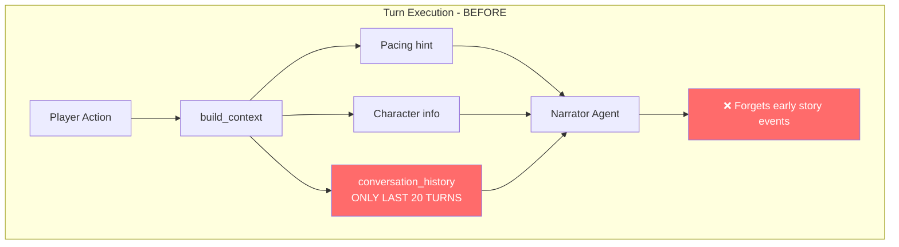
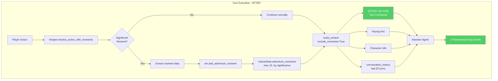
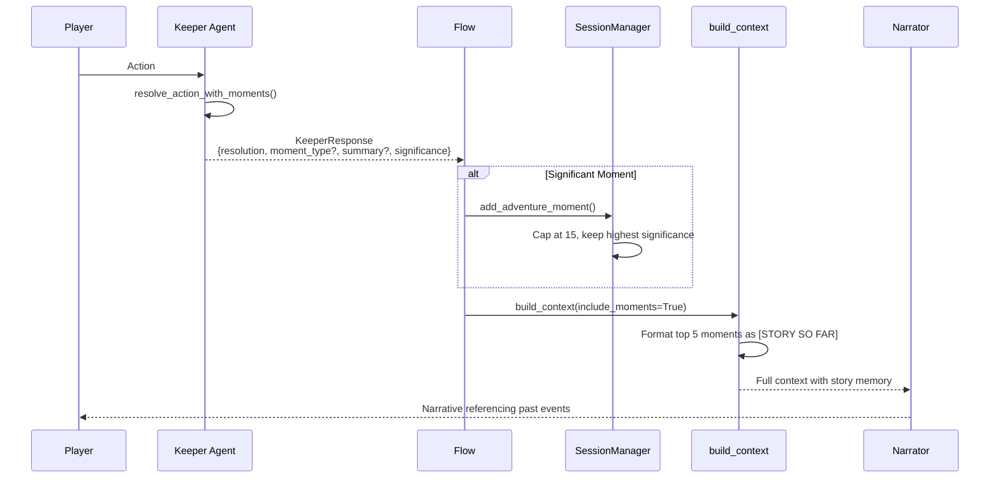
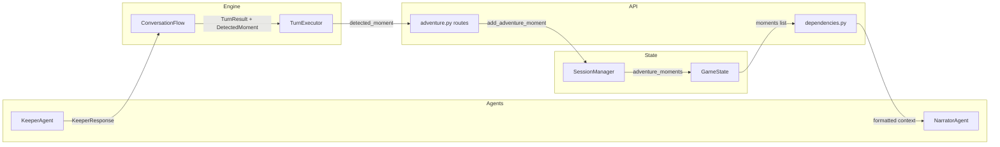

# Design: Adventure Moments for Narrator Memory

**Date**: 2026-01-09
**Status**: Proposed
**Author**: AI Assistant

## Problem Statement

The narrator forgets story details because `conversation_history` is truncated to 20 turns in `SessionManager.add_exchange()`:

```python
if len(state.conversation_history) > 20:
    state.conversation_history = state.conversation_history[-20:]  # TRUNCATION
```

**Impact on 50-turn adventures:**
- Turn 21: Turns 1-10 permanently deleted
- Turn 30: Quest introduction lost (turns 1-20 gone)
- Turn 50: Only turns 31-50 remain - **60% of story forgotten**

**What gets forgotten:**
- NPC names and dialogue from early game
- Quest introduction and objectives
- World-building details (locations, factions)
- Character backstory context from creation
- Plot setup and foreshadowing

## Solution

Have the **Keeper agent return moment metadata** alongside mechanical resolution using Pydantic structured output (same pattern as `NarratorResponse`), then include moments in narrator context.

**Key insight:** The `AdventureMoment` model and `SessionManager.add_adventure_moment()` already exist but are never called.

## Design Decisions

| Decision | Choice | Rationale |
|----------|--------|-----------|
| Moment Detection | **Keeper LLM-based** | Keeper already analyzes actions; let it detect significance |
| Pattern | Structured output (`KeeperResponse`) | Matches existing `NarratorResponse` pattern |
| Context Integration | Modify `build_context()` | Consistent with existing pacing pattern |
| Moment Cap | 15 stored, 5 in context | Balance memory vs relevance |

## Architecture

### Current Flow (Problem)



### Proposed Flow (Solution)



### Data Flow



### Component Interaction



## Existing Infrastructure (Already Built)

These components exist but are **never called**:

### AdventureMoment Model (`src/state/models.py:122-138`)
```python
class AdventureMoment(BaseModel):
    turn: int
    type: str  # "combat_victory", "discovery", "choice", "npc_interaction"
    summary: str
    significance: float = Field(default=0.5, ge=0.0, le=1.0)
```

### GameState Field (`src/state/models.py:264`)
```python
adventure_moments: list[AdventureMoment] = Field(default_factory=list)
```

### SessionManager Method (`src/state/session_manager.py:402-416`)
```python
async def add_adventure_moment(self, session_id: str, moment: AdventureMoment) -> None:
    """Add significant moment to adventure for epilogue generation."""
    state = await self._backend.get(session_id)
    if state:
        state.adventure_moments.append(moment)
        await self._backend.update(session_id, state)
```

### EpilogueAgent Usage (`src/agents/epilogue.py:125-151`)
Already formats and uses `adventure_moments` for personalized endings - falls back to history extraction if empty.

## Moment Types (Keeper Decides)

| Type | Description |
|------|-------------|
| `combat_victory` | Player defeats enemy |
| `combat_defeat` | Player falls in battle |
| `critical_success` | Exceptional roll/outcome |
| `critical_failure` | Dramatic failure |
| `discovery` | Major revelation |
| `achievement` | Goal/objective completed |
| `turning_point` | Significant story shift |

## Implementation Steps

### Step 1: Create KeeperResponse Pydantic Model
**File**: `src/agents/keeper.py`

Uses the same Pydantic structured output pattern as `NarratorResponse`:

```python
from pydantic import BaseModel, Field

class KeeperResponse(BaseModel):
    """Structured response from Keeper with optional moment detection.

    Uses CrewAI's output_pydantic for structured LLM output, matching
    the pattern established by NarratorResponse.
    """
    resolution: str = Field(
        description="Numbers-first mechanical resolution. Under 10 words. "
        "Example: '14. Hits. 6 damage.' or 'DC 15. Rolled 12. Fails.'"
    )
    moment_type: str | None = Field(
        default=None,
        description="If this is a SIGNIFICANT moment, the type: "
        "'combat_victory', 'combat_defeat', 'critical_success', "
        "'critical_failure', 'discovery', 'achievement', 'turning_point'. "
        "None if routine action."
    )
    moment_summary: str | None = Field(
        default=None,
        description="If significant, a brief 5-10 word summary of what happened. "
        "Example: 'Defeated the goblin chief in single combat'"
    )
    moment_significance: float = Field(
        default=0.5,
        ge=0.0,
        le=1.0,
        description="How significant is this moment? 0.0=routine, 1.0=climactic. "
        "Combat victories ~0.8, discoveries ~0.7, critical hits ~0.9"
    )
```

### Step 2: Add resolve_action_with_moments() Method
**File**: `src/agents/keeper.py`

New method using CrewAI's `output_pydantic` parameter (same pattern as Narrator):

```python
def resolve_action_with_moments(
    self, action: str, context: str = "", difficulty: int = 12
) -> KeeperResponse:
    """Resolve action AND detect if it's a significant moment.

    Uses structured Pydantic output for reliable moment extraction.
    """
    task_config = load_task_config("resolve_action_with_moments")
    description = task_config.description.format(
        action=action,
        difficulty=difficulty,
        context=context,
    )

    task = Task(
        description=description,
        expected_output=task_config.expected_output,
        agent=self.agent,
        output_pydantic=KeeperResponse,  # Structured output!
    )

    result = task.execute_sync()
    return result.pydantic  # Returns KeeperResponse instance
```

### Step 3: Update Keeper Task YAML
**File**: `src/config/tasks.yaml`

Add new task `resolve_action_with_moments`:
```yaml
resolve_action_with_moments:
  description: |
    The player attempts: "{action}"
    Context: {context}

    1. Determine mechanical outcome (dice if needed). Numbers first, under 10 words.
    2. Is this a SIGNIFICANT MOMENT? (combat victory, critical hit, major discovery, turning point)
       - If yes: provide moment_type, brief summary, significance (0.0-1.0)
       - If no: leave moment fields null
  expected_output: "Mechanical resolution with optional moment detection"
  agent: keeper
```

### Step 4: Create Moment Utilities
**File**: `src/engine/moments.py` (NEW)

```python
def format_moments_for_context(moments: list[AdventureMoment], max_count: int = 5) -> str:
    """Format top moments chronologically for LLM context."""

def build_moment_from_keeper(
    keeper_response: KeeperResponse,
    turn: int
) -> AdventureMoment | None:
    """Convert KeeperResponse to AdventureMoment if significant."""
```

### Step 5: Update Session Manager
**File**: `src/state/session_manager.py`

- Add `MAX_ADVENTURE_MOMENTS = 15` constant
- Modify `add_adventure_moment()` to cap at max, keeping highest significance

### Step 6: Update Flow to Extract Moments
**File**: `src/engine/flow.py`

In `execute_agents()`, when Keeper responds:
```python
if agent_name == "keeper":
    response = agent.resolve_action_with_moments(action, context)
    content = response.resolution

    if response.moment_type:
        moment = build_moment_from_keeper(response, turn)
        # Store via session manager
```

### Step 7: Update build_context()
**File**: `src/api/dependencies.py`

- Add `include_moments: bool = False` parameter
- When enabled, prepend `[STORY SO FAR]` with formatted moments

### Step 8: Enable Moments in Adventure Routes
**File**: `src/api/routes/adventure.py`

- Pass `include_moments=True` to `build_context()` in `process_action()`

### Step 9: Tests

**File**: `tests/test_keeper.py` (ADD)
- `test_resolve_action_with_moments_returns_structured_response`
- `test_significant_action_includes_moment_data`
- `test_routine_action_has_no_moment`

**File**: `tests/test_moments.py` (NEW)
- `test_format_moments_for_context_empty_list`
- `test_format_moments_for_context_respects_max`
- `test_format_moments_chronological_order`
- `test_build_moment_from_keeper_creates_moment`
- `test_build_moment_from_keeper_returns_none_when_no_moment`

**File**: `tests/test_session_manager.py` (ADD)
- `test_add_adventure_moment_stores_moment`
- `test_add_adventure_moment_caps_at_max`
- `test_add_adventure_moment_keeps_highest_significance`

## Files to Modify

| File | Change |
|------|--------|
| `src/agents/keeper.py` | Add `KeeperResponse`, `resolve_action_with_moments()` |
| `src/config/tasks.yaml` | Add `resolve_action_with_moments` task |
| `src/engine/moments.py` | NEW - formatting and conversion utils |
| `src/engine/__init__.py` | Export moments module |
| `src/engine/flow.py` | Extract moments from Keeper response |
| `src/state/session_manager.py` | Add capping logic |
| `src/api/dependencies.py` | Add `include_moments` param |
| `src/api/routes/adventure.py` | Enable `include_moments=True` |
| `tests/test_keeper.py` | Add structured response tests |
| `tests/test_moments.py` | NEW - unit tests |
| `tests/test_session_manager.py` | Add moment capping tests |

## Verification

1. **Unit tests**: `uv run pytest tests/test_keeper.py tests/test_moments.py -v`
2. **Session manager tests**: `uv run pytest tests/test_session_manager.py -v`
3. **Full test suite**: `uv run pytest --cov=src`
4. **Manual E2E test**:
   - Start game, trigger combat and win
   - Check logs for Keeper returning moment metadata
   - Progress past turn 25
   - Verify narrator context includes `[STORY SO FAR]`
   - Check epilogue references adventure moments

## Expected Context Output

After turn 20+, narrator context will include:
```
[STORY SO FAR]
- Turn 5 (combat_victory): Defeated the cave goblin after fierce battle
- Turn 12 (discovery): Uncovered the secret passage behind the waterfall
- Turn 18 (achievement): Retrieved the ancient artifact from the temple
```

This provides persistent story memory even after conversation_history truncation.
