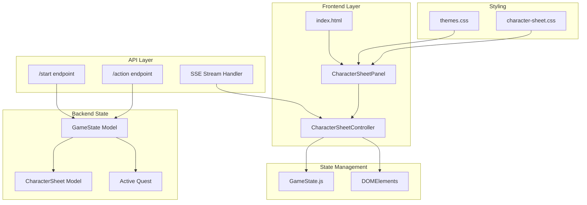
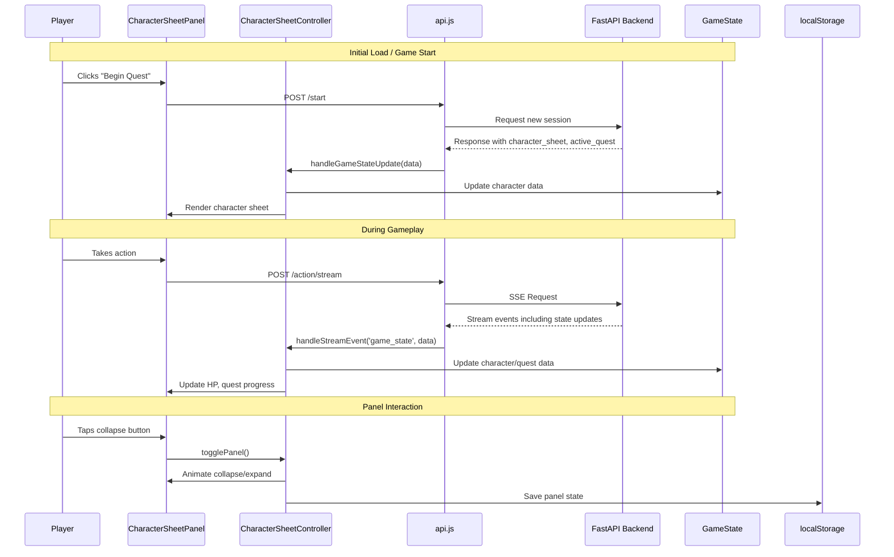

# Character Sheet Display - Design Document

**Status: IMPLEMENTED ✅**

Technical design document for the Pocket Portals character sheet display feature, covering UI components, data flow, theming integration, and mobile-first responsive design.

## Implementation Status

| Phase | Status | Notes |
|-------|--------|-------|
| Phase 1: HTML Structure and Basic CSS | ✅ Complete | `static/index.html`, `static/css/character-sheet.css` |
| Phase 2: JavaScript Controller | ✅ Complete | `static/js/character-sheet.js` |
| Phase 3: API Integration | ✅ Complete | `CharacterSheetData` model, SSE events |
| Phase 4: Theme Integration | ✅ Complete | All 4 themes tested |
| Phase 5: Testing and Polish | ✅ Complete | E2E tests 11-14 passing |

**Key Implementation Details**:
- Frontend component receives character data via API response and SSE `game_state` event
- CharacterBuilderAgent generates intelligent stats from interview conversation
- CharacterSheetData Pydantic model added to `src/api/main.py` for API responses
- Both skip mechanisms (`/start?skip_creation=true` and typing "skip") return character data
- E2E screenshots: `docs/e2e-screenshots/11-14*.png`

## Overview

The Character Sheet Display feature provides players with an accessible, collapsible panel to view their character's essential information during gameplay. This includes stats (STR, DEX, CON, INT, WIS, CHA with modifiers), HP tracking, active quest details, and character identity (name, race, class).

### Business Value

- **Player Engagement**: Immediate access to character information increases immersion and reduces cognitive load
- **Game Transparency**: Clear display of stats helps players understand mechanical outcomes (dice rolls, combat results)
- **Quest Tracking**: Visible quest objectives keep players focused on their goals
- **Accessibility**: Mobile-first design ensures the feature works across all device sizes

### Key Features

- **Character Identity**: Name, race, class, level display
- **Ability Scores**: Six core stats with computed modifiers
- **HP Tracking**: Current/max HP with visual indicator
- **Quest Display**: Active quest title and objectives with completion status
- **Collapsible Panel**: Space-efficient UI that can be minimized when not needed
- **Theme Integration**: Consistent styling across all 5 themes (RPG, Midnight, Mono, iOS)

## Requirements

### Functional Requirements

| ID | Requirement | Priority |
|----|-------------|----------|
| FR-1 | Display character name, race, class, and level | Must Have |
| FR-2 | Display all 6 ability scores (STR, DEX, CON, INT, WIS, CHA) with modifiers | Must Have |
| FR-3 | Display current HP / max HP with visual progress bar | Must Have |
| FR-4 | Display active quest title and description | Must Have |
| FR-5 | Display quest objectives with completion checkmarks | Should Have |
| FR-6 | Collapsible/expandable panel with smooth animation | Must Have |
| FR-7 | Persist collapsed/expanded state across page interactions | Nice to Have |
| FR-8 | Update character sheet data in real-time as game state changes | Must Have |

### Non-Functional Requirements

| ID | Requirement | Target |
|----|-------------|--------|
| NFR-1 | Mobile-first responsive design | Works on 320px+ viewports |
| NFR-2 | Touch-friendly tap targets | Minimum 44px touch targets |
| NFR-3 | Theme consistency | Matches all 5 existing themes |
| NFR-4 | Accessibility | WCAG 2.1 AA compliance |
| NFR-5 | Performance | No layout shifts, smooth 60fps animations |
| NFR-6 | Load time impact | <5ms additional render time |

## Architecture

### Component Diagram



### Component Responsibilities

| Component | Responsibility |
|-----------|----------------|
| `CharacterSheetPanel` | HTML structure for the collapsible character sheet display |
| `CharacterSheetController` | JavaScript controller for state management and UI updates |
| `character-sheet.css` | Component-specific styles with theme variable integration |
| `GameState.js` | Extended to track character sheet and quest data client-side |
| `api.js` | Extended to parse and propagate character data from API responses |

### Data Flow Diagram



## Data Models

### Frontend Character Data Structure

The frontend needs to track the following data from the backend `CharacterSheet` and `GameState` models:

```javascript
// Extended GameState for character sheet display
const GameState = {
    // ... existing fields ...

    // Character Sheet Data
    characterSheet: {
        name: string,           // e.g., "Thorin"
        race: string,           // e.g., "dwarf"
        characterClass: string, // e.g., "fighter"
        level: number,          // 1-20
        stats: {
            strength: number,     // 3-18
            dexterity: number,
            constitution: number,
            intelligence: number,
            wisdom: number,
            charisma: number
        },
        currentHp: number,      // Current hit points
        maxHp: number,          // Maximum hit points
        equipment: string[],    // List of items
        backstory: string       // Character background
    },

    // Active Quest Data
    activeQuest: {
        id: string,
        title: string,
        description: string,
        objectives: [
            {
                id: string,
                description: string,
                isCompleted: boolean
            }
        ],
        status: 'active' | 'completed' | 'failed'
    }
};
```

### Backend Data Sources

From `src/state/character.py`:

```python
class CharacterSheet(BaseModel):
    name: str                    # 1-50 characters
    race: CharacterRace          # HUMAN, ELF, DWARF, HALFLING, DRAGONBORN, TIEFLING
    character_class: CharacterClass  # FIGHTER, WIZARD, ROGUE, CLERIC, RANGER, BARD
    level: int = 1               # 1-20
    stats: CharacterStats        # STR, DEX, CON, INT, WIS, CHA (3-18 each)
    current_hp: int = 20
    max_hp: int = 20
    equipment: list[str]
    backstory: str
```

From `src/state/models.py`:

```python
class Quest(BaseModel):
    id: str
    title: str
    description: str
    objectives: list[QuestObjective]
    status: QuestStatus  # ACTIVE, COMPLETED, FAILED
```

### Modifier Calculation

Ability modifiers are calculated using the D&D 5e formula:

```javascript
function calculateModifier(score) {
    return Math.floor((score - 10) / 2);
}

// Examples:
// score 18 -> +4
// score 14 -> +2
// score 10 -> +0
// score 8  -> -1
// score 6  -> -2
```

## UI Design

### Desktop Layout

```
+-----------------------------------------------------------------------+
|  [Header with Turn Counter and Quest Title]                           |
+-----------------------------------------------------------------------+
|                                                                       |
|  +---------------------------+  +-----------------------------------+ |
|  | CHARACTER SHEET      [-] |  |                                   | |
|  +---------------------------+  |     [Story/Chat Area]             | |
|  | Thorin                    |  |                                   | |
|  | Dwarf Fighter Lv. 1       |  |                                   | |
|  +---------------------------+  |                                   | |
|  | HP: [========--] 16/20    |  |                                   | |
|  +---------------------------+  |                                   | |
|  | STR 16 (+3) | DEX 12 (+1) |  |                                   | |
|  | CON 14 (+2) | INT 10 (+0) |  |                                   | |
|  | WIS 13 (+1) | CHA  8 (-1) |  |                                   | |
|  +---------------------------+  |                                   | |
|  | QUEST: The Missing Sword  |  |                                   | |
|  | [x] Find the blacksmith   |  |                                   | |
|  | [ ] Search the ruins      |  |                                   | |
|  +---------------------------+  +-----------------------------------+ |
|                                                                       |
|  [Choices Section / Input Area]                                       |
+-----------------------------------------------------------------------+
```

### Mobile Layout (Collapsed)

```
+---------------------------+
| [Header]              [=] |
+---------------------------+
|                           |
| [Character Sheet Toggle]  |
| Thorin - 16/20 HP    [v] |
|                           |
+---------------------------+
|                           |
|    [Story/Chat Area]      |
|                           |
|                           |
+---------------------------+
| [Bottom Sheet - Choices]  |
+---------------------------+
```

### Mobile Layout (Expanded)

```
+---------------------------+
| [Header]              [=] |
+---------------------------+
| CHARACTER SHEET       [^] |
+---------------------------+
| Thorin                    |
| Dwarf Fighter Lv. 1       |
+---------------------------+
| HP: [==========-] 16/20   |
+---------------------------+
| STR 16 (+3) | DEX 12 (+1) |
| CON 14 (+2) | INT 10 (+0) |
| WIS 13 (+1) | CHA  8 (-1) |
+---------------------------+
| QUEST: The Missing Sword  |
| [x] Find the blacksmith   |
| [ ] Search the ruins      |
+---------------------------+
|    [Story/Chat Area]      |
+---------------------------+
| [Bottom Sheet - Choices]  |
+---------------------------+
```

### Theme Integration

The character sheet panel must integrate with all 5 existing themes using CSS custom properties:

| Theme | Accent Color | Font Style | Border Style |
|-------|--------------|------------|--------------|
| RPG Classic | Gold (#f7d354) | Press Start 2P | Solid 8px radius |
| Midnight Minimal | White | Playfair Display | No radius |
| Monospace | White | IBM Plex Mono | No radius, underline |
| iOS Dark | White | DM Sans | 16px radius |

Theme-specific overrides will be handled via `[data-theme="xxx"]` selectors.

## Implementation Plan

### Phase 1: HTML Structure and Basic CSS (2 hours)

| Task | Description | Estimate |
|------|-------------|----------|
| 1.1 | Add character sheet panel HTML to `index.html` | 30 min |
| 1.2 | Create `character-sheet.css` with base styles | 45 min |
| 1.3 | Add responsive breakpoints for mobile/desktop | 30 min |
| 1.4 | Implement collapse/expand animation | 15 min |

### Phase 2: JavaScript Controller (2 hours)

| Task | Description | Estimate |
|------|-------------|----------|
| 2.1 | Create `character-sheet.js` controller module | 30 min |
| 2.2 | Extend `GameState` with character data fields | 15 min |
| 2.3 | Add DOM element references to `initDOMElements()` | 15 min |
| 2.4 | Implement `updateCharacterSheet()` function | 30 min |
| 2.5 | Implement `updateActiveQuest()` function | 30 min |

### Phase 3: API Integration (1.5 hours)

| Task | Description | Estimate |
|------|-------------|----------|
| 3.1 | Extend API response parsing in `handleStreamEvent()` | 30 min |
| 3.2 | Add `game_state` event handling with character data | 30 min |
| 3.3 | Update `startNewAdventure()` to initialize character sheet | 30 min |

### Phase 4: Theme Integration (1 hour)

| Task | Description | Estimate |
|------|-------------|----------|
| 4.1 | Add `[data-theme]` overrides in `character-sheet.css` | 30 min |
| 4.2 | Test across all 5 themes | 30 min |

### Phase 5: Testing and Polish (1.5 hours)

| Task | Description | Estimate |
|------|-------------|----------|
| 5.1 | Write unit tests for modifier calculation | 15 min |
| 5.2 | Write integration tests for data flow | 30 min |
| 5.3 | Add E2E tests with Playwright | 30 min |
| 5.4 | Accessibility audit and fixes | 15 min |

**Total Estimated Time: 8 hours**

### File Changes Summary

| File | Change Type | Description |
|------|-------------|-------------|
| `static/index.html` | Modify | Add character sheet panel HTML structure |
| `static/css/character-sheet.css` | Create | New component styles |
| `static/js/character-sheet.js` | Create | New controller module |
| `static/js/game-state.js` | Modify | Add character/quest state fields |
| `static/js/api.js` | Modify | Parse character data from API responses |
| `static/js/main.js` | Modify | Initialize CharacterSheetController |
| `tests/js/character-sheet.test.js` | Create | Unit tests for new functionality |

## Risks and Mitigations

### Risk 1: API Response Size Increase

**Risk**: Including full character sheet in every API response increases payload size.

**Mitigation**:
- Only include character data on initial `/start` response and when changes occur
- Use SSE events to send incremental updates (e.g., HP changes only)
- Character sheet data is ~500 bytes, minimal impact on modern networks

### Risk 2: Layout Shift on Mobile

**Risk**: Expanding character sheet may cause jarring layout shifts.

**Mitigation**:
- Use fixed height for collapsed state
- Animate height changes smoothly with CSS transitions
- Consider using overlay mode on mobile rather than pushing content

### Risk 3: Theme Inconsistency

**Risk**: Character sheet may not match theme aesthetics perfectly.

**Mitigation**:
- Use only existing CSS custom properties (`--theme-*` variables)
- Review each theme during implementation
- Add theme-specific overrides only where necessary

### Risk 4: State Synchronization

**Risk**: Client-side character data may become stale or out of sync with server.

**Mitigation**:
- Always trust server as source of truth
- Update client state on every API response
- Add visual indicator for stale data (optional)

## Testing Strategy

### Unit Tests

```javascript
// tests/js/character-sheet.test.js

describe('CharacterSheetController', () => {
    describe('calculateModifier', () => {
        it('returns +4 for score of 18', () => {
            expect(calculateModifier(18)).toBe(4);
        });
        it('returns 0 for score of 10', () => {
            expect(calculateModifier(10)).toBe(0);
        });
        it('returns -1 for score of 8', () => {
            expect(calculateModifier(8)).toBe(-1);
        });
    });

    describe('formatModifier', () => {
        it('adds + prefix for positive modifiers', () => {
            expect(formatModifier(3)).toBe('+3');
        });
        it('no prefix for zero', () => {
            expect(formatModifier(0)).toBe('0');
        });
        it('includes - for negative modifiers', () => {
            expect(formatModifier(-2)).toBe('-2');
        });
    });

    describe('updateCharacterSheet', () => {
        it('updates DOM elements with character data', () => {
            const mockData = {
                name: 'Thorin',
                race: 'dwarf',
                characterClass: 'fighter',
                level: 1,
                stats: { strength: 16, dexterity: 12, constitution: 14, intelligence: 10, wisdom: 13, charisma: 8 },
                currentHp: 16,
                maxHp: 20
            };
            updateCharacterSheet(mockData);
            expect(document.getElementById('char-name').textContent).toBe('Thorin');
            expect(document.getElementById('char-hp-current').textContent).toBe('16');
        });
    });
});
```

### Integration Tests

```javascript
describe('Character Sheet API Integration', () => {
    it('parses character sheet from /start response', async () => {
        const response = await fetch('/start?shuffle=false');
        const data = await response.json();

        // After character creation completes, character_sheet should be populated
        expect(data.session_id).toBeDefined();
    });

    it('updates character sheet on combat HP change', async () => {
        // Start game, create character, enter combat, take damage
        // Verify HP display updates correctly
    });
});
```

### E2E Tests (Playwright)

```javascript
// tests/e2e/character-sheet.spec.js

test.describe('Character Sheet Display', () => {
    test('displays character info after creation', async ({ page }) => {
        await page.goto('/');
        await page.click('#begin-btn');

        // Complete character creation...

        await expect(page.locator('#character-sheet-panel')).toBeVisible();
        await expect(page.locator('#char-name')).toHaveText(/\w+/);
    });

    test('collapses and expands on toggle click', async ({ page }) => {
        // ... setup

        await page.click('#char-sheet-toggle');
        await expect(page.locator('#character-sheet-content')).not.toBeVisible();

        await page.click('#char-sheet-toggle');
        await expect(page.locator('#character-sheet-content')).toBeVisible();
    });

    test('updates HP when combat damage occurs', async ({ page }) => {
        // ... enter combat scenario

        const initialHp = await page.locator('#char-hp-current').textContent();
        // Take action that causes damage
        await page.click('text=Attack the goblin');

        // Wait for HP to potentially change
        await page.waitForTimeout(2000);
        // Verify HP display is responsive to changes
    });

    test('works correctly in all themes', async ({ page }) => {
        const themes = ['rpg', 'midnight', 'mono', 'ios'];

        for (const theme of themes) {
            await page.evaluate((t) => {
                document.documentElement.setAttribute('data-theme', t);
            }, theme);

            await expect(page.locator('#character-sheet-panel')).toBeVisible();
            // Check for visual regressions (optional: screenshot comparison)
        }
    });
});
```

### Accessibility Testing

- Screen reader compatibility (NVDA, VoiceOver)
- Keyboard navigation (Tab order, Enter to toggle)
- Color contrast ratios (minimum 4.5:1 for text)
- Focus indicators visible on all interactive elements
- ARIA labels for stats grid (e.g., `aria-label="Strength: 16, modifier +3"`)

## Future Considerations

### Potential Enhancements

1. **Equipment Panel**: Expandable equipment list with item descriptions
2. **Stat History**: Show stat changes over time (buffs/debuffs)
3. **Quest Log**: Full quest history with completed quests
4. **Character Portrait**: AI-generated or selectable character avatar
5. **Experience Bar**: XP progress toward next level
6. **Skill Proficiencies**: Display class-specific skills

### Out of Scope for V1

- Character editing (name change, respec)
- Inventory management (add/remove items)
- Multiclass support
- Custom ability score generation

## References

- Backend Models: `src/state/character.py`, `src/state/models.py`
- API Endpoints: `src/api/main.py` - `/start`, `/action`, `/action/stream`
- Theme System: `static/css/themes.css`
- Existing Controllers: `static/js/controllers.js`
- State Management: `static/js/game-state.js`
- Quest System Design: `docs/design/quest-system.md`
