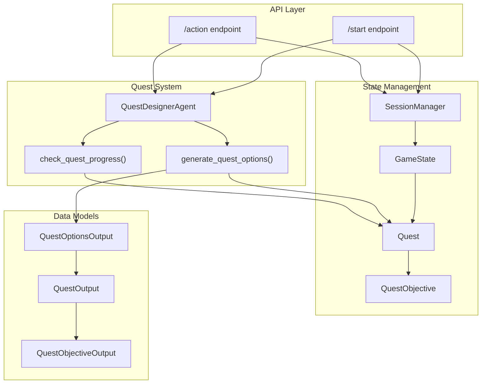
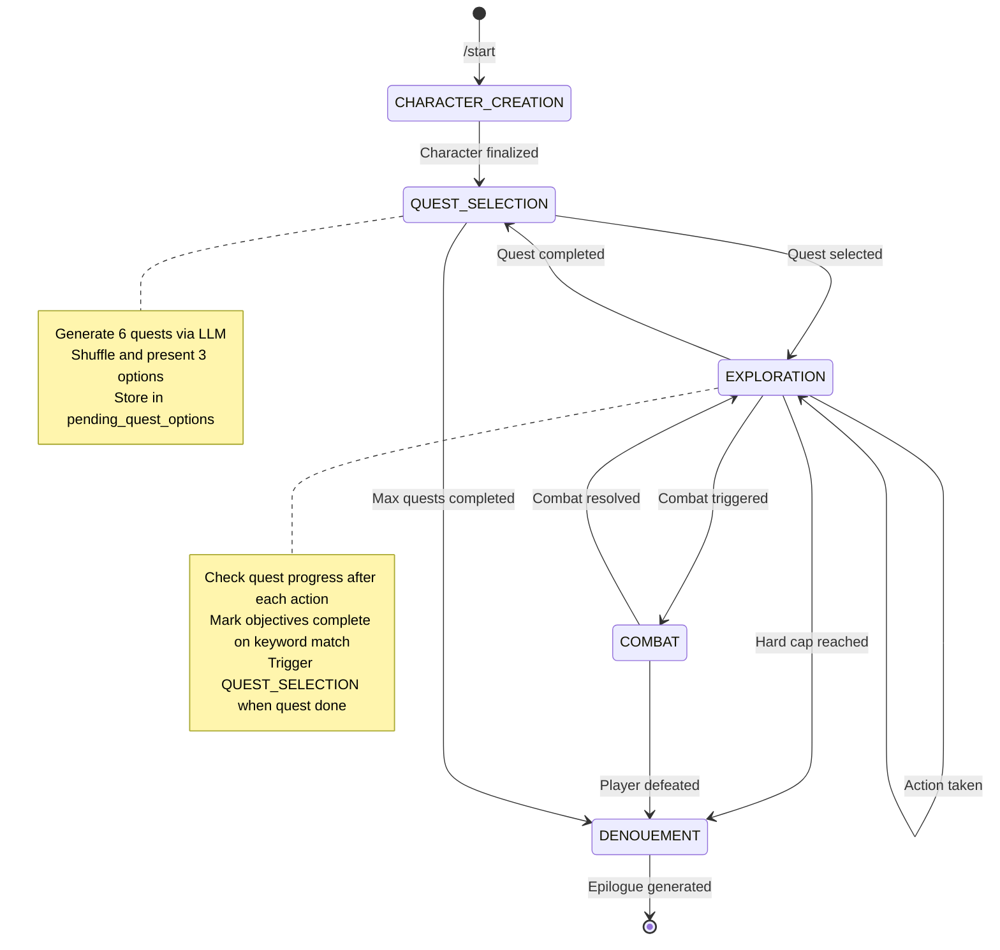
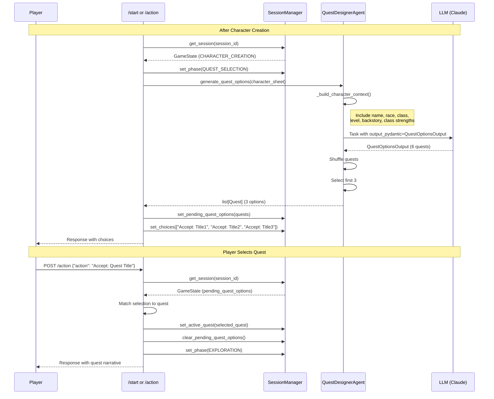
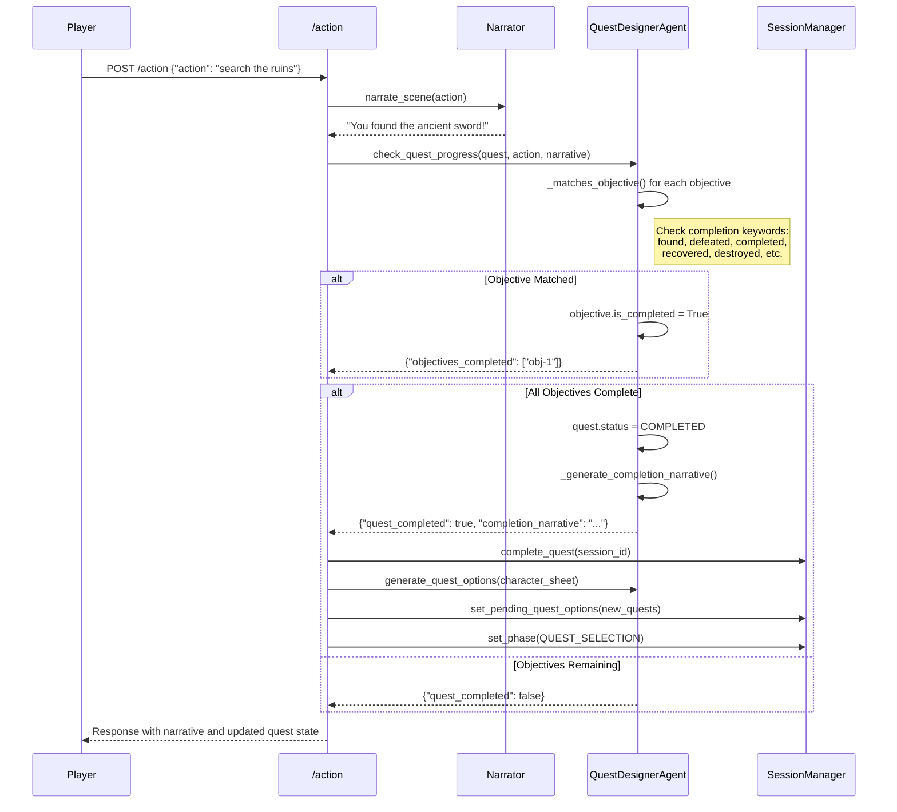

# Quest System Design Documentation

Technical design document for the Pocket Portals quest system, covering quest variety generation, progress tracking, selection flow, and class-based personalization.

## Overview

The quest system provides dynamic, personalized adventures for players through LLM-powered quest generation. The system generates six diverse quests per selection cycle, shuffles them for variety, and presents three options to the player. Quests are tailored to the character's class, race, backstory, and play history.

### Key Features

- **Quest Variety**: Six quests generated across three categories (Combat, Exploration, Social)
- **Progress Tracking**: Keyword-based objective completion detection after each action
- **Selection Flow**: Dedicated game phase for quest choice with seamless transitions
- **Personalization**: Class-specific quest types aligned with character strengths

## Architecture

### Component Diagram



### Component Responsibilities

| Component | Responsibility |
|-----------|----------------|
| `QuestDesignerAgent` | LLM-powered quest generation and progress analysis |
| `SessionManager` | Game state persistence and quest lifecycle management |
| `GameState` | Session state including active quest and pending options |
| `Quest` | Quest data model with objectives, rewards, and metadata |
| `QuestObjective` | Individual trackable objective within a quest |

## Data Models

### Quest

The primary quest data structure stored in `GameState`.

```python
class Quest(BaseModel):
    id: str                           # UUID for unique identification
    title: str                        # Display name (4-6 words)
    description: str                  # NPC quest description (30-50 words)
    objectives: list[QuestObjective]  # 1-3 trackable objectives
    status: QuestStatus = ACTIVE      # ACTIVE | COMPLETED | FAILED | ABANDONED
    rewards: str | None               # Concrete reward description
    given_by: str                     # NPC name
    location_hint: str | None         # Where to go (nearby, urgent)
```

### QuestObjective

Individual objectives tracked within a quest.

```python
class QuestObjective(BaseModel):
    id: str                           # UUID for tracking
    description: str                  # Action description (8-12 words)
    is_completed: bool = False        # Completion status
    target_count: int | None          # For quantity-based objectives
    current_count: int = 0            # Progress counter
```

### QuestStatus

Enumeration of quest lifecycle states.

```python
class QuestStatus(str, Enum):
    ACTIVE = "active"         # In progress
    COMPLETED = "completed"   # All objectives done
    FAILED = "failed"         # Failed condition met
    ABANDONED = "abandoned"   # Player abandoned
```

### QuestOptionsOutput (Pydantic Structured Output)

The LLM output schema for quest generation using CrewAI's `output_pydantic`.

```python
class QuestOptionsOutput(BaseModel):
    """Structured output for quest option generation."""
    quests: list[QuestOutput]  # Exactly 6 quests for selection

class QuestOutput(BaseModel):
    """Individual quest in the output."""
    title: str
    description: str
    objectives: list[QuestObjectiveOutput]
    rewards: str
    given_by: str
    location_hint: str

class QuestObjectiveOutput(BaseModel):
    """Objective within a quest output."""
    id: str
    description: str
```

## Game Flow

### State Machine



### Phase Transitions

| From | To | Trigger |
|------|-----|---------|
| `CHARACTER_CREATION` | `QUEST_SELECTION` | Character sheet finalized |
| `QUEST_SELECTION` | `EXPLORATION` | Player selects quest ("Accept: Quest Title" or "1"/"2"/"3") |
| `EXPLORATION` | `QUEST_SELECTION` | All objectives completed |
| `EXPLORATION` | `COMBAT` | Combat encounter triggered |
| `COMBAT` | `EXPLORATION` | Combat resolved |
| `EXPLORATION` | `DENOUEMENT` | Turn limit reached (50 turns) |

## Quest Selection Flow

### Sequence Diagram



### Selection Methods

Players can select a quest in multiple ways:

1. **By Title**: "Accept: The Missing Merchant"
2. **By Number**: "1", "2", or "3"
3. **By Description**: Natural language matching quest content

The API matches the player's input against `pending_quest_options` using title matching and numeric index parsing.

## Quest Progress Tracking

### Progress Check Flow



### Keyword-Based Completion Detection

The `_matches_objective()` method uses keyword matching to detect objective completion:

**Completion Keywords**:
- `found`, `discovered`, `located`, `retrieved`
- `defeated`, `killed`, `destroyed`, `eliminated`
- `completed`, `finished`, `accomplished`
- `recovered`, `obtained`, `acquired`
- `rescued`, `saved`, `freed`
- `delivered`, `returned`, `brought`

**Matching Logic**:
1. Extract key nouns from objective description (e.g., "sword", "dragon", "merchant")
2. Check if completion keyword appears in narrative
3. Check if objective target appears in narrative
4. Return `True` if both conditions met

```python
def _matches_objective(
    self, objective: QuestObjective, action: str, narrative: str
) -> bool:
    # Combine action and narrative for analysis
    combined = f"{action} {narrative}".lower()

    # Check for completion indicators
    completion_keywords = ["found", "defeated", "completed", "recovered", ...]
    has_completion = any(kw in combined for kw in completion_keywords)

    # Extract objective target (simplified)
    objective_words = objective.description.lower().split()
    target_words = [w for w in objective_words if len(w) > 4]
    has_target = any(w in combined for w in target_words)

    return has_completion and has_target
```

## API Endpoints

### POST /start

Initiates a new game session or resumes an existing one.

**Quest-Related Behavior**:
- If `skip_creation=true`: Creates default character and transitions to `QUEST_SELECTION`
- Calls `QuestDesignerAgent.generate_quest_options()` to populate `pending_quest_options`
- Sets choices to quest titles prefixed with "Accept: "

**Response includes**:
```json
{
  "session_id": "uuid",
  "narrative": "Welcome to the tavern...",
  "choices": [
    "Accept: The Missing Merchant",
    "Accept: Goblin Troubles",
    "Accept: The Stolen Artifact"
  ],
  "phase": "quest_selection",
  "active_quest": null,
  "pending_quest_options": [...]
}
```

### POST /action

Processes player actions including quest selection and progress tracking.

**Quest Selection Phase**:
- Matches player input to pending quest options
- Sets matched quest as `active_quest`
- Clears `pending_quest_options`
- Transitions to `EXPLORATION` phase

**Exploration Phase**:
- Calls `check_quest_progress()` after narrative generation
- Updates objective completion status
- Triggers quest completion flow if all objectives done

**Request**:
```json
{
  "session_id": "uuid",
  "action": "Accept: The Missing Merchant"
}
```

**Response includes**:
```json
{
  "narrative": "Quest narrative...",
  "choices": ["Search the warehouse", "Ask locals", "Head north"],
  "phase": "exploration",
  "active_quest": {
    "id": "quest-uuid",
    "title": "The Missing Merchant",
    "objectives": [
      {"id": "obj-1", "description": "Find clues at the warehouse", "is_completed": false}
    ],
    "status": "active"
  }
}
```

## Personalization

### Class-Specific Quest Types

The `generate_quest_options` task includes class-specific guidance in the prompt:

| Character Class | Primary Quest Types | Example Quests |
|----------------|---------------------|----------------|
| **Fighter** | Combat challenges, protection missions, arena battles, mercenary work | "Clear the Bandit Camp", "Protect the Caravan" |
| **Wizard** | Arcane mysteries, artifact recovery, magical threats, spell research | "The Corrupted Tome", "Seal the Rift" |
| **Rogue** | Stealth missions, tracking targets, theft recovery, infiltration | "The Stolen Heirloom", "Shadow the Informant" |
| **Cleric** | Undead threats, holy site protection, healing missions, exorcisms | "Cleanse the Crypt", "The Cursed Village" |
| **Ranger** | Wilderness exploration, animal rescue, tracking, elemental threats | "The Lost Expedition", "Hunt the Beast" |
| **Bard** | Social intrigue, performance challenges, information gathering, diplomacy | "The Noble's Secret", "The Festival Contest" |

### Character Context Building

The `_build_character_context()` method creates a comprehensive context string for the LLM:

```python
def _build_character_context(
    self,
    character_sheet: CharacterSheet,
    completed_quests: list[dict] | None = None,
    turn_count: int | None = None,
    game_phase: str | None = None,
) -> str:
    context_parts = [
        f"Name: {character_sheet.name}",
        f"Race: {character_sheet.race.value}",
        f"Class: {character_sheet.character_class.value}",
        f"Level: {character_sheet.level}",
    ]

    # Add backstory if present
    if character_sheet.backstory:
        context_parts.append(f"Backstory: {character_sheet.backstory}")

    # Add class-specific strengths
    class_strengths = self._get_class_strengths(character_sheet.character_class)
    context_parts.append(f"Class Strengths: {class_strengths}")

    # Add quest history if available
    if completed_quests:
        history = ", ".join(q["title"] for q in completed_quests)
        context_parts.append(f"Quest History: {history}")

    # Add game progress if available
    if turn_count is not None and game_phase:
        context_parts.append(f"Game Progress: Turn {turn_count}, Phase: {game_phase}")

    return "\n".join(context_parts)
```

### Class Strengths Mapping

```python
CLASS_STRENGTHS = {
    CharacterClass.FIGHTER: "Combat prowess, martial weapons, physical challenges",
    CharacterClass.WIZARD: "Arcane magic, spell research, magical phenomena",
    CharacterClass.ROGUE: "Stealth, cunning, lockpicking, information gathering",
    CharacterClass.CLERIC: "Divine magic, healing, undead, holy rituals",
    CharacterClass.RANGER: "Tracking, wilderness survival, animal handling",
    CharacterClass.BARD: "Social skills, performance, diplomacy, lore",
}
```

## Quest Generation

### Generation Process

1. **Context Building**: Assemble character information including class strengths
2. **Task Execution**: Run CrewAI task with `output_pydantic=QuestOptionsOutput`
3. **Shuffle**: Randomize quest order for variety
4. **Select**: Return first 3 quests from shuffled list
5. **Fallback**: On LLM failure, return pre-defined fallback quests

### Task Configuration

From `tasks.yaml`:

```yaml
generate_quest_options:
  description: |
    Generate 6 diverse quest options for this character.

    CHARACTER: {character_info}
    GAME CONTEXT: {game_context}

    CLASS-SPECIFIC QUEST TYPES (prioritize based on character class):
    - Fighter: Combat challenges, protection missions...
    - Wizard: Arcane mysteries, artifact recovery...
    ...

    Create quests across different themes:
    COMBAT (2 quests): Fighting, protecting, hunting creatures
    EXPLORATION (2 quests): Finding, investigating, retrieving items
    SOCIAL (2 quests): Helping NPCs, negotiating, escorting travelers
  expected_output: "Valid JSON with 6 diverse quest options"
  agent: quest_designer
```

### Fallback Mechanism

When LLM generation fails, the system provides fallback quests:

```python
def _create_fallback_quest(self, character_sheet: CharacterSheet) -> Quest:
    return Quest(
        id=str(uuid.uuid4()),
        title="The Missing Shipment",
        description="Innkeeper Theron needs help finding a delayed supply wagon...",
        objectives=[
            QuestObjective(
                id=str(uuid.uuid4()),
                description="Investigate the supply route for the missing wagon"
            )
        ],
        status=QuestStatus.ACTIVE,
        rewards="50 gold pieces",
        given_by="Innkeeper Theron",
        location_hint="The merchant road east of town"
    )
```

## Testing

### Test Coverage Summary

The quest system has comprehensive test coverage across three test modules:

#### test_quest_designer.py

| Test Class | Coverage |
|------------|----------|
| `TestBuildCharacterContext` | Character context building with/without backstory, class strengths, quest history, game phase |
| `TestParseQuestResult` | JSON parsing with/without markdown code blocks, error handling |
| `TestCreateQuestFromData` | Quest creation with full/minimal data, missing fields, quantity objectives |
| `TestCreateFallbackQuest` | Fallback quest field validation, unique ID generation |
| `TestMatchesObjective` | Keyword matching with various completion scenarios |
| `TestGenerateCompletionNarrative` | Narrative generation with/without rewards |
| `TestCheckQuestProgress` | Progress tracking edge cases, objective completion |
| `TestCreateQuestFromOutput` | Pydantic output to Quest conversion |
| `TestGenerateQuestOptions` | LLM integration, shuffling, fallback on failure |

#### test_quest_selection.py

| Test Class | Coverage |
|------------|----------|
| `TestQuestSelectionModels` | `QUEST_SELECTION` phase enum, `pending_quest_options` field, serialization |
| `TestQuestSelectionFlow` | Phase transitions, quest option presentation, activation, clearing options |
| `TestQuestCompletionFlow` | Quest completion triggering new selection, completed quest list management |
| `TestQuestSelectionByIndex` | Numeric selection ("1", "2", "3"), invalid selection handling |

#### test_api_quest_progress.py

| Test Class | Coverage |
|------------|----------|
| API Integration | Quest progress tracking through `/action` endpoint, objective completion, quest completion flow |

### Running Tests

```bash
# Run all quest-related tests
pytest tests/test_quest_*.py -v

# Run with coverage
pytest tests/test_quest_*.py --cov=src/agents/quest_designer --cov-report=term-missing
```

## Future Considerations

### Potential Enhancements

1. **LLM-Based Progress Detection**: Replace keyword matching with LLM analysis for more nuanced completion detection
2. **Quest Chains**: Multi-part quests that span multiple selection cycles
3. **Dynamic Difficulty**: Adjust quest complexity based on player performance
4. **Quest Reputation**: Track quest completion patterns to influence NPC interactions
5. **Branching Objectives**: Objectives with multiple completion paths
6. **Time-Limited Quests**: Quests that expire after a certain number of turns

### Known Limitations

1. **Keyword Matching**: Current objective completion relies on keyword presence, which may miss contextual completions
2. **No Partial Credit**: Quantity-based objectives are not fully implemented
3. **Single Active Quest**: Only one quest can be active at a time
4. **No Quest Abandonment**: Players cannot abandon quests (must complete or reach game end)

## References

- Source: `src/agents/quest_designer.py`
- Models: `src/state/models.py`
- Session Management: `src/state/session_manager.py`
- API: `src/api/main.py`
- Task Configuration: `src/config/tasks.yaml`
- Tests: `tests/test_quest_*.py`
