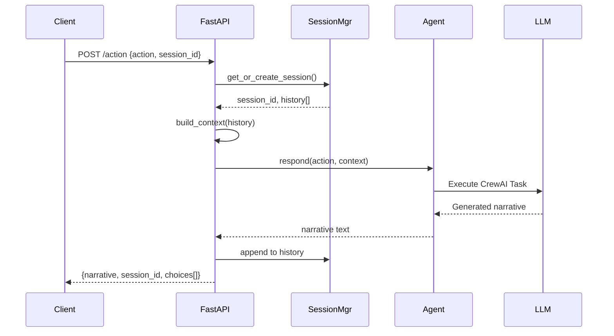

# Pocket Portals Spike: Crash Course

**Version**: 1.0 | **Branch**: `spike/one-turn` | **Date**: December 2025

---

## Executive Summary

This crash course documents everything learned from the **Pocket Portals spike** - a proof-of-concept for a solo D&D adventure generator using multi-agent AI. The spike demonstrates how to integrate **CrewAI agents** with **FastAPI**, build a **session-based conversation system**, and create an **immersive retro RPG UI**.

### What We Built

```
┌─────────────────────────────────────────────────────────────────┐
│                     POCKET PORTALS SPIKE                        │
├─────────────────────────────────────────────────────────────────┤
│  Frontend: NES.css retro UI with vanilla JavaScript            │
│  Backend: FastAPI with session management                       │
│  AI Agent: NarratorAgent using CrewAI + Claude Sonnet 4        │
│  Config: YAML-based agent and task definitions                  │
│  Deployment: Docker + Render.com ready                          │
└─────────────────────────────────────────────────────────────────┘
```

### Key Achievements

- ✅ FastAPI backend with `/health`, `/start`, `/action` endpoints
- ✅ NarratorAgent generating immersive D&D narratives
- ✅ Session-based conversation context for multi-turn continuity
- ✅ Choice system (3 predefined options + free text input)
- ✅ Starter adventure hooks with shuffle functionality
- ✅ Retro RPG UI with NES.css styling
- ✅ Docker containerization with multi-stage build
- ✅ 78% test coverage with comprehensive test suite

---

## Table of Contents

1. [Architecture Overview](#1-architecture-overview)
2. [Technology Stack](#2-technology-stack)
3. [Project Structure](#3-project-structure)
4. [Core Components Deep Dive](#4-core-components-deep-dive)
5. [API Design](#5-api-design)
6. [Agent System](#6-agent-system)
7. [Session Management](#7-session-management)
8. [Choice System](#8-choice-system)
9. [Frontend Implementation](#9-frontend-implementation)
10. [Testing Strategy](#10-testing-strategy)
11. [Development Workflow](#11-development-workflow)
12. [Deployment](#12-deployment)
13. [Patterns & Best Practices](#13-patterns--best-practices)
14. [Lessons Learned](#14-lessons-learned)
15. [Future Roadmap](#15-future-roadmap)

---

## 1. Architecture Overview

### High-Level Flow

```
┌──────────────┐     HTTP      ┌──────────────┐     CrewAI     ┌──────────────┐
│              │ ────────────► │              │ ─────────────► │              │
│   Browser    │               │   FastAPI    │                │   Claude     │
│   (NES.css)  │ ◄──────────── │   Backend    │ ◄───────────── │   Sonnet 4   │
│              │     JSON      │              │    Narrative   │              │
└──────────────┘               └──────────────┘                └──────────────┘
                                      │
                                      │ Session Store
                                      ▼
                               ┌──────────────┐
                               │  In-Memory   │
                               │  Sessions    │
                               │  (dict)      │
                               └──────────────┘
```

### Request-Response Cycle



### Design Decisions

| Decision | Choice | Rationale |
|----------|--------|-----------|
| Agent Pattern | Global Singleton | Simplest for spike; easy upgrade path |
| Session Storage | In-memory dict | No persistence needed for MVP |
| Frontend | Vanilla JS + NES.css | No build step; retro aesthetic |
| Configuration | YAML files | Declarative agent definitions |
| LLM Provider | Anthropic Claude | Quality narrative generation |

---

## 2. Technology Stack

### Backend

| Technology | Version | Purpose |
|------------|---------|---------|
| Python | 3.12 | Runtime |
| FastAPI | latest | Web framework |
| CrewAI | latest | Agent orchestration |
| Anthropic SDK | latest | Claude API client |
| Pydantic | v2 | Data validation |
| uvicorn | latest | ASGI server |

### Frontend

| Technology | Purpose |
|------------|---------|
| NES.css | Retro RPG styling |
| Press Start 2P | 8-bit font |
| RPG Awesome | Icon library |
| Vanilla JavaScript | Interactivity |

### DevOps

| Technology | Purpose |
|------------|---------|
| Docker | Containerization |
| Docker Compose | Development orchestration |
| Render.com | Production deployment |
| uv | Fast Python package management |
| ruff | Linting and formatting |
| pytest | Testing framework |
| pre-commit | Git hooks |

---

## 3. Project Structure

```
pocket-portals/
├── src/
│   ├── __init__.py
│   ├── settings.py              # Configuration management
│   │
│   ├── api/
│   │   ├── __init__.py
│   │   └── main.py              # FastAPI app & endpoints
│   │
│   ├── agents/
│   │   ├── __init__.py
│   │   └── narrator.py          # NarratorAgent implementation
│   │
│   └── config/
│       ├── __init__.py
│       ├── agents.yaml          # Agent definitions
│       └── tasks.yaml           # Task templates
│
├── static/
│   └── index.html               # Frontend (NES.css UI)
│
├── tests/
│   ├── __init__.py
│   └── test_api.py              # API & integration tests
│
├── docs/
│   ├── ONBOARDING.md            # Agent onboarding guide
│   ├── CRASH-COURSE.md          # This document
│   ├── design/                  # Design documents
│   │   ├── choice-system.md
│   │   ├── conversation-context.md
│   │   └── starter-choices.md
│   └── adr/                     # Architecture Decision Records
│       └── 001-agent-service-pattern.md
│
├── pyproject.toml               # Python project config
├── Makefile                     # Development commands
├── Dockerfile                   # Container definition
├── docker-compose.yml           # Development orchestration
├── render.yaml                  # Render.com deployment
├── tasks.md                     # Task tracking
├── product.md                   # Product requirements
└── architecture.md              # System architecture
```

---

## 4. Core Components Deep Dive

### 4.1 Settings Module (`src/settings.py`)

The settings module provides centralized configuration management using a dataclass pattern:

```python
from dataclasses import dataclass
import os
from dotenv import load_dotenv

load_dotenv()

@dataclass
class Settings:
    """Application settings."""
    anthropic_api_key: str
    log_level: str = "INFO"
    crew_verbose: bool = True

    @classmethod
    def from_env(cls) -> "Settings":
        """Load settings from environment variables."""
        api_key = os.getenv("ANTHROPIC_API_KEY")
        if not api_key:
            raise ValueError("ANTHROPIC_API_KEY environment variable not set")
        return cls(
            anthropic_api_key=api_key,
            log_level=os.getenv("LOG_LEVEL", "INFO"),
            crew_verbose=os.getenv("CREW_VERBOSE", "true").lower() == "true",
        )

# Global settings instance
settings = Settings.from_env()
```

**Key Patterns**:
- Factory method pattern for construction
- Fail-fast on missing required config
- Type-safe configuration with dataclass

### 4.2 FastAPI Application (`src/api/main.py`)

The main application module contains:

1. **Request/Response Models** (Pydantic)
2. **Session Management** (in-memory)
3. **API Endpoints** (health, start, action)
4. **Agent Lifecycle** (lifespan context)

```python
from contextlib import asynccontextmanager
from fastapi import FastAPI
from pydantic import BaseModel, Field, model_validator

# Global state
narrator: NarratorAgent | None = None
sessions: dict[str, list[dict[str, str]]] = {}
session_choices: dict[str, list[str]] = {}

@asynccontextmanager
async def lifespan(app: FastAPI):
    """Initialize narrator on startup."""
    global narrator
    if os.getenv("ANTHROPIC_API_KEY"):
        narrator = NarratorAgent()
    yield
    narrator = None

app = FastAPI(
    title="Pocket Portals API",
    description="Solo D&D adventure generator",
    version="0.1.0",
    lifespan=lifespan,
)
```

### 4.3 NarratorAgent (`src/agents/narrator.py`)

The agent wraps CrewAI's Agent and Task classes:

```python
from crewai import LLM, Agent, Task
import yaml
from pathlib import Path

CONFIG_DIR = Path(__file__).parent.parent / "config"

def load_agent_config(agent_name: str) -> dict:
    """Load agent configuration from agents.yaml."""
    with open(CONFIG_DIR / "agents.yaml") as f:
        agents = yaml.safe_load(f)
    return agents[agent_name]

class NarratorAgent:
    """Narrator agent that creates immersive scene descriptions."""

    def __init__(self) -> None:
        config = load_agent_config("narrator")

        # CrewAI's native LLM class
        self.llm = LLM(
            model="anthropic/claude-sonnet-4-20250514",
            api_key=settings.anthropic_api_key,
            temperature=0.7,
            max_tokens=1024,
        )

        self.agent = Agent(
            role=config["role"],
            goal=config["goal"],
            backstory=config["backstory"],
            verbose=config.get("verbose", True),
            allow_delegation=config.get("allow_delegation", False),
            llm=self.llm,
        )

    def respond(self, action: str, context: str = "") -> str:
        """Generate narrative response to player action."""
        task_config = load_task_config("narrate_scene")

        description = task_config["description"].format(action=action)
        if context:
            description = f"{context}\n\nCurrent action: {description}"

        task = Task(
            description=description,
            expected_output=task_config["expected_output"],
            agent=self.agent,
        )

        result = task.execute_sync()
        return str(result)
```

**Key Patterns**:
- YAML-based configuration for flexibility
- Context injection for conversation continuity
- Synchronous execution for simplicity

---

## 5. API Design

### Endpoints Summary

| Method | Endpoint | Purpose |
|--------|----------|---------|
| GET | `/health` | Health check with environment info |
| GET | `/start` | Initialize new adventure with starter choices |
| POST | `/action` | Process player action, return narrative |

### Request/Response Models

#### ActionRequest

```python
class ActionRequest(BaseModel):
    """Request model for player actions."""
    action: str | None = Field(default=None)
    choice_index: int | None = Field(default=None, ge=1, le=3)
    session_id: str | None = Field(default=None)

    @model_validator(mode="after")
    def validate_action_or_choice(self) -> "ActionRequest":
        """Ensure either action or choice_index is provided."""
        if self.action is None and self.choice_index is None:
            raise ValueError("Either 'action' or 'choice_index' must be provided")
        return self
```

#### NarrativeResponse

```python
class NarrativeResponse(BaseModel):
    """Response model containing narrative text."""
    narrative: str
    session_id: str
    choices: list[str] = Field(
        default_factory=lambda: ["Look around", "Wait", "Leave"]
    )
```

### Example API Calls

```bash
# Health check
curl http://localhost:8888/health
# {"status":"healthy","environment":"development"}

# Start new adventure
curl http://localhost:8888/start
# {"narrative":"The mists part...","session_id":"abc-123","choices":["Enter the tavern","Explore the forest","Follow the stranger"]}

# Start with shuffled choices
curl "http://localhost:8888/start?shuffle=true"

# Submit action (free text)
curl -X POST http://localhost:8888/action \
  -H "Content-Type: application/json" \
  -d '{"action":"I cautiously enter the tavern"}'

# Continue session
curl -X POST http://localhost:8888/action \
  -H "Content-Type: application/json" \
  -d '{"action":"I order a drink","session_id":"abc-123"}'

# Select a choice by index (1-3)
curl -X POST http://localhost:8888/action \
  -H "Content-Type: application/json" \
  -d '{"choice_index":2,"session_id":"abc-123"}'
```

---

## 6. Agent System

### YAML Configuration

#### Agent Definition (`src/config/agents.yaml`)

```yaml
narrator:
  role: "Narrator"
  goal: "Create immersive, sensory-rich descriptions of scenes and events"
  backstory: |
    You are a masterful storyteller and dungeon master with decades of experience.
    You excel at painting vivid pictures with words, engaging all five senses to
    bring fantasy worlds to life.

    Voice Guidelines:
    - Use flowing, cinematic sentences with rich sensory detail
    - Engage multiple senses: sight, sound, smell, touch, taste
    - Maintain second-person perspective ("You see...", "You feel...")
    - Create atmosphere through environmental details
  verbose: true
  allow_delegation: false
```

#### Task Definition (`src/config/tasks.yaml`)

```yaml
narrate_scene:
  description: |
    The player has taken this action: "{action}"

    Respond with a vivid, sensory-rich description of what happens next.

    FORMAT YOUR RESPONSE WITH CLEAR STRUCTURE:
    - Use short paragraphs (2-3 sentences each)
    - Add blank lines between paragraphs for readability
    - Lead with the most immediate sensory detail
    - End with a hook or tension point

    Keep your response to 2-3 short paragraphs.
  expected_output: "A well-structured 2-3 paragraph narrative"
  agent: narrator
```

### Future Agents (Defined but Not Implemented)

| Agent | Role | Voice |
|-------|------|-------|
| **Keeper** | Dice, HP, mechanics | Terse, numbers-first |
| **Jester** | Complications, meta-commentary | Dry, absurdist |
| **Innkeeper Theron** | Quest hooks, NPC introductions | World-weary, direct |

---

## 7. Session Management

### Architecture

```python
# In-memory session storage
sessions: dict[str, list[dict[str, str]]] = {}
session_choices: dict[str, list[str]] = {}

def get_session(session_id: str | None) -> tuple[str, list[dict[str, str]]]:
    """Get existing session or create new one."""
    if session_id and session_id in sessions:
        return session_id, sessions[session_id]
    new_id = str(uuid.uuid4())
    sessions[new_id] = []
    return new_id, sessions[new_id]
```

### Context Building

```python
def build_context(history: list[dict[str, str]]) -> str:
    """Format conversation history for LLM context."""
    if not history:
        return ""
    lines = ["Previous conversation:"]
    for turn in history:
        lines.append(f"- Player: {turn['action']}")
        lines.append(f"- Narrator: {turn['narrative']}")
    return "\n".join(lines)
```

### Session Flow

1. **New Session**: No `session_id` → Create UUID → Store empty history
2. **Existing Session**: Valid `session_id` → Retrieve history
3. **Context Injection**: Format history → Pass to LLM
4. **History Update**: Append action + narrative to session

---

## 8. Choice System

### Design Philosophy

The choice system follows **YAGNI** (You Aren't Gonna Need It):
- Simple 3-choice structure
- Free text always available
- Default fallback choices
- No complex parsing or generation

### Implementation

#### Starter Choices Pool

```python
STARTER_CHOICES_POOL = [
    "Enter the mysterious tavern",
    "Explore the dark forest path",
    "Investigate the ancient ruins",
    "Follow the hooded stranger",
    "Approach the glowing portal",
    "Descend into the forgotten dungeon",
    "Board the departing airship",
    "Answer the distress signal",
    "Accept the wizard's quest",
]
```

#### Choice Selection

```python
# In process_action endpoint
if request.choice_index is not None:
    choices = session_choices.get(session_id, DEFAULT_CHOICES)
    action = choices[request.choice_index - 1]  # 1-indexed to 0-indexed
else:
    action = request.action or ""
```

### User Experience

1. **Welcome Screen**: "Begin Quest" button
2. **After /start**: 3 starter choices displayed
3. **After /action**: 3 contextual choices + free text input
4. **Choice Interaction**: Click choice button OR type custom action

---

## 9. Frontend Implementation

### Technology Choices

| Component | Technology | Why |
|-----------|------------|-----|
| Styling | NES.css | Retro RPG aesthetic |
| Font | Press Start 2P | Authentic 8-bit look |
| Icons | RPG Awesome | Thematic iconography |
| JavaScript | Vanilla | No build step needed |

### Key UI Components

#### Message Cards

```html
<div class="message message-narrator">
    <div class="message-label"><i class="ra ra-scroll-unfurled"></i> Narrator</div>
    <div class="message-text"><p>The tavern is warm and crowded...</p></div>
</div>
```

#### Choice Buttons

```html
<div class="choices-section">
    <div class="choices-label"><i class="ra ra-forging"></i> Choose Your Path</div>
    <button class="nes-btn choice-btn">
        <i class="ra ra-axe"></i> Enter the tavern
    </button>
    <!-- ... more choices ... -->
</div>
```

#### Custom Input

```html
<div class="input-section">
    <div class="input-label"><i class="ra ra-quill-ink"></i> Write Your Own</div>
    <input type="text" class="nes-input is-dark" placeholder="What do you do?">
    <button class="nes-btn is-success">Act</button>
</div>
```

### JavaScript State Management

```javascript
// State
let sessionId = null;
let currentChoices = [];
let isLoading = false;

// API call
async function sendAction(action, choiceIndex = null) {
    if (isLoading) return;
    setLoading(true);

    const payload = {};
    if (choiceIndex) payload.choice_index = choiceIndex;
    else payload.action = action;
    if (sessionId) payload.session_id = sessionId;

    const response = await fetch('/action', {
        method: 'POST',
        headers: { 'Content-Type': 'application/json' },
        body: JSON.stringify(payload),
    });

    const data = await response.json();
    sessionId = data.session_id;
    addMessage(data.narrative, 'narrator');
    updateChoices(data.choices);

    setLoading(false);
}
```

---

## 10. Testing Strategy

### Test Categories

| Category | Purpose | Tools |
|----------|---------|-------|
| Unit Tests | Context building, validation | pytest |
| Integration Tests | API endpoints, session flow | pytest, TestClient |
| E2E Tests | Full user journeys | (future: Playwright) |

### Test Coverage: 78%

```bash
make test
# 28 tests passing
# Coverage: 78%
```

### Key Test Examples

#### Health Endpoint

```python
def test_health_endpoint_returns_200(client: TestClient) -> None:
    response = client.get("/health")
    assert response.status_code == 200
    data = response.json()
    assert data["status"] == "healthy"
```

#### Session Isolation

```python
def test_different_sessions_are_isolated(client: TestClient) -> None:
    response1 = client.post("/action", json={"action": "go north"})
    response2 = client.post("/action", json={"action": "go south"})

    session1 = response1.json()["session_id"]
    session2 = response2.json()["session_id"]

    assert session1 != session2
```

#### Choice System

```python
def test_action_accepts_choice_index(client: TestClient) -> None:
    # Get initial choices
    response1 = client.post("/action", json={"action": "enter dungeon"})
    session_id = response1.json()["session_id"]

    # Select choice by index
    payload = {"choice_index": 2, "session_id": session_id}
    response2 = client.post("/action", json=payload)

    assert response2.status_code == 200
    assert "narrative" in response2.json()
```

#### Context Building

```python
def test_build_context_formats_multiple_turns() -> None:
    history = [
        {"action": "enter tavern", "narrative": "You push open the door."},
        {"action": "order ale", "narrative": "The barkeep nods."},
    ]
    context = build_context(history)

    assert "enter tavern" in context
    assert "order ale" in context
```

---

## 11. Development Workflow

### XP Principles Applied

| Principle | Application |
|-----------|-------------|
| **TDD** | Write failing test → Minimal code → Refactor |
| **Simple Design** | In-memory sessions, global singleton |
| **YAGNI** | No auth, no persistence, no complex parsing |
| **Small Steps** | Frequent commits, incremental features |

### TDD Cycle

```bash
# 1. RED: Write failing test
make test-fast  # Should fail

# 2. GREEN: Minimal implementation
# Edit code...
make test-fast  # Should pass

# 3. REFACTOR: Clean up
# Improve code...
make test       # Full suite should pass

# 4. COMMIT
make check      # Run all quality gates
git add . && git commit -m "feat: add feature X"
```

### Makefile Commands

```bash
# Development
make install          # Install dependencies
make dev              # Start server (port 8888)
make dev-reload       # Start with hot reload

# Testing
make test             # Full test suite with coverage
make test-fast        # Stop on first failure (TDD)
make test-cov         # HTML coverage report

# Quality
make lint             # Check code style
make format           # Auto-fix style
make check            # All quality gates

# Docker
make docker-build     # Build image
make docker-run       # Run container
make docker-dev       # Development with hot reload
```

---

## 12. Deployment

### Docker

#### Dockerfile (Multi-stage)

```dockerfile
FROM python:3.12-slim as builder
WORKDIR /app
COPY pyproject.toml README.md ./
COPY src ./src
RUN pip install build && python -m build --wheel

FROM python:3.12-slim
WORKDIR /app
COPY --from=builder /app/dist/*.whl .
RUN pip install *.whl && rm *.whl
COPY static ./static
EXPOSE 8888
CMD ["uvicorn", "src.api.main:app", "--host", "0.0.0.0", "--port", "8888"]
```

#### docker-compose.yml

```yaml
version: '3.8'
services:
  app:
    build: .
    ports:
      - "8888:8888"
    env_file:
      - .env
    volumes:
      - ./src:/app/src:ro   # Hot reload for development
```

### Render.com

```yaml
# render.yaml
services:
  - type: web
    name: pocket-portals
    runtime: python
    buildCommand: pip install -e .
    startCommand: uvicorn src.api.main:app --host 0.0.0.0 --port 8888
    envVars:
      - key: ANTHROPIC_API_KEY
        sync: false
      - key: PYTHON_VERSION
        value: 3.12
```

---

## 13. Patterns & Best Practices

### 1. Global Singleton for Agent Lifecycle

**Pattern**: Initialize expensive resources once at startup.

```python
narrator: NarratorAgent | None = None

@asynccontextmanager
async def lifespan(app: FastAPI):
    global narrator
    narrator = NarratorAgent()
    yield
    narrator = None
```

**Why**: LLM connections are expensive; reuse across requests.

### 2. Pydantic Model Validators

**Pattern**: Complex validation with `model_validator`.

```python
class ActionRequest(BaseModel):
    action: str | None = None
    choice_index: int | None = Field(None, ge=1, le=3)

    @model_validator(mode="after")
    def validate_action_or_choice(self) -> "ActionRequest":
        if self.action is None and self.choice_index is None:
            raise ValueError("Either action or choice_index required")
        return self
```

**Why**: Business rules live with the model, not scattered in endpoints.

### 3. YAML-Based Agent Configuration

**Pattern**: Declarative agent definitions separate from code.

```yaml
narrator:
  role: "Narrator"
  goal: "Create immersive descriptions"
  backstory: |
    You are a masterful storyteller...
```

**Why**: Easy to adjust prompts without code changes.

### 4. Context Injection Pattern

**Pattern**: Build context string from conversation history.

```python
def build_context(history: list[dict]) -> str:
    if not history:
        return ""
    lines = ["Previous conversation:"]
    for turn in history:
        lines.append(f"- Player: {turn['action']}")
        lines.append(f"- Narrator: {turn['narrative']}")
    return "\n".join(lines)
```

**Why**: LLM needs previous context for coherent multi-turn conversations.

### 5. Graceful Degradation

**Pattern**: Handle missing dependencies gracefully.

```python
@asynccontextmanager
async def lifespan(app: FastAPI):
    global narrator
    if os.getenv("ANTHROPIC_API_KEY"):  # Only init if key available
        narrator = NarratorAgent()
    yield
    narrator = None

# In endpoint
if narrator is None:
    return NarrativeResponse(
        narrative="Narrator unavailable. Check ANTHROPIC_API_KEY.",
        session_id=session_id,
        choices=DEFAULT_CHOICES,
    )
```

**Why**: API remains functional for testing without API keys.

### 6. Response Defaults

**Pattern**: Always provide fallback values.

```python
class NarrativeResponse(BaseModel):
    narrative: str
    session_id: str
    choices: list[str] = Field(
        default_factory=lambda: ["Look around", "Wait", "Leave"]
    )
```

**Why**: UI always has choices to display.

---

## 14. Lessons Learned

### What Worked Well

| Practice | Outcome |
|----------|---------|
| **TDD** | Caught edge cases early; confident refactoring |
| **YAGNI** | Shipped fast; avoided over-engineering |
| **YAML Config** | Easy prompt iteration without code changes |
| **Simple Design** | In-memory sessions sufficient for spike |
| **NES.css** | Immediate visual appeal with minimal effort |

### Challenges Encountered

| Challenge | Solution |
|-----------|----------|
| CrewAI LLM integration | Used native `LLM` class, not langchain |
| Newline rendering in UI | Added CSS for `white-space: pre-wrap` |
| Session state for choices | Separate `session_choices` dict |
| Render.com deployment | Fixed README.md for hatchling build |

### What We'd Do Differently

1. **Start with structured output** - JSON mode from LLM instead of text parsing
2. **Add streaming earlier** - Better UX for long narratives
3. **More comprehensive logging** - Debug agent behavior in production

---

## 15. Future Roadmap

### Phase 2: Multi-Agent System

- [ ] Implement Keeper agent (dice, mechanics)
- [ ] Implement Jester agent (complications)
- [ ] Implement Innkeeper Theron (quest hooks)
- [ ] CrewAI Crew orchestration

### Phase 3: Game Mechanics

- [ ] Character sheet generation
- [ ] Dice rolling system
- [ ] Combat mechanics
- [ ] HP and resource tracking

### Phase 4: Persistence

- [ ] Save/resume adventures
- [ ] Adventure log export
- [ ] Character persistence

### Phase 5: Polish

- [ ] Streaming responses
- [ ] Sound effects
- [ ] Mobile optimization
- [ ] Accessibility improvements

---

## Quick Reference Card

### Commands

```bash
make dev          # Start server
make test         # Run tests
make check        # Quality gates
make docker-dev   # Docker development
```

### API

```bash
GET  /health              # Health check
GET  /start?shuffle=true  # New adventure
POST /action              # Player action
```

### Files to Know

```
src/api/main.py           # Endpoints
src/agents/narrator.py    # Agent
src/config/agents.yaml    # Agent config
static/index.html         # Frontend
tests/test_api.py         # Tests
```

### Environment

```bash
ANTHROPIC_API_KEY=your_key_here
LOG_LEVEL=INFO
CREW_VERBOSE=true
```

---

## Appendix: Complete Code Examples

### Minimal Agent Example

```python
from crewai import LLM, Agent, Task

llm = LLM(
    model="anthropic/claude-sonnet-4-20250514",
    api_key=os.getenv("ANTHROPIC_API_KEY"),
    temperature=0.7,
)

agent = Agent(
    role="Narrator",
    goal="Create immersive narratives",
    backstory="You are a masterful storyteller.",
    llm=llm,
)

task = Task(
    description="The player enters the tavern. Describe what they see.",
    expected_output="A vivid 2-3 paragraph scene description.",
    agent=agent,
)

result = task.execute_sync()
print(result)
```

### Minimal FastAPI Example

```python
from fastapi import FastAPI
from pydantic import BaseModel

app = FastAPI()

class ActionRequest(BaseModel):
    action: str

class NarrativeResponse(BaseModel):
    narrative: str

@app.post("/action", response_model=NarrativeResponse)
async def process_action(request: ActionRequest):
    # In real code, call agent here
    return NarrativeResponse(
        narrative=f"You {request.action}. The scene unfolds..."
    )
```

---

**End of Crash Course**

For questions or updates, see:
- `docs/ONBOARDING.md` - Detailed development guide
- `tasks.md` - Current project state
- `product.md` - Product requirements
- `architecture.md` - System architecture
