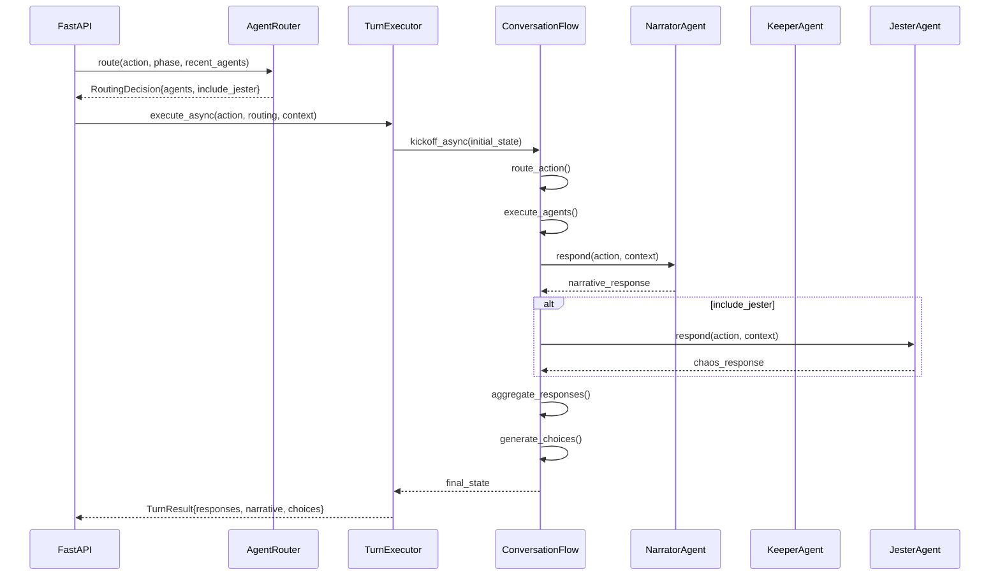

# Pocket Portals: CrewAI Crews and Flows Guide

**Version**: 1.0 | **Branch**: `main` | **Date**: December 2025

---

## Executive Summary

This guide documents the evolution from **single-agent** to **multi-agent orchestration** in Pocket Portals using **CrewAI Flows**. It covers the architecture, patterns, and implementation details for coordinating multiple AI agents through a declarative flow-based system.

### What We Built

```
┌─────────────────────────────────────────────────────────────────┐
│                 MULTI-AGENT ORCHESTRATION                        │
├─────────────────────────────────────────────────────────────────┤
│  Flow Engine: CrewAI Flow with typed Pydantic state             │
│  Agents: Narrator, Keeper, Jester (with common interface)       │
│  Router: Phase-aware agent selection with jester probability    │
│  Executor: Sync/Async turn execution with response aggregation  │
│  Streaming: SSE endpoint for real-time agent responses          │
└─────────────────────────────────────────────────────────────────┘
```

### Key Achievements

- ✅ Multi-agent orchestration with CrewAI Flows
- ✅ Typed flow state using Pydantic BaseModel
- ✅ Phase-aware agent routing (exploration, combat, dialogue)
- ✅ Jester chaos injection with probability and cooldown
- ✅ Contextual choice generation from narrative
- ✅ Async execution for FastAPI integration
- ✅ SSE streaming for real-time agent responses

---

## Table of Contents

1. [Concepts: Agents vs Crews vs Flows](#1-concepts-agents-vs-crews-vs-flows)
2. [Architecture Overview](#2-architecture-overview)
3. [Flow State Design](#3-flow-state-design)
4. [The Conversation Flow](#4-the-conversation-flow)
5. [Agent Router](#5-agent-router)
6. [Turn Executor](#6-turn-executor)
7. [Agent Interface Pattern](#7-agent-interface-pattern)
8. [Streaming Implementation](#8-streaming-implementation)
9. [Testing Strategies](#9-testing-strategies)
10. [Patterns & Best Practices](#10-patterns--best-practices)
11. [Common Issues & Solutions](#11-common-issues--solutions)
12. [Future Enhancements](#12-future-enhancements)

---

## 1. Concepts: Agents vs Crews vs Flows

### CrewAI Hierarchy

```
┌───────────────────────────────────────────────────────────────────┐
│                         CrewAI Architecture                        │
├───────────────────────────────────────────────────────────────────┤
│                                                                   │
│   ┌─────────┐         ┌─────────┐         ┌─────────┐            │
│   │  AGENT  │         │  CREW   │         │  FLOW   │            │
│   ├─────────┤         ├─────────┤         ├─────────┤            │
│   │ Single  │         │ Group   │         │ State   │            │
│   │ LLM with│   →     │ of      │   →     │ Machine │            │
│   │ role &  │         │ agents  │         │ for     │            │
│   │ tools   │         │ with    │         │ complex │            │
│   │         │         │ tasks   │         │ logic   │            │
│   └─────────┘         └─────────┘         └─────────┘            │
│                                                                   │
│   Simplest unit       Collaborative        Declarative           │
│   of intelligence     task execution       orchestration          │
│                                                                   │
└───────────────────────────────────────────────────────────────────┘
```

### When to Use Each

| Concept | Use Case | Example |
|---------|----------|---------|
| **Agent** | Single focused task | Narrator generates scene description |
| **Crew** | Sequential/parallel tasks | Research → Write → Edit pipeline |
| **Flow** | Complex orchestration with branching | Game turn with routing and error handling |

### Why We Chose Flows

For Pocket Portals, we need:
1. **Dynamic routing** - Different agents based on action type
2. **Error handling** - Graceful fallbacks on agent failures
3. **State management** - Track responses across multiple agents
4. **Branching logic** - Success vs error paths

Flows provide all of these through decorators like `@start()`, `@listen()`, and `@router()`.

---

## 2. Architecture Overview

### High-Level Flow

```
┌──────────────┐     ┌──────────────┐     ┌──────────────┐     ┌──────────────┐
│   FastAPI    │ ──► │    Turn      │ ──► │ Conversation │ ──► │   Agents     │
│   Endpoint   │     │   Executor   │     │    Flow      │     │ (N,K,J)      │
└──────────────┘     └──────────────┘     └──────────────┘     └──────────────┘
       │                    │                    │                    │
       │                    │                    │                    ▼
       │                    │                    │            ┌──────────────┐
       │                    │                    └──────────► │   Claude     │
       │                    │                                 │   Sonnet 4   │
       │                    ▼                                 └──────────────┘
       │           ┌──────────────┐
       └────────── │   Agent      │
                   │   Router     │
                   └──────────────┘
```

### Component Responsibilities

| Component | File | Responsibility |
|-----------|------|----------------|
| **ConversationFlow** | `src/engine/flow.py` | Orchestrates agent execution using CrewAI Flow decorators |
| **ConversationFlowState** | `src/engine/flow_state.py` | Typed state container using Pydantic |
| **TurnExecutor** | `src/engine/executor.py` | Simplified interface for flow execution |
| **AgentRouter** | `src/engine/router.py` | Determines which agents handle each action |
| **Agents** | `src/agents/*.py` | Individual agent implementations |

### Request Flow Sequence



---

## 3. Flow State Design

### The State Model

CrewAI Flows require a state class that inherits from `pydantic.BaseModel`. This provides:
- Type safety across flow steps
- Automatic serialization for `kickoff(inputs=...)`
- Clear documentation of state shape

```python
# src/engine/flow_state.py
from pydantic import BaseModel, Field

class ConversationFlowState(BaseModel):
    """State container for conversation flow orchestration."""

    # Session context
    session_id: str = Field(default="default")
    action: str = Field(default="")
    context: str = Field(default="")
    phase: str = Field(default="exploration")

    # Routing decisions
    recent_agents: list[str] = Field(default_factory=list)
    agents_to_invoke: list[str] = Field(default_factory=list)
    include_jester: bool = Field(default=False)
    routing_reason: str = Field(default="")

    # Results
    responses: dict[str, str] = Field(default_factory=dict)
    error: str | None = Field(default=None)
    narrative: str = Field(default="")
    choices: list[str] = Field(default_factory=list)
```

### State Lifecycle

```
1. INITIAL STATE              2. AFTER ROUTING           3. AFTER EXECUTION
┌───────────────────┐         ┌───────────────────┐      ┌───────────────────┐
│ action: "attack"  │         │ action: "attack"  │      │ action: "attack"  │
│ agents_to_invoke: │   →     │ agents_to_invoke: │  →   │ agents_to_invoke: │
│   []              │         │   ["narrator",    │      │   ["narrator",    │
│ responses: {}     │         │    "keeper"]      │      │    "keeper"]      │
│ narrative: ""     │         │ include_jester:   │      │ responses: {      │
└───────────────────┘         │   true            │      │   "narrator": "..│
                              └───────────────────┘      │   "keeper": "..."│
                                                         │ }                 │
                                                         │ narrative: "..."  │
                                                         │ choices: [...]    │
                                                         └───────────────────┘
```

### Why Pydantic Over Dataclass?

| Feature | Pydantic BaseModel | Dataclass |
|---------|-------------------|-----------|
| CrewAI Flow compatibility | ✅ Native support | ❌ Requires wrapper |
| Validation | ✅ Built-in | ❌ Manual |
| Serialization | ✅ `.model_dump()` | ⚠️ Requires `asdict()` |
| Default factories | ✅ `Field(default_factory=...)` | ✅ `field(default_factory=...)` |

---

## 4. The Conversation Flow

### Flow Definition

```python
# src/engine/flow.py
from crewai.flow.flow import Flow, listen, router, start
from src.engine.flow_state import ConversationFlowState

class ConversationFlow(Flow[ConversationFlowState]):
    """Orchestrates multi-agent conversations using CrewAI Flows."""

    DEFAULT_CHOICES = [
        "Investigate further",
        "Talk to someone nearby",
        "Move to a new location",
    ]

    def __init__(self, narrator, keeper, jester):
        super().__init__()
        self.agents = {
            "narrator": narrator,
            "keeper": keeper,
            "jester": jester,
        }
        self.router = AgentRouter()
```

### Flow Steps (Decorators)

#### Step 1: `@start()` - Entry Point

```python
@start()
def route_action(self) -> ConversationFlowState:
    """Route the player action to appropriate agents."""
    # If routing is already provided, skip re-routing
    if self.state.agents_to_invoke:
        return self.state

    phase = GamePhase(self.state.phase)
    routing = self.router.route(
        action=self.state.action,
        phase=phase,
        recent_agents=self.state.recent_agents,
    )

    self.state.agents_to_invoke = routing.agents.copy()
    self.state.include_jester = routing.include_jester
    self.state.routing_reason = routing.reason

    return self.state
```

#### Step 2: `@listen()` - Execute Agents

```python
@listen(route_action)
def execute_agents(self) -> ConversationFlowState:
    """Execute each routed agent and collect responses."""
    try:
        for agent_name in self.state.agents_to_invoke:
            agent = self.agents[agent_name]
            content = agent.respond(
                action=self.state.action,
                context=self.state.context,
            )
            self.state.responses[agent_name] = content

        if self.state.include_jester:
            jester_content = self.agents["jester"].respond(
                action=self.state.action,
                context=self.state.context,
            )
            self.state.responses["jester"] = jester_content

        return self.state

    except Exception as e:
        self.state.error = f"Agent execution failed: {str(e)}"
        return self.state
```

#### Step 3: `@router()` - Branch on Success/Error

```python
@router(execute_agents)
def check_execution_status(self) -> str:
    """Route flow based on agent execution success or failure."""
    if self.state.error is not None:
        return "error"
    return "success"
```

#### Step 4a: `@listen("success")` - Aggregate Responses

```python
@listen("success")
def aggregate_responses(self) -> ConversationFlowState:
    """Aggregate all agent responses into a coherent narrative."""
    narrative_parts = []

    for agent_name in self.state.agents_to_invoke:
        if agent_name in self.state.responses:
            narrative_parts.append(self.state.responses[agent_name])

    if self.state.include_jester and "jester" in self.state.responses:
        narrative_parts.append(self.state.responses["jester"])

    self.state.narrative = "\n\n".join(narrative_parts)
    return self.state
```

#### Step 4b: `@listen("error")` - Handle Failures

```python
@listen("error")
def handle_error(self) -> ConversationFlowState:
    """Handle agent execution errors gracefully."""
    self.state.narrative = (
        "The magical energies flicker and waver. "
        "Something went wrong in the weave of reality. "
        f"[Error: {self.state.error}]"
    )
    self.state.choices = self.DEFAULT_CHOICES
    return self.state
```

#### Step 5: `@listen()` - Generate Choices

```python
@listen(aggregate_responses)
def generate_choices(self) -> ConversationFlowState:
    """Generate contextual player choices based on the narrative."""
    try:
        narrator = self.agents.get("narrator")
        if narrator and self.state.narrative:
            choice_prompt = (
                f"Based on this scene:\n\n{self.state.narrative}\n\n"
                "Suggest exactly 3 short action choices (max 6 words each)"
            )
            response = narrator.respond(action=choice_prompt, context="")
            choices = self._parse_choices(response)
            if len(choices) >= 3:
                self.state.choices = choices[:3]
                return self.state
    except Exception:
        pass

    self.state.choices = self.DEFAULT_CHOICES
    return self.state
```

### Flow Execution Graph

```
                    ┌──────────────────┐
                    │   route_action   │
                    │    (@start)      │
                    └────────┬─────────┘
                             │
                             ▼
                    ┌──────────────────┐
                    │  execute_agents  │
                    │   (@listen)      │
                    └────────┬─────────┘
                             │
                    ┌────────┴────────┐
                    │                 │
            "success"                "error"
                    │                 │
                    ▼                 ▼
        ┌───────────────────┐  ┌──────────────┐
        │aggregate_responses│  │ handle_error │
        │    (@listen)      │  │  (@listen)   │
        └─────────┬─────────┘  └──────────────┘
                  │
                  ▼
        ┌───────────────────┐
        │ generate_choices  │
        │    (@listen)      │
        └───────────────────┘
```

---

## 5. Agent Router

### Routing Logic

The `AgentRouter` determines which agents should handle each action based on:

1. **Game Phase** - Exploration, Combat, or Dialogue
2. **Action Keywords** - Mechanical terms trigger Keeper
3. **Jester Probability** - Random chaos injection with cooldown

```python
# src/engine/router.py
@dataclass
class RoutingDecision:
    agents: list[str]
    include_jester: bool
    reason: str

class AgentRouter:
    JESTER_PROBABILITY = 0.15   # 15% chance per turn
    JESTER_COOLDOWN = 3         # Skip 3 turns after appearance
    MECHANICAL_KEYWORDS = [
        "attack", "fight", "roll", "cast", "defend",
        "dodge", "swing", "shoot", "hit", "strike",
    ]

    def route(
        self,
        action: str,
        phase: GamePhase,
        recent_agents: list[str],
    ) -> RoutingDecision:
        agents = ["narrator"]  # Always include narrator
        include_jester = False
        reason_parts = [f"{phase.value} phase"]

        # Check for mechanical keywords
        action_lower = action.lower()
        has_mechanical = any(kw in action_lower for kw in self.MECHANICAL_KEYWORDS)

        if has_mechanical or phase == GamePhase.COMBAT:
            agents.append("keeper")
            reason_parts.append("mechanical action detected")

        # Jester logic with cooldown
        if not self._is_jester_in_cooldown(recent_agents):
            if random.random() < self.JESTER_PROBABILITY:
                include_jester = True
                reason_parts.append("jester chaos injection")

        return RoutingDecision(
            agents=agents,
            include_jester=include_jester,
            reason="; ".join(reason_parts),
        )
```

### Routing Matrix

| Phase | Action | Agents | Jester? |
|-------|--------|--------|---------|
| Exploration | "look around" | narrator | Probability check |
| Exploration | "attack goblin" | narrator, keeper | Probability check |
| Combat | "dodge left" | narrator, keeper | Probability check |
| Dialogue | "ask about quest" | narrator | Probability check |

---

## 6. Turn Executor

### Purpose

The `TurnExecutor` provides a simplified interface for flow execution, hiding the complexity of state initialization and result extraction.

```python
# src/engine/executor.py
@dataclass
class TurnResult:
    responses: list[AgentResponse]
    narrative: str
    choices: list[str]

class TurnExecutor:
    def __init__(self, narrator, keeper, jester):
        self.flow = ConversationFlow(
            narrator=narrator,
            keeper=keeper,
            jester=jester,
        )

    async def execute_async(
        self,
        action: str,
        routing: RoutingDecision,
        context: str,
        session_id: str = "default",
    ) -> TurnResult:
        """Execute a turn using ConversationFlow (async version)."""
        initial_state = ConversationFlowState(
            session_id=session_id,
            action=action,
            context=context,
            phase="exploration",
            agents_to_invoke=routing.agents.copy(),
            include_jester=routing.include_jester,
            routing_reason=routing.reason,
        )

        # Execute the flow asynchronously
        final_state = await self.flow.kickoff_async(
            inputs=initial_state.model_dump()
        )

        return TurnResult(
            responses=self._build_responses(final_state),
            narrative=final_state.narrative,
            choices=final_state.choices,
        )
```

### Sync vs Async Execution

| Method | Use Case | CrewAI Method |
|--------|----------|---------------|
| `execute()` | CLI, scripts | `flow.kickoff()` |
| `execute_async()` | FastAPI endpoints | `flow.kickoff_async()` |

**Important**: CrewAI's `kickoff()` internally uses `asyncio.run()`, which fails if called from an already-running event loop (like FastAPI). Always use `kickoff_async()` in async contexts.

---

## 7. Agent Interface Pattern

### Common Interface

All agents used in the flow must implement a `respond()` method:

```python
def respond(self, action: str, context: str = "") -> str:
    """Generate response to player action.

    Args:
        action: The player's action text
        context: Optional conversation history

    Returns:
        Agent's response text
    """
```

### Agent Implementations

#### NarratorAgent

```python
class NarratorAgent:
    def respond(self, action: str, context: str = "") -> str:
        task_config = load_task_config("narrate_scene")
        description = task_config.description.format(action=action)
        if context:
            description = f"{context}\n\nCurrent action: {description}"
        task = Task(
            description=description,
            expected_output=task_config.expected_output,
            agent=self.agent,
        )
        result = task.execute_sync()
        return str(result)
```

#### KeeperAgent (Wrapper Pattern)

```python
class KeeperAgent:
    def respond(self, action: str, context: str = "") -> str:
        """Standard interface for flow compatibility."""
        return self.resolve_action(action=action, context=context)

    def resolve_action(self, action: str, context: str = "", difficulty: int = 12) -> str:
        """Original method with additional parameters."""
        # ... implementation
```

#### JesterAgent (Wrapper Pattern)

```python
class JesterAgent:
    def respond(self, action: str, context: str = "") -> str:
        """Standard interface for flow compatibility."""
        return self.add_complication(situation=action, context=context)

    def add_complication(self, situation: str, context: str = "") -> str:
        """Original method with different parameter names."""
        # ... implementation
```

---

## 8. Streaming Implementation

### SSE Endpoint

For real-time feedback during multi-agent execution:

```python
# src/api/main.py
from sse_starlette.sse import EventSourceResponse

@app.post("/action/stream")
async def process_action_stream(request: ActionRequest) -> EventSourceResponse:
    """Stream agent responses via Server-Sent Events."""

    async def event_generator():
        # Route to agents
        routing = agent_router.route(action, phase, recent_agents)

        yield {
            "event": "routing",
            "data": json.dumps({"agents": routing.agents}),
        }

        # Execute each agent and stream responses
        for agent_name in routing.agents:
            yield {
                "event": "agent_start",
                "data": json.dumps({"agent": agent_name}),
            }

            # Run in thread pool to avoid blocking
            response = await loop.run_in_executor(
                None, lambda: agent.respond(action, context)
            )

            yield {
                "event": "agent_response",
                "data": json.dumps({
                    "agent": agent_name,
                    "content": response
                }),
            }

        yield {
            "event": "complete",
            "data": json.dumps({"session_id": session_id}),
        }

    return EventSourceResponse(event_generator())
```

### SSE Events

| Event | Data | Purpose |
|-------|------|---------|
| `routing` | `{agents: [...], reason: "..."}` | Which agents will respond |
| `agent_start` | `{agent: "narrator"}` | Agent beginning to process |
| `agent_response` | `{agent: "...", content: "..."}` | Agent completed with response |
| `choices` | `{choices: [...]}` | Available next actions |
| `complete` | `{session_id: "..."}` | Stream finished |
| `error` | `{message: "..."}` | Error occurred |

### Frontend Consumption

```javascript
async function sendActionStream(action) {
    const response = await fetch('/action/stream', {
        method: 'POST',
        headers: { 'Content-Type': 'application/json' },
        body: JSON.stringify({ action, session_id }),
    });

    const reader = response.body.getReader();
    const decoder = new TextDecoder();

    while (true) {
        const { value, done } = await reader.read();
        if (done) break;

        const lines = decoder.decode(value).split('\n');
        for (const line of lines) {
            if (line.startsWith('event:')) {
                const event = line.slice(7);
            }
            if (line.startsWith('data:')) {
                const data = JSON.parse(line.slice(6));
                handleEvent(event, data);
            }
        }
    }
}
```

---

## 9. Testing Strategies

### Unit Tests for Flow State

```python
def test_flow_state_defaults():
    state = ConversationFlowState()
    assert state.session_id == "default"
    assert state.phase == "exploration"
    assert state.agents_to_invoke == []
    assert state.responses == {}

def test_flow_state_serialization():
    state = ConversationFlowState(
        action="test action",
        agents_to_invoke=["narrator"],
    )
    data = state.model_dump()
    assert data["action"] == "test action"
    assert data["agents_to_invoke"] == ["narrator"]
```

### Integration Tests for Flow

```python
def test_flow_executes_agents(mock_agents):
    flow = ConversationFlow(
        narrator=mock_agents["narrator"],
        keeper=mock_agents["keeper"],
        jester=mock_agents["jester"],
    )

    initial_state = ConversationFlowState(
        action="enter tavern",
        agents_to_invoke=["narrator"],
    )

    final_state = flow.kickoff(inputs=initial_state.model_dump())

    assert "narrator" in final_state.responses
    assert final_state.narrative != ""
```

### Testing Router Decisions

```python
def test_router_includes_keeper_for_combat_actions():
    router = AgentRouter()
    decision = router.route(
        action="I attack the goblin",
        phase=GamePhase.EXPLORATION,
        recent_agents=[],
    )
    assert "keeper" in decision.agents
    assert "mechanical action detected" in decision.reason

def test_router_jester_cooldown():
    router = AgentRouter()
    decision = router.route(
        action="look around",
        phase=GamePhase.EXPLORATION,
        recent_agents=["narrator", "jester", "narrator"],
    )
    # Jester appeared 2 turns ago, still in cooldown
    assert decision.include_jester is False
```

---

## 10. Patterns & Best Practices

### 1. State Immutability Pattern

Always return a new or modified state from flow methods:

```python
@listen(previous_step)
def my_step(self) -> ConversationFlowState:
    # Modify state
    self.state.narrative = "New narrative"
    # Return state (even if modified in place)
    return self.state
```

### 2. Error Containment

Catch exceptions in `execute_agents` and set error state:

```python
try:
    # Agent execution
except Exception as e:
    self.state.error = str(e)
    return self.state  # Router will handle
```

### 3. Common Agent Interface

Wrap specialized methods with a common `respond()` interface:

```python
def respond(self, action: str, context: str = "") -> str:
    return self.specialized_method(action, context)
```

### 4. Async-First for Web

Always use `kickoff_async()` in FastAPI endpoints:

```python
# ❌ Wrong - will fail in FastAPI
result = flow.kickoff(inputs=state.model_dump())

# ✅ Correct
result = await flow.kickoff_async(inputs=state.model_dump())
```

### 5. Thread Pool for Sync Agents

When streaming, use executor to avoid blocking:

```python
loop = asyncio.get_event_loop()
response = await loop.run_in_executor(
    None, lambda: agent.respond(action, context)
)
```

---

## 11. Common Issues & Solutions

### Issue: `asyncio.run() cannot be called from running event loop`

**Cause**: Using `flow.kickoff()` instead of `flow.kickoff_async()` in FastAPI.

**Solution**: Use the async version:
```python
result = await flow.kickoff_async(inputs=state.model_dump())
```

### Issue: Agent has no attribute 'respond'

**Cause**: Agent doesn't implement the common interface.

**Solution**: Add wrapper method:
```python
def respond(self, action: str, context: str = "") -> str:
    return self.original_method(action, context)
```

### Issue: Choices always show defaults

**Cause**: Choice parsing failing or narrator returning unexpected format.

**Solution**: Check `_parse_choices()` logic and add fallback:
```python
if len(parsed_choices) >= 3:
    return parsed_choices[:3]
return self.DEFAULT_CHOICES
```

### Issue: Jester appears too frequently

**Cause**: Cooldown not working or probability too high.

**Solution**: Check cooldown logic and adjust `JESTER_PROBABILITY`:
```python
JESTER_PROBABILITY = 0.15  # 15% base chance
JESTER_COOLDOWN = 3        # Must wait 3 turns
```

---

## 12. Future Enhancements

### Planned Features

- [ ] **LLM-level streaming**: Stream tokens as they generate using CrewAI's `stream=True`
- [ ] **Parallel agent execution**: Run independent agents concurrently
- [ ] **Agent memory**: Long-term context retention across sessions
- [ ] **Dynamic agent creation**: Create new specialized agents at runtime

### Advanced Flow Patterns

```python
# Future: Parallel execution
@listen(route_action)
async def execute_agents_parallel(self):
    tasks = [
        agent.respond_async(action, context)
        for agent in self.agents_to_invoke
    ]
    responses = await asyncio.gather(*tasks)
```

```python
# Future: LLM streaming
llm = LLM(
    model="anthropic/claude-sonnet-4-20250514",
    stream=True,
)

class StreamingFlow(Flow):
    stream = True
```

---

## Quick Reference

### File Locations

```
src/engine/
├── flow.py          # ConversationFlow class
├── flow_state.py    # ConversationFlowState model
├── executor.py      # TurnExecutor interface
└── router.py        # AgentRouter logic

src/agents/
├── narrator.py      # Scene descriptions
├── keeper.py        # Game mechanics
└── jester.py        # Chaos injection
```

### Key Classes

```python
# State
from src.engine.flow_state import ConversationFlowState

# Flow
from src.engine.flow import ConversationFlow

# Executor
from src.engine.executor import TurnExecutor, TurnResult

# Router
from src.engine.router import AgentRouter, RoutingDecision
```

### Flow Decorators

```python
from crewai.flow.flow import Flow, listen, router, start

@start()           # Entry point
@listen(step)      # Listen to step completion
@listen("string")  # Listen to router output
@router(step)      # Branch based on return value
```

---

**End of Crews and Flows Guide**

For questions or updates, see:
- `docs/guides/CRASH-COURSE.md` - Original spike documentation
- `docs/guides/ONBOARDING.md` - Development setup guide
- `docs/architecture.md` - System architecture
