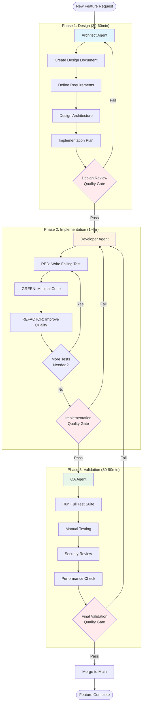
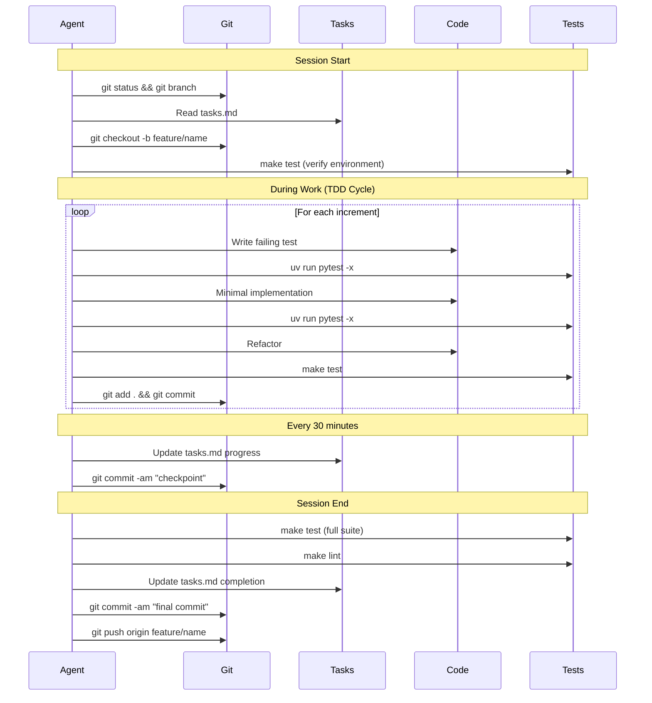
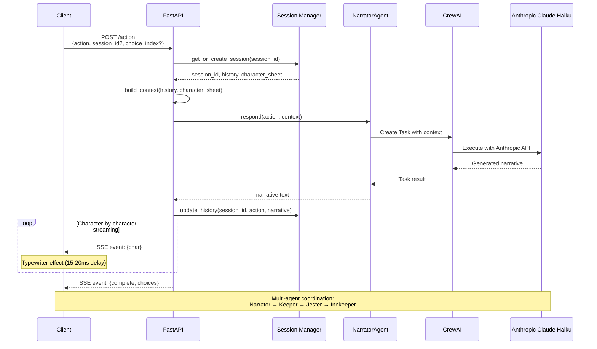

# Pocket Portals Onboarding Guide

**Purpose**: Get new developers and AI agents productive quickly on Pocket Portals with clear setup instructions, workflows, quality standards, and task tracking.

---

## Developer Setup

This section covers environment setup for new developers joining the project.

### Prerequisites

Before starting, ensure you have the following installed:

| Requirement | Version | Verification Command | Notes |
|-------------|---------|---------------------|-------|
| Python | 3.12+ | `python --version` | Python 3.11 minimum, 3.12 recommended |
| uv | Latest | `uv --version` | Fast Python package manager |
| Docker | Latest | `docker --version` | Required for Redis (optional if using memory backend) |
| Docker Compose | v2+ | `docker compose version` | Included with Docker Desktop |
| Git | Latest | `git --version` | Version control |

**Installing uv** (if not already installed):

```bash
# macOS/Linux
curl -LsSf https://astral.sh/uv/install.sh | sh

# Or with pip
pip install uv

# Or with Homebrew (macOS)
brew install uv
```

### Quick Start

Follow these steps to get a working development environment:

```bash
# 1. Clone the repository
git clone https://github.com/darth-dodo/pocket-portals.git
cd pocket-portals

# 2. Install dependencies with uv
uv sync

# 3. Set up environment variables
cp .env.example .env
# Edit .env and add your ANTHROPIC_API_KEY

# 4. Start Redis (optional - can use memory backend instead)
docker compose up -d redis

# 5. Run the development server
uv run uvicorn src.api.main:app --reload

# 6. Verify the setup
curl http://localhost:8000/health
# Expected: {"status": "healthy", ...}
```

**Without Docker (using memory backend)**:

If you prefer not to run Redis locally, you can use the in-memory session backend:

```bash
# In your .env file, set:
SESSION_BACKEND=memory
```

This is suitable for development and testing but sessions will not persist across server restarts.

### Development Workflow

#### Pre-commit Hooks

Set up pre-commit hooks to ensure code quality before each commit:

```bash
uv run pre-commit install
```

This automatically runs linting and formatting checks on staged files.

#### Running Tests

```bash
# Run all tests with coverage
uv run pytest

# Run specific test file
uv run pytest tests/test_api.py

# Run with verbose output
uv run pytest -v

# Stop on first failure (useful during TDD)
uv run pytest -x
```

#### Code Formatting

```bash
# Format code with Ruff
uv run ruff format src/ tests/

# Check for linting issues
uv run ruff check src/ tests/

# Auto-fix linting issues
uv run ruff check --fix src/ tests/
```

#### Type Checking

```bash
# Run mypy for type checking
uv run mypy src/
```

### Project Structure

```
pocket-portals/
├── src/
│   ├── agents/           # AI agent implementations (Narrator, Keeper, etc.)
│   ├── api/              # FastAPI application and endpoints
│   ├── config/           # YAML configuration for agents and tasks
│   ├── data/             # Static data files
│   ├── engine/           # Game engine (combat, mechanics)
│   ├── state/            # State management (sessions, combat state)
│   ├── utils/            # Utility functions (dice rolling, etc.)
│   └── settings.py       # Application settings
├── static/               # Static web files (HTML, CSS, JS)
├── tests/                # Test files
├── docs/                 # Documentation
│   ├── adr/              # Architecture Decision Records
│   └── guides/           # Onboarding and development guides
├── .env.example          # Example environment configuration
├── docker-compose.yml    # Docker services configuration
├── pyproject.toml        # Python project configuration
└── tasks.md              # Current project tasks and status
```

### Key Configuration

Environment variables are configured in the `.env` file:

| Variable | Description | Default | Required |
|----------|-------------|---------|----------|
| `ANTHROPIC_API_KEY` | Your Anthropic API key for Claude | - | Yes |
| `SESSION_BACKEND` | Session storage backend | `redis` | No |
| `REDIS_URL` | Redis connection URL | `redis://localhost:6379/0` | No (only if using Redis) |
| `REDIS_SESSION_TTL` | Session TTL in seconds | `86400` (24 hours) | No |
| `ENVIRONMENT` | Runtime environment | `development` | No |
| `HOST` | Server host | `0.0.0.0` | No |
| `PORT` | Server port | `8000` | No |

### Testing the Combat System

The combat system has a dedicated test page for manual testing:

```bash
# Start the server
uv run uvicorn src.api.main:app --reload

# Open in browser
open http://localhost:8000/static/combat-test.html
```

This provides an interactive UI for testing:
- Combat initiation with different enemy types
- Attack, defend, and flee actions
- HP tracking and combat resolution
- Dice roll visualization

### Makefile Commands

The project includes a Makefile for common operations:

```bash
make install          # Install dependencies with uv
make dev              # Run development server (port 8888)
make test             # Run all tests with coverage
make test-fast        # Stop on first failure
make lint             # Run linting and formatting
make check            # Run all quality gates
make docker-build     # Build Docker image
make docker-run       # Run in Docker container
make clean            # Remove build artifacts
```

### Troubleshooting

**Tests fail with "ANTHROPIC_API_KEY not set"**:
- Ensure your `.env` file contains a valid `ANTHROPIC_API_KEY`
- The key should start with `sk-ant-`

**Redis connection errors**:
- Start Redis with `docker compose up -d redis`
- Or switch to memory backend: `SESSION_BACKEND=memory` in `.env`

**Port already in use**:
- Default port is 8000 for uvicorn, 8888 for make dev
- Check for existing processes: `lsof -i :8000`
- Or specify a different port: `uv run uvicorn src.api.main:app --port 8001`

**Import errors**:
- Ensure you ran `uv sync` to install dependencies
- Check you are running commands with `uv run` prefix

---

## Agent Quick Start Checklist

**Do these 5 things first, in order**:

```bash
# 1. Verify environment (30 seconds)
make test

# 2. Read current state (2 minutes)
cat tasks.md

# 3. Check git status (10 seconds)
git status && git branch

# 4. Create feature branch (10 seconds)
git checkout -b feature/your-feature-name

# 5. Run server to verify API works (optional, 30 seconds)
make dev  # Then check http://localhost:8888/docs
```

**If any step fails, STOP and fix it before proceeding.**

| Step | Expected Result | If It Fails |
|------|-----------------|-------------|
| `make test` | All tests pass, coverage shown | Check `.env` has `ANTHROPIC_API_KEY` |
| `cat tasks.md` | See current tasks and status | File should exist in project root |
| `git status` | Clean working tree or known changes | Commit or stash pending changes |
| `git checkout -b` | New branch created | Already on branch? That's fine |
| `make dev` | Server starts on port 8888 | Check for port conflicts |

---

## What's New (Recent Changes)

**Latest Updates** - Key changes you need to know about:

### 1. Character-by-Character Streaming (Typewriter Effect)
- **What Changed**: `/action` endpoint now uses Server-Sent Events (SSE) for streaming responses
- **Why It Matters**: Better UX with progressive text display, mobile-friendly
- **Implementation**: 15-20ms delay per character for natural typing effect
- **Testing**: Use `curl -N` flag or test in browser with EventSource API
- **See**: [Character-by-Character Streaming](#character-by-character-streaming) section

### 2. Character Sheet Context Integration
- **What Changed**: Session context now includes character sheet data (name, race, class, background)
- **Why It Matters**: Agents remember character details for continuity and personalization
- **Implementation**: `build_context()` function includes character sheet when available
- **Testing**: Character info persists across conversation turns
- **See**: [Context Building with Character Sheets](#context-building-with-character-sheets) section

### 3. All Agents Use Claude 3.5 Haiku
- **What Changed**: Switched from Claude Sonnet to Claude Haiku across all agents
- **Why It Matters**: Faster responses, lower cost, sufficient quality for narrative generation
- **Implementation**: `model="anthropic/claude-3-5-haiku-20241022"` in all agent configs
- **Testing**: No changes to API contracts, just faster/cheaper responses
- **See**: [Agents](#agents) section

### 4. Mobile-First UI Improvements
- **What Changed**: Enhanced touch targets, responsive typography, better contrast
- **Why It Matters**: Better mobile experience for portrait gameplay
- **Implementation**: CSS improvements for touch-friendly 44px minimum tap targets
- **Testing**: Use browser DevTools responsive mode or test on actual mobile device
- **See**: [Mobile-First Design Notes](#mobile-first-design-notes) section

### 5. Character Creation Flow Fixes
- **What Changed**: Improved character creation state management and context handling
- **Why It Matters**: More reliable character creation with better conversation flow
- **Implementation**: Better session phase tracking and turn management
- **Testing**: Character creation completes successfully in 5-6 turns
- **See**: [Character Creation Flow](#character-creation-flow) section

### 6. Combat System Implementation
- **What Changed**: Complete D&D 5e-inspired combat mechanics added
- **Why It Matters**: Turn-based combat with real dice rolling, initiative, and dramatic battles
- **Implementation**: DiceRoller, CombatManager, 5 enemy types, attack/defend/flee actions
- **Testing**: 275 backend tests passing, frontend HUD with HP bars and action buttons
- **Cost**: ~$0.002 per combat with batched narrator summary
- **See**: [Combat System](#combat-system) section

**Quick Migration Guide**:
- If testing API manually: Use `curl -N` for streaming endpoints
- If working on agents: All use Haiku model, not Sonnet
- If building context: Include character sheet parameter when available
- If testing mobile: Check 44px touch target compliance

---

## 🧭 Decision Trees

### Which Approach Should I Use?

```
Start here: What are you doing?
│
├─► Adding a new feature?
│   └─► Use Architect → Developer → QA workflow
│       └─► See "Agent Workflow" section
│
├─► Fixing a bug?
│   └─► Is it obvious what's wrong?
│       ├─► YES → Direct fix with TDD
│       │   1. Write test that reproduces bug
│       │   2. Fix code
│       │   3. Verify test passes
│       └─► NO → Investigate first
│           1. Read related tests
│           2. Add debug logging
│           3. Write reproduction test
│           4. Fix with TDD
│
├─► Understanding the codebase?
│   └─► Read in this order:
│       1. tasks.md (current state)
│       2. docs/xp.md (development philosophy)
│       3. src/api/main.py (API structure)
│       4. tests/test_api.py (behavior specs)
│
├─► Continuing previous work?
│   └─► See "Session Recovery" section below
│
└─► Not sure what to do?
    └─► Read tasks.md → Pick a task → Ask if unclear
```

### TDD or BDD?

```
What are you implementing?
│
├─► User-facing behavior (user stories)?
│   └─► BDD: Write Gherkin scenarios first
│       Given/When/Then → Implementation
│
├─► Internal logic (functions, algorithms)?
│   └─► TDD: Write unit tests first
│       test_function_does_x() → Implementation
│
├─► API endpoint?
│   └─► Both: BDD for user scenarios, TDD for logic
│       1. BDD: Given API call, When X, Then Y
│       2. TDD: test_validation_rejects_invalid()
│
└─► Not sure?
    └─► Start with TDD (simpler, faster)
        Add BDD later if user behavior matters
```

### Which Agent Role Am I?

```
What phase is the task in?
│
├─► Just starting? No design doc exists?
│   └─► You are the ARCHITECT
│       - Create docs/design/{feature}.md
│       - Define interfaces and data structures
│       - Plan implementation steps
│
├─► Design exists? Need to write code?
│   └─► You are the DEVELOPER
│       - Follow TDD: Red → Green → Refactor
│       - Commit after each working increment
│       - Update tasks.md as you go
│
└─► Code complete? Need validation?
    └─► You are the QA AGENT
        - Run full test suite
        - Check coverage meets target
        - Verify design requirements met
```

---

## ⚠️ Common Pitfalls

**These mistakes will slow you down. Avoid them.**

### ❌ DON'T: Jump straight to coding

```python
# BAD: Writing implementation without a test
def new_feature():
    # implementation...
```

```python
# GOOD: Write the test first
def test_new_feature_does_x():
    result = new_feature()
    assert result == expected
```

### ❌ DON'T: Skip reading tasks.md

```bash
# BAD: Start working without context
git checkout -b feature/something

# GOOD: Read tasks.md first
cat tasks.md
# Then understand what's done and what's next
```

### ❌ DON'T: Work on main/master branch

```bash
# BAD: Commit directly to main
git add . && git commit -m "changes"

# GOOD: Always create a feature branch
git checkout -b feature/descriptive-name
git add . && git commit -m "feat: specific change"
```

### ❌ DON'T: Make giant commits

```bash
# BAD: One commit with everything
git commit -m "implement entire feature"

# GOOD: Small, frequent commits
git commit -m "feat: add request model"
git commit -m "feat: add response model"
git commit -m "feat: add endpoint handler"
git commit -m "test: add endpoint tests"
```

### ❌ DON'T: Ignore failing tests

```bash
# BAD: "I'll fix it later"
# Tests failing, but proceeding anyway

# GOOD: Stop and fix immediately
# Red → Green → Refactor (never skip Green)
```

### ❌ DON'T: Over-engineer

```python
# BAD: Adding features "just in case"
class AbstractSessionManagerFactory:
    def create_manager(self, strategy: Strategy) -> Manager:
        ...

# GOOD: Simplest thing that works (YAGNI)
sessions: dict[str, list] = {}
```

### ❌ DON'T: Forget to update tasks.md

```markdown
# BAD: Complete work but don't record it
# Next agent has no idea what happened

# GOOD: Update tasks.md with every completion
| Add choice system | ✅ | FR-07 & FR-08 from product.md |
```

### ❌ DON'T: Skip quality gates before commit

```bash
# BAD: Commit without testing
git add . && git commit

# GOOD: Always run quality gates
make test && make lint
git add . && git commit
```

---

## 🔄 Session Recovery

**Resuming work after interruption or handoff to another agent.**

### Step 1: Understand Current State

```bash
# What's the git status?
git status && git branch

# What was last committed?
git log --oneline -5

# Are there uncommitted changes?
git diff --stat
```

### Step 2: Read Project Memory

```bash
# Current task state
cat tasks.md

# Look for "In Progress" or "Recently Completed"
grep -A 5 "In Progress\|🔄" tasks.md
```

### Step 3: Verify Environment Still Works

```bash
# Run tests to confirm nothing is broken
make test

# If tests fail, check last changes
git diff HEAD~1
```

### Step 4: Resume Work

**If tests pass**: Continue from where you left off
```bash
# Check what needs to be done next
cat tasks.md | grep "⏳\|pending"
```

**If tests fail**: Fix before continuing
```bash
# See what broke
uv run pytest -x  # Stop on first failure
# Fix the issue, then continue
```

### Step 5: Document Your Session

Before ending your session:
```bash
# Update tasks.md with progress
# Commit with clear message
git add . && git commit -m "checkpoint: description of progress"
```

### Recovery Checklist

| Check | Command | Expected |
|-------|---------|----------|
| Git clean? | `git status` | Working tree clean OR known changes |
| Tests pass? | `make test` | All green, coverage shown |
| On feature branch? | `git branch` | Not on main/master |
| tasks.md updated? | `cat tasks.md` | Recent work documented |

---

## 📊 Success Metrics

**How do you know you're doing well?**

### Code Quality Metrics

| Metric | Target | Check Command |
|--------|--------|---------------|
| Test Coverage | ≥70% | `make test` (shows coverage) |
| All Tests Pass | 100% | `uv run pytest` |
| Lint Errors | 0 | `make lint` |
| Type Errors | 0 | `uv run mypy src/` (if configured) |

### Process Metrics

| Metric | Target | How to Verify |
|--------|--------|---------------|
| Commit Frequency | Every working increment | `git log --oneline` |
| Task Updates | Every 30 minutes | Check timestamps in tasks.md |
| TDD Compliance | Tests before code | Review commit history |
| Small Commits | <50 lines changed | `git log --stat` |

### Session Success Indicators

**✅ Good Session**:
- Started by reading tasks.md
- Created feature branch
- Wrote tests before code
- Committed frequently (3+ commits per feature)
- Updated tasks.md at end
- All tests passing before push

**⚠️ Needs Improvement**:
- Skipped reading tasks.md
- Worked on main branch
- Large commits (>100 lines)
- Tests written after code
- Forgot to update tasks.md

**❌ Problem Session**:
- Left tests failing
- No commits
- tasks.md not updated
- Broke existing functionality

### Quality Gate Scorecard

Run this before ending your session:

```bash
# Create a quick scorecard
echo "=== Session Scorecard ==="
echo -n "Tests: " && (make test > /dev/null 2>&1 && echo "✅ PASS" || echo "❌ FAIL")
echo -n "Lint:  " && (make lint > /dev/null 2>&1 && echo "✅ PASS" || echo "❌ FAIL")
echo -n "Git:   " && (git branch | grep -v main > /dev/null && echo "✅ Feature branch" || echo "⚠️ On main")
echo "========================"
```

---

## Table of Contents

### Developer Setup
- [Prerequisites](#prerequisites)
- [Quick Start](#quick-start)
- [Development Workflow](#development-workflow)
- [Project Structure](#project-structure)
- [Key Configuration](#key-configuration)
- [Testing the Combat System](#testing-the-combat-system)
- [Makefile Commands](#makefile-commands)
- [Troubleshooting](#troubleshooting)

### Agent Workflows
- [Agent Quick Start Checklist](#agent-quick-start-checklist)
- [What's New (Recent Changes)](#whats-new-recent-changes)
- [Decision Trees](#-decision-trees)
- [Common Pitfalls](#-common-pitfalls)
- [Session Recovery](#-session-recovery)
- [Success Metrics](#-success-metrics)
- [Project Context](#project-context)
- [XP Principles](#xp-principles-core-philosophy)
- [Agent Workflow](#agent-workflow)
- [Session Lifecycle](#session-lifecycle)
- [API Request Flow](#api-request-flow)
- [Development Commands](#development-commands-1)
- [Task Tracking](#task-tracking)
- [Code Patterns](#code-patterns)
  - [Context Building with Character Sheets](#context-building-with-character-sheets)
  - [Character-by-Character Streaming](#character-by-character-streaming)
  - [Dynamic Choice Generation](#dynamic-choice-generation)
- [Quality Gates](#quality-gates)
- [Git Workflow](#git-workflow)
- [Resources](#resources)
  - [Mobile-First Design Notes](#mobile-first-design-notes)

---

## Project Context

**What**: Solo D&D adventure generator using multi-agent AI
**Stack**: Python 3.12, FastAPI, CrewAI, Anthropic Claude
**Phase**: Spike/one-turn (proving the concept)
**Framework**: `.agentic-framework/` for workflows and quality gates

### Current State

**Completed**:
- ✅ FastAPI app with `/health`, `/start`, `/action`, and `/character` endpoints
- ✅ NarratorAgent using CrewAI + Anthropic Claude Haiku
- ✅ CharacterInterviewerAgent for guided character creation
- ✅ Session management for multi-user support
- ✅ YAML-based agent configuration
- ✅ Conversation context passing to LLM with character sheet integration
- ✅ Character-by-character streaming (typewriter effect) for agent responses
- ✅ Choice system (3 options + free text input)
- ✅ Dynamic choice generation from LLM responses
- ✅ Starter choices with shuffle from pool of 9 adventure hooks
- ✅ Genre flexibility (fantasy, sci-fi, horror, modern, etc.)
- ✅ Retro RPG web UI with NES.css styling
- ✅ Mobile-first design with touch-friendly UI
- ✅ Docker containerization with multi-stage build
- ✅ All agents using Claude 3.5 Haiku model for cost efficiency

**Next Steps** (check `tasks.md` for current priorities):
- Add more agents (Keeper, Jester, Theron)

**Deployment**: Project includes `render.yaml` for deployment to Render.com (Python 3.12, standard pip install)

---

## XP Principles (Core Philosophy)

**Follow these principles in all work**:

For comprehensive XP documentation, see **`docs/xp.md`**.

### Test-Driven Development (TDD)
```
Write failing test → Implement → Refactor → Repeat
```
- Red: Write failing test first
- Green: Minimal code to pass
- Refactor: Improve without breaking

### Simple Design
- Simplest solution that works
- No over-engineering
- Refactor when you understand more

### Small Steps
- Commit frequently (every working increment)
- Iterate quickly with feedback
- Ship small, working features

### YAGNI (You Aren't Gonna Need It)
- Don't build what isn't needed yet
- No speculative features
- Add complexity only when required

**These are non-negotiable**. Quality comes from following XP, not from elaborate planning.

---

## Agent Workflow

**Pattern**: Architect → Developer → QA (from `.agentic-framework/workflows/feature-development.md`)



### Agent Roles

| Agent | Focus | Duration | Outputs |
|-------|-------|----------|---------|
| **Architect** | System design, architecture | 30-60 min | Design document, implementation plan |
| **Developer** | TDD implementation | 1-4 hours | Working code, tests, documentation |
| **QA** | Testing, validation | 30-90 min | Test report, approval/rejection |

**Reference**: See `.agentic-framework/workflows/feature-development.md` for detailed workflow.

---

## Session Lifecycle

**Pattern**: Start → Work → Checkpoint → End



### Starting Work

```bash
# 1. Check current state
git status && git branch

# 2. Load context
cat tasks.md

# 3. Create feature branch
git checkout -b feature/descriptive-name

# 4. Verify environment
make test
```

### During Work

```bash
# TDD Cycle (repeat frequently)
uv run pytest -x              # Run tests, stop on first failure
# ... write code ...
uv run pytest -x              # Verify fix
make test                     # Full suite when ready

# Commit frequently (every working increment)
git add .
git commit -m "feat: add X"

# Update tasks.md every 30 minutes
# Mark tasks as 🔄 (in progress) or ✅ (done)
```

### Ending Work

```bash
# 1. Full validation
make test                     # All tests pass
make lint                     # No linting errors

# 2. Update task log
# Edit tasks.md with completed work

# 3. Final commit
git add .
git commit -m "feat: complete feature X

🤖 Generated with [Claude Code](https://claude.com/claude-code)

Co-Authored-By: Claude Opus 4.5 <noreply@anthropic.com>"

# 4. Push (if ready)
git push origin feature/name
```

---

## API Request Flow

**Pattern**: Request → Session → Agent → LLM → Streaming Response



### Request Example

```bash
# Health check
curl http://localhost:8888/health

# Start new adventure with starter choices (recommended)
curl http://localhost:8888/start

# Start with shuffled choices (randomizes which 3 from pool of 9)
curl "http://localhost:8888/start?shuffle=true"

# Start character creation interview
curl -X POST http://localhost:8888/character \
  -H "Content-Type: application/json" \
  -d '{"action": "start"}'

# Continue character creation
curl -X POST http://localhost:8888/character \
  -H "Content-Type: application/json" \
  -d '{"action": "I want to be a space explorer", "session_id": "abc123"}'

# Generate narrative (new session - direct action)
curl -X POST http://localhost:8888/action \
  -H "Content-Type: application/json" \
  -d '{"action": "I enter the dark tavern"}'

# Continue session
curl -X POST http://localhost:8888/action \
  -H "Content-Type: application/json" \
  -d '{"action": "I order an ale", "session_id": "abc123"}'

# Select a choice (1-3)
curl -X POST http://localhost:8888/action \
  -H "Content-Type: application/json" \
  -d '{"choice_index": 2, "session_id": "abc123"}'
```

### Response Format

**Streaming Response (Server-Sent Events)**:

The `/action` endpoint now streams responses character-by-character for a typewriter effect:

```
event: message
data: {"type": "char", "char": "T"}

event: message
data: {"type": "char", "char": "h"}

event: message
data: {"type": "char", "char": "e"}

... (continues for each character)

event: message
data: {"type": "complete", "session_id": "abc123", "choices": ["Option 1", "Option 2", "Option 3"]}
```

**Traditional JSON Response** (for reference):

```json
{
  "narrative": "The tavern keeper nods...",
  "session_id": "abc123-def456-ghi789",
  "choices": [
    "Investigate further",
    "Talk to someone nearby",
    "Move to a new location"
  ]
}
```

### Character Creation Flow

**CharacterInterviewerAgent** provides a guided interview process for character creation:

1. **Start Interview**: POST to `/character` with `{"action": "start"}`
2. **Agent Asks Questions**: AI guides player through character creation
3. **Player Responds**: Continue with answers in subsequent requests
4. **Dynamic Choices**: Agent generates 3 contextual choices based on conversation
5. **Genre Flexibility**: Works with ANY setting (fantasy, sci-fi, horror, modern, cyberpunk, etc.)

**Example Flow**:

```bash
# 1. Start character creation
curl -X POST http://localhost:8888/character \
  -H "Content-Type: application/json" \
  -d '{"action": "start"}'

# Response: "Welcome, adventurer! Let's create your character..."
# Choices: ["Create a fantasy hero", "Design a sci-fi explorer", "Start with a custom concept"]

# 2. Player chooses sci-fi
curl -X POST http://localhost:8888/character \
  -H "Content-Type: application/json" \
  -d '{"choice_index": 2, "session_id": "xyz789"}'

# Response: "Excellent! What kind of sci-fi character interests you?"
# Choices: ["Space pilot", "Cybernetic engineer", "Describe my own idea"]

# 3. Custom response
curl -X POST http://localhost:8888/character \
  -H "Content-Type: application/json" \
  -d '{"action": "A telepathic alien diplomat", "session_id": "xyz789"}'

# Response: "Fascinating! Tell me about your telepathic abilities..."
# Choices: [contextual options based on player's concept]
```

**Testing Character Creation**:

```bash
# Run character creation tests
uv run pytest tests/test_api.py::test_character_creation -v

# Test dynamic choice generation
uv run pytest tests/test_api.py::test_character_choices -v

# Test genre flexibility
uv run pytest tests/test_character_interviewer.py::test_genre_adaptation -v

# Manual testing via Swagger UI
make dev
# Navigate to http://localhost:8888/docs
# Try /character endpoint with different genres
```

**Genre Examples**:

The CharacterInterviewerAgent adapts to ANY genre/setting:

```json
// Fantasy
{"action": "I want to be a wizard in a medieval world"}

// Sci-Fi
{"action": "I'm a cyborg bounty hunter in space"}

// Horror
{"action": "Create a paranormal investigator in modern-day Salem"}

// Cyberpunk
{"action": "I'm a netrunner in a dystopian megacity"}

// Modern
{"action": "A detective in contemporary New York"}
```

The agent intelligently adapts its questions and suggestions based on player input, creating a natural interview experience regardless of genre.

---

## Development Commands

### Quick Reference

```bash
# Setup
make install          # Install dependencies with uv

# Development
make dev              # Run FastAPI server (port 8888)
make dev-reload       # Run with auto-reload

# Testing streaming endpoint
curl -N http://localhost:8888/action \
  -H "Content-Type: application/json" \
  -d '{"action": "I look around the tavern"}'
# Watch character-by-character output in real-time!

# Docker (alternative approach)
make docker-build     # Build Docker image
make docker-run       # Run in container (port 8888)
make docker-dev       # Run with live code reload

# Testing (TDD workflow)
make test             # Full test suite with coverage
make test-fast        # Stop on first failure (TDD cycle)
make test-cov         # Generate HTML coverage report

# Quality
make lint             # Check code style (ruff)
make format           # Auto-fix code style
make check            # Run all quality gates

# Quick checks
uv run pytest -x      # Stop on first failure
uv run pytest -v      # Verbose output
uv run pytest tests/test_api.py::test_name  # Run specific test

# Character creation testing
uv run pytest tests/test_api.py::test_character_creation -v
uv run pytest tests/test_character_interviewer.py -v

# Coverage
uv run pytest --cov=src --cov-report=html
open htmlcov/index.html
```

### Makefile Targets

| Command | Description | Use When |
|---------|-------------|----------|
| `make install` | Install dependencies | First time, after dependency changes |
| `make dev` | Start development server | Testing API locally |
| `make docker-build` | Build Docker image | Containerized development |
| `make docker-run` | Run in container | Testing Docker deployment |
| `make docker-dev` | Docker with live reload | Alternative to `make dev` |
| `make test` | Run all tests with coverage | Before committing |
| `make test-fast` | Stop on first failure | During TDD cycle |
| `make lint` | Check and format code | Before committing |
| `make check` | Run all quality gates | Final verification |
| `make clean` | Remove build artifacts | After testing, before commit |

**Note**: Docker provides an alternative development approach with isolated dependencies and consistent environments across machines. Use native `make dev` for faster iteration, Docker for deployment testing.

---

## Task Tracking

**CRITICAL**: Always update `tasks.md` with your work. This is our project memory.

### Format

```markdown
## YYYY-MM-DD

### [Section Name]

| Task | Status |
|------|--------|
| Description of work | ✅ |
| Another task | 🔄 |
| Blocked task | ❌ |
```

### Status Icons

- ✅ **Done** - Task completed and verified
- 🔄 **In Progress** - Currently working on this
- ⏳ **Pending** - Not started yet
- ❌ **Blocked** - Cannot proceed, needs attention

### Update Frequency

- **Start of session**: Read `tasks.md` to understand current state
- **Every 30 minutes**: Update progress on current tasks
- **End of session**: Mark completed tasks as ✅
- **When blocked**: Mark as ❌ and document blocker

### Example Entry

```markdown
## 2025-12-21

### Narrator Agent Integration

| Task | Status |
|------|--------|
| Connect NarratorAgent to /action endpoint | ✅ |
| Add session-based context management | ✅ |
| Test live LLM call via Swagger UI | ✅ |

**Verified**:
- Narrator initialized on app startup
- /action returns narrative with session_id
- Sessions isolated per user
- 7/7 tests passing, 73% coverage
```

---

## Code Patterns

### API Endpoints

**Location**: `src/api/main.py`

```python
@app.post("/endpoint", response_model=ResponseModel)
async def endpoint_name(request: RequestModel) -> ResponseModel:
    """
    Brief description.

    Args:
        request: Request model with required fields

    Returns:
        Response model with result
    """
    # Implementation
    return ResponseModel(...)
```

### Request/Response Models

```python
from pydantic import BaseModel, Field, model_validator

class ActionRequest(BaseModel):
    """Request model for player actions."""
    action: str | None = Field(default=None)
    choice_index: int | None = Field(default=None, ge=1, le=3)
    session_id: str | None = Field(default=None)

    @model_validator(mode="after")
    def validate_action_or_choice(self) -> "ActionRequest":
        """Ensure either action or choice_index is provided."""
        if self.action is None and self.choice_index is None:
            raise ValueError("Either 'action' or 'choice_index' must be provided")
        return self

class NarrativeResponse(BaseModel):
    """Response model containing narrative text."""
    narrative: str
    session_id: str
    choices: list[str] = Field(default_factory=lambda: ["Look around", "Wait", "Leave"])
```

### Agents

**Location**: `src/agents/`

**All agents use Claude 3.5 Haiku** for cost-efficient, fast responses:

```python
from crewai import Agent, Task, LLM
from src.config.loader import load_agent_config
from src.settings import settings

class AgentName:
    """Agent description."""

    def __init__(self) -> None:
        """Initialize agent with config."""
        config = load_agent_config("agent_name")

        # All agents use Claude 3.5 Haiku
        self.llm = LLM(
            model="anthropic/claude-3-5-haiku-20241022",
            api_key=settings.anthropic_api_key,
            temperature=0.7,
            max_tokens=1024
        )

        self.agent = Agent(
            role=config.role,
            goal=config.goal,
            backstory=config.backstory,
            verbose=config.verbose,
            allow_delegation=config.allow_delegation,
            llm=self.llm
        )

    def respond(self, input: str, context: str = "") -> str:
        """Generate response based on input and context.

        Args:
            input: User action or message
            context: Conversation history and character sheet info

        Returns:
            Agent's narrative response
        """
        task_config = load_task_config("task_name")
        description = task_config.description.format(action=input)

        if context:
            description = f"{context}\n\nCurrent action: {description}"

        task = Task(
            description=description,
            agent=self.agent,
            expected_output=task_config.expected_output
        )
        return str(task.execute_sync())
```

### Context Building with Character Sheets

**Feature**: Session context now includes character sheet information for continuity.

**Implementation Pattern**:

```python
def build_context(
    history: list[dict[str, str]],
    character_sheet: CharacterSheet | None = None,
    character_description: str = "",
) -> str:
    """Format conversation history and character info for LLM context.

    Args:
        history: List of conversation exchanges
        character_sheet: Optional CharacterSheet with structured character data
        character_description: Optional text description of character

    Returns:
        Formatted context string for LLM
    """
    lines = []

    # Include character information for continuity
    if character_sheet:
        lines.append("Character:")
        lines.append(f"- Name: {character_sheet.name}")
        lines.append(f"- Race: {character_sheet.race.value}")
        lines.append(f"- Class: {character_sheet.character_class.value}")
        if character_sheet.background:
            lines.append(f"- Background: {character_sheet.background}")
        lines.append("")

    # Include character description if no sheet but description exists
    elif character_description:
        lines.append(f"Character: {character_description}")
        lines.append("")

    # Include conversation history
    if history:
        lines.append("Previous conversation:")
        for exchange in history[-5:]:  # Last 5 exchanges
            lines.append(f"Player: {exchange['action']}")
            lines.append(f"Game: {exchange['narrative']}")
        lines.append("")

    return "\n".join(lines)
```

**Why Character Sheet Context?**:
- **Continuity**: Agents remember your character's name, race, and class
- **Personalization**: Responses adapt to character background and abilities
- **Consistency**: Character details persist across the entire session
- **Immersion**: NPCs can reference your character appropriately

**Usage**:

```python
# Get session and character sheet
state = session_manager.get_or_create_session(session_id)
character_sheet = session_manager.get_character_sheet(session_id)

# Build context with character info
context = build_context(
    state.conversation_history,
    character_sheet=character_sheet,
    character_description=state.character_description
)

# Pass to agent
response = narrator.respond(action, context)
```

### Dynamic Choice Generation

**Feature**: LLM-generated choices that adapt to player actions and conversation context.

**Implementation Pattern**:

```python
import re

def extract_choices(narrative_text: str) -> list[str]:
    """
    Extract choices from LLM response using regex patterns.

    Supports multiple formats:
    - "CHOICE: option text"
    - "**CHOICE:** option text"
    - "CHOICE 1: option text"

    Returns exactly 3 choices, with fallbacks if needed.
    """
    choice_pattern = re.compile(
        r"\*\*CHOICE(?:\s+\d+)?:\*\*\s*(.+?)(?=\*\*CHOICE|\Z)",
        re.IGNORECASE | re.DOTALL
    )
    matches = choice_pattern.findall(narrative_text)

    choices = [choice.strip() for choice in matches if choice.strip()]

    # Ensure exactly 3 choices with fallbacks
    default_choices = ["Continue the conversation", "Ask a question", "Try something different"]
    while len(choices) < 3:
        choices.append(default_choices[len(choices)])

    return choices[:3]

# Usage in agent
response = agent.respond(action, context)
choices = extract_choices(response)
```

**Why Dynamic Choices?**:
- **Context-Aware**: Choices reflect current narrative state
- **Genre-Adaptive**: Options match the setting (fantasy, sci-fi, etc.)
- **Natural Flow**: LLM understands conversation and suggests relevant actions
- **Player-Driven**: Choices adapt to player's unique character concepts

**Testing**:

```bash
# Test choice extraction with various formats
uv run pytest tests/test_choices.py::test_extract_choices_formats -v

# Test fallback to defaults when no choices found
uv run pytest tests/test_choices.py::test_extract_choices_fallback -v

# Test in character creation context
uv run pytest tests/test_character_interviewer.py::test_dynamic_choices -v
```

### Configuration

**Agent Definitions**: `src/config/agents.yaml`

```yaml
narrator:
  role: "Dungeon Master Narrator"
  goal: "Create immersive D&D narratives"
  backstory: "An experienced DM who brings worlds to life"

character_interviewer:
  role: "Character Creation Guide"
  goal: "Help players create compelling characters through guided interview"
  backstory: "Expert in character development across all genres and settings"
  # Note: Works with ANY genre - fantasy, sci-fi, horror, modern, etc.
```

**Task Templates**: `src/config/tasks.yaml`

```yaml
narrate:
  description: "Generate narrative response"
  expected_output: "Immersive story text"
```

**Environment**: `.env` (copy from `.env.example`)

```bash
ANTHROPIC_API_KEY=your_key_here
LOG_LEVEL=INFO
```

### Character-by-Character Streaming

**Feature**: Server-Sent Events (SSE) streaming for typewriter effect in UI.

**Why Streaming?**:
- **Better UX**: Text appears gradually, mimicking typing
- **Faster Perceived Response**: Users see content immediately as it's generated
- **Mobile-Friendly**: Progressive rendering works well on slower connections
- **Engagement**: Typewriter effect creates anticipation and immersion

**Implementation Pattern**:

```python
from sse_starlette.sse import EventSourceResponse
import asyncio

@app.post("/action")
async def process_action_stream(request: ActionRequest) -> EventSourceResponse:
    """Process player action with streaming response."""

    async def event_generator() -> AsyncGenerator[dict, None]:
        # Get narrative from agent
        narrative = agent.respond(action, context)

        # Stream character-by-character
        for char in narrative:
            yield {
                "event": "message",
                "data": json.dumps({"type": "char", "char": char})
            }
            await asyncio.sleep(0.015)  # 15ms delay for typewriter effect

        # Send completion event with choices
        yield {
            "event": "message",
            "data": json.dumps({
                "type": "complete",
                "session_id": session_id,
                "choices": choices
            })
        }

    return EventSourceResponse(event_generator())
```

**Client-Side Handling**:

```javascript
// Frontend code to consume SSE stream
const eventSource = new EventSource('/action');

eventSource.addEventListener('message', (event) => {
    const data = JSON.parse(event.data);

    if (data.type === 'char') {
        // Append character to display
        narrativeText += data.char;
    } else if (data.type === 'complete') {
        // Update session ID and show choices
        sessionId = data.session_id;
        displayChoices(data.choices);
        eventSource.close();
    }
});
```

**Performance Characteristics**:
- **Delay**: 15-20ms per character (configurable)
- **Average Response**: ~500 characters = 7.5-10 seconds total display time
- **Memory**: Minimal overhead, events streamed as generated
- **Mobile**: Works on slow 3G connections without buffering

**Testing Streaming**:

```bash
# Command-line test with curl -N flag
curl -N http://localhost:8888/action \
  -H "Content-Type: application/json" \
  -d '{"action": "test"}'

# Run streaming tests
uv run pytest tests/test_api.py::test_streaming -v

# Manual test in browser
make dev
# Open http://localhost:8888/docs and try /action endpoint
```

---

### Combat System

**Overview**: D&D 5e-inspired turn-based combat with cost-efficient design.

**Combat Flow**:
1. **Encounter Triggered** - Enemy appears based on narrative context
2. **Initiative Rolled** - d20 + DEX modifier determines turn order
3. **Player Turn** - Choose Attack, Defend, or Flee
4. **Enemy Turn** - Enemy attacks with same mechanics
5. **Victory/Defeat/Escape** - Combat ends with narrative summary

**API Endpoints**:

```python
# Start combat encounter
POST /combat/start
{
  "session_id": "uuid",
  "enemy_type": "goblin"  # goblin, bandit, skeleton, wolf, orc
}

# Execute combat action
POST /combat/action
{
  "session_id": "uuid",
  "action": "attack"  # attack, defend, flee
}
```

**Key Components**:

| Component | Location | Purpose |
|-----------|----------|---------|
| DiceRoller | `src/utils/dice.py` | Parse dice notation (1d20, 2d6+3, etc.) |
| CombatManager | `src/engine/combat_manager.py` | Combat state machine and resolution |
| CombatState | `src/state/combat.py` | Combat state models |
| KeeperAgent | `src/agents/keeper.py` | Mechanical referee |
| Enemy Templates | `src/engine/combat_manager.py` | 5 enemy types with D&D stats |

**Enemy Types**:

| Enemy | HP | AC | Attack | Damage | Notes |
|-------|----|----|--------|--------|-------|
| Goblin | 7 | 13 | +4 | 1d6+2 | Nimble |
| Bandit | 11 | 12 | +3 | 1d8+1 | Human |
| Skeleton | 13 | 13 | +4 | 1d6+2 | Undead |
| Wolf | 11 | 13 | +4 | 2d4+2 | Pack tactics |
| Orc | 15 | 13 | +5 | 1d12+3 | Aggressive |

**Combat Actions**:

```python
# Attack - Roll d20 + attack bonus vs enemy AC
# If hit: Roll damage dice + modifiers
result = combat_manager.attack(target)

# Defend - Enemy gets disadvantage on next attack
combat_manager.defend()

# Flee - DEX check (d20 + DEX modifier) vs DC 12
success = combat_manager.flee()
```

**Cost-Efficient Design**:
- **During Combat**: Pure Python mechanics, no LLM calls
- **At Combat End**: Single Narrator LLM call for dramatic summary
- **Cost**: ~$0.002 per combat (vs ~$0.05 for full LLM approach)

**Testing**:
```bash
# Run combat tests (275 tests)
uv run pytest tests/test_dice.py -v
uv run pytest tests/test_combat_state.py -v
uv run pytest tests/test_combat_manager.py -v
uv run pytest tests/test_keeper.py -v

# Integration tests
uv run pytest tests/test_combat_integration.py -v
```

**Frontend Combat HUD**:
- HP progress bars (player and enemies)
- Action buttons (Attack, Defend, Flee)
- Turn order display
- Dice roll animations
- Combat log with results

**Common Issues**:
- **Enemy not found**: Check enemy_type matches template names
- **Invalid dice notation**: Use standard D&D format (1d20, 2d6+3)
- **Combat state lost**: Ensure session_id matches active session
- **HP not updating**: Verify combat state is saved after each turn

---

## Quality Gates

**Reference**: `.agentic-framework/quality-gates/generic-gates.md`

### 8-Step Validation Cycle

Before committing, verify all gates pass:

1. **Syntax** ✅
   ```bash
   python -m py_compile src/**/*.py
   ```
   - All Python files parse correctly
   - No syntax errors

2. **Types** ✅
   ```bash
   uv run mypy src/
   ```
   - Type hints correct (when configured)
   - No type errors

3. **Lint** ✅
   ```bash
   uv run ruff check src/
   ```
   - Code style compliant
   - No linting errors

4. **Security** 🔒
   ```bash
   # Manual review for now
   # Check for hardcoded secrets, SQL injection, etc.
   ```
   - No hardcoded secrets
   - Input validation present
   - No obvious vulnerabilities

5. **Tests** ✅
   ```bash
   uv run pytest
   ```
   - All tests pass
   - Coverage ≥70% (current: 75%)

6. **Performance** ⚡
   ```bash
   # Manual check for now
   # API response times <2s
   ```
   - No obvious performance issues
   - API responds within SLA

7. **Accessibility** ♿
   ```bash
   # N/A for API-only project
   ```
   - Not applicable (no UI yet)

8. **Integration** 🔗
   ```bash
   make test
   ```
   - All components work together
   - No integration failures

### Pre-Commit Hooks

Configured in `.pre-commit-config.yaml`:

```yaml
repos:
  - repo: https://github.com/astral-sh/ruff-pre-commit
    hooks:
      - id: ruff        # Linting
      - id: ruff-format # Formatting
```

**These run automatically on `git commit`**.

---

## Git Workflow

### Branch Naming

```bash
feature/description   # New features
fix/description       # Bug fixes
spike/description     # Exploration/proof of concept
```

### Commit Messages

```
<type>: <description>

<optional body>

🤖 Generated with [Claude Code](https://claude.com/claude-code)

Co-Authored-By: Claude Opus 4.5 <noreply@anthropic.com>
```

**Types**: `feat`, `fix`, `refactor`, `test`, `docs`, `chore`

**Examples**:

```bash
# Good
git commit -m "feat: add Keeper agent with YAML config"
git commit -m "fix: handle missing session_id in /action endpoint"
git commit -m "test: add integration tests for session management"

# Bad
git commit -m "update stuff"
git commit -m "fix"
```

### Git Safety Rules

1. **Always check status first**
   ```bash
   git status && git branch
   ```

2. **Never work on main/master**
   ```bash
   git checkout -b feature/name
   ```

3. **Commit frequently**
   - Every working increment
   - Before risky changes
   - At end of session

4. **Verify before commit**
   ```bash
   git diff                    # Review changes
   make test && make lint      # Quality gates
   git add .
   git commit
   ```

---

## Resources

### Project Documentation

- **`tasks.md`** - Project task log (read first!)
- **`docs/xp.md`** - Comprehensive XP guide with TDD/BDD
- **`docs/adr/`** - Architecture decision records
- **`README.md`** - Project overview and setup

### Framework Documentation

- **`.agentic-framework/README.md`** - Framework overview
- **`.agentic-framework/workflows/feature-development.md`** - Feature workflow (Architect → Developer → QA)
- **`.agentic-framework/workflows/bug-fix.md`** - Bug fix workflow
- **`.agentic-framework/quality-gates/examples/python.md`** - Python quality gates

### Technology References

- **FastAPI**: [fastapi.tiangolo.com](https://fastapi.tiangolo.com)
- **CrewAI**: [docs.crewai.com](https://docs.crewai.com)
- **Anthropic Claude 3.5 Haiku**: [docs.anthropic.com](https://docs.anthropic.com)
- **Server-Sent Events**: [developer.mozilla.org/en-US/docs/Web/API/Server-sent_events](https://developer.mozilla.org/en-US/docs/Web/API/Server-sent_events)
- **sse-starlette**: [github.com/sysid/sse-starlette](https://github.com/sysid/sse-starlette)
- **Pytest**: [docs.pytest.org](https://docs.pytest.org)
- **Ruff**: [docs.astral.sh/ruff](https://docs.astral.sh/ruff)

### Mobile-First Design Notes

**Recent Improvements**:
- Touch-friendly button sizes (minimum 44px tap targets)
- Responsive typography that scales well on small screens
- Optimized streaming for mobile networks (15-20ms character delay)
- Improved contrast and readability on mobile devices
- Character creation flow optimized for portrait orientation

**Testing Mobile**:
```bash
# Test responsive design in browser DevTools
# Chrome: F12 → Toggle Device Toolbar (Ctrl+Shift+M)
# Firefox: F12 → Responsive Design Mode (Ctrl+Shift+M)

# Test on actual device
make dev
# Access from mobile: http://[your-ip]:8888
```

### Quick Links

```bash
# API docs (when server running)
http://localhost:8888/docs        # Swagger UI
http://localhost:8888/redoc       # ReDoc

# Code coverage report
open htmlcov/index.html           # After running make test
```

---

## Questions?

**Read these in order**:

1. **`tasks.md`** - What's been done, what's next
2. **`docs/xp.md`** - Development philosophy and practices
3. **`.agentic-framework/README.md`** - Framework concepts
4. **`.agentic-framework/workflows/`** - Detailed workflows
5. **`docs/adr/`** - Architecture decisions

**Still stuck?** Document the question in `tasks.md` and mark it ❌ blocked.

---

## TL;DR Checklist

**Before starting**:
- [ ] `make test` passes
- [ ] Read `tasks.md`
- [ ] On feature branch (not main)

**While working**:
- [ ] Tests before code (TDD)
- [ ] Commit every working increment
- [ ] Update tasks.md every 30 min

**Before ending**:
- [ ] `make test && make lint` passes
- [ ] tasks.md updated
- [ ] Final commit with good message

**Remember**: ✅ Follow XP → 📋 Update tasks.md → 🧪 Test first → 📦 Commit often

**Happy coding! 🚀**
