# Extreme Programming (XP) Guide

**Purpose**: Define the XP practices and agentic development workflow used in Pocket Portals.

---

## Table of Contents

- [Core XP Principles](#core-xp-principles)
- [TDD vs BDD](#tdd-vs-bdd)
- [TDD Cycle](#tdd-cycle)
- [BDD Cycle](#bdd-cycle)
- [Agentic Workflow](#agentic-workflow)
- [Quality Gates](#quality-gates)
- [Code Patterns](#code-patterns)
- [Session Lifecycle](#session-lifecycle)
- [Examples](#examples)

---

## Core XP Principles

### 1. Test-Driven Development (TDD)

**Write tests first, then implement.**

```mermaid
graph LR
    R[🔴 RED<br/>Write failing test] --> G[🟢 GREEN<br/>Minimal code to pass]
    G --> RF[🔄 REFACTOR<br/>Improve without breaking]
    RF --> R
```



| Phase | Action | Duration |
|-------|--------|----------|
| **RED** | Write a test that fails | 2-5 min |
| **GREEN** | Write minimal code to pass | 5-15 min |
| **REFACTOR** | Clean up while tests stay green | 5-10 min |

**Rules**:
- Never write production code without a failing test
- Write only enough test to fail
- Write only enough code to pass
- Refactor both test and production code

### 2. Simple Design

**Build the simplest solution that works.**

```
┌─────────────────────────────────────────────────────┐
│                  SIMPLE DESIGN                       │
├─────────────────────────────────────────────────────┤
│  ✅ Passes all tests                                │
│  ✅ Reveals intention (readable)                    │
│  ✅ No duplication (DRY)                            │
│  ✅ Fewest elements (minimal)                       │
└─────────────────────────────────────────────────────┘
```

**Questions to ask**:
- Does it work? (passes tests)
- Is it clear? (another dev can understand)
- Is it minimal? (no extra code)

### 3. Small Steps

**Commit frequently, iterate quickly.**


**Guidelines**:
- Commit every 15-30 minutes
- Each commit should be deployable
- One logical change per commit
- Descriptive commit messages

**Commit Message Format**:
```
<type>: <description>

<optional body>

🤖 Generated with [Claude Code](https://claude.com/claude-code)

Co-Authored-By: Claude Opus 4.5 <noreply@anthropic.com>
```

Types: `feat`, `fix`, `refactor`, `test`, `docs`, `chore`

### 4. YAGNI (You Aren't Gonna Need It)

**Don't build what isn't needed yet.**

| ❌ Don't | ✅ Do |
|----------|-------|
| Add "future" features | Build current requirements |
| Premature optimization | Profile first, optimize later |
| Abstract "just in case" | Extract when pattern emerges |
| Complex error handling | Handle known failure modes |

**Decision Framework**:
```
Is this feature explicitly required?
├── Yes → Build it
└── No → Don't build it
    └── "But we might need it later!"
        └── Build it later when you need it
```

### 5. Continuous Integration

**Integrate code frequently, catch issues early.**

```bash
# Before every commit
make test      # All tests pass
make lint      # No linting errors

# After every push
# CI runs full quality gates
```

### 6. Collective Code Ownership

**Anyone can modify any code.**

- No "my code" vs "your code"
- All agents can work on any file
- Consistent patterns across codebase
- Shared responsibility for quality

---

## TDD vs BDD

Both TDD and BDD are valid approaches in XP. Choose based on context:


### Comparison

| Aspect | TDD | BDD |
|--------|-----|-----|
| **Focus** | Implementation correctness | User behavior & outcomes |
| **Language** | Technical (assertions) | Natural (Given/When/Then) |
| **Audience** | Developers | Developers + Stakeholders |
| **Granularity** | Unit/function level | Feature/scenario level |
| **Best for** | Algorithms, utilities | User stories, API contracts |

### When to Use Each

**Use TDD when**:
- Testing internal logic (algorithms, calculations)
- Testing utility functions
- Working alone on technical components
- Need fast feedback on code correctness

**Use BDD when**:
- Testing user-facing behavior
- Requirements come from user stories
- Need stakeholder-readable specs
- Testing API contracts and workflows

### Combined Approach (Recommended for Pocket Portals)

```
┌─────────────────────────────────────────────────────┐
│  OUTER LOOP: BDD (Feature Level)                    │
│  ┌───────────────────────────────────────────────┐  │
│  │  INNER LOOP: TDD (Unit Level)                 │  │
│  │                                               │  │
│  │  Unit tests → Implementation → Refactor       │  │
│  └───────────────────────────────────────────────┘  │
│  Scenario tests → Feature complete → Acceptance    │
└─────────────────────────────────────────────────────┘
```

1. **BDD**: Write scenario describing user behavior
2. **TDD**: Write unit tests for components needed
3. **Implement**: Make unit tests pass
4. **Verify**: Run BDD scenario to confirm feature works

---

## TDD Cycle

### Phase 1: RED - Write Failing Test

```python
# tests/test_feature.py

def test_new_feature_does_something() -> None:
    """Describe expected behavior."""
    result = new_feature()
    assert result == expected_value
```

Run test:
```bash
uv run pytest tests/test_feature.py -v
# Expected: FAILED
```

### Phase 2: GREEN - Minimal Implementation

```python
# src/feature.py

def new_feature():
    """Minimal code to pass test."""
    return expected_value  # Hardcode if needed
```

Run test:
```bash
uv run pytest tests/test_feature.py -v
# Expected: PASSED
```

### Phase 3: REFACTOR - Improve Quality

```python
# src/feature.py

def new_feature():
    """Improved implementation."""
    # Real logic here
    return computed_value
```

Run test:
```bash
uv run pytest tests/test_feature.py -v
# Expected: STILL PASSED
```

### TDD Best Practices

1. **Test behavior, not implementation**
   ```python
   # ❌ Bad: Tests implementation
   def test_uses_specific_algorithm():
       assert feature._internal_method() == ...

   # ✅ Good: Tests behavior
   def test_returns_correct_result():
       assert feature.compute(input) == expected_output
   ```

2. **One assertion per test** (when practical)
   ```python
   # ❌ Bad: Multiple unrelated assertions
   def test_everything():
       assert result.status == "ok"
       assert result.data == expected
       assert len(result.errors) == 0

   # ✅ Good: Focused tests
   def test_status_is_ok():
       assert result.status == "ok"

   def test_data_matches_expected():
       assert result.data == expected
   ```

3. **Descriptive test names**
   ```python
   # ❌ Bad
   def test_1():
   def test_feature():

   # ✅ Good
   def test_action_returns_narrative_with_choices():
   def test_empty_history_returns_empty_context():
   ```

---

## BDD Cycle

BDD uses **Given/When/Then** syntax to describe behavior from the user's perspective.

### The Gherkin Language

```gherkin
Feature: Player choices
  As a player
  I want to see suggested actions
  So that I can make quick decisions

  Scenario: Player receives choices after action
    Given I am in an active session
    When I submit an action "look around"
    Then I should receive a narrative response
    And I should see 3 suggested choices
    And each choice should be a valid action

  Scenario: Player selects a suggested choice
    Given I received choices from my last action
    When I select choice 2
    Then my action should be the second choice
    And I should receive a new narrative
```

### BDD with Pytest (pytest-bdd)

```python
# tests/features/choices.feature
Feature: Player choices

  Scenario: Action returns choices
    Given I am a player
    When I submit action "enter tavern"
    Then I receive 3 choices

# tests/step_defs/test_choices.py
from pytest_bdd import given, when, then, scenarios

scenarios("../features/choices.feature")

@given("I am a player")
def player(client):
    return {"client": client}

@when('I submit action "enter tavern"')
def submit_action(player, client):
    player["response"] = client.post("/action", json={"action": "enter tavern"})

@then("I receive 3 choices")
def check_choices(player):
    data = player["response"].json()
    assert len(data["choices"]) == 3
```

### BDD Best Practices

1. **Write scenarios before code**
   ```gherkin
   # Start with the user story
   Scenario: Player continues adventure
     Given I have an active session
     When I select choice 1
     Then I receive a narrative continuation
   ```

2. **Keep scenarios focused**
   ```gherkin
   # ❌ Bad: Too many steps
   Scenario: Complete adventure
     Given I create a character
     And I enter the tavern
     And I talk to the innkeeper
     And I accept a quest
     ...

   # ✅ Good: One behavior per scenario
   Scenario: Accept quest from innkeeper
     Given I am talking to the innkeeper
     When I accept the quest
     Then I receive quest details
   ```

3. **Use domain language**
   ```gherkin
   # ❌ Bad: Technical language
   Scenario: POST request returns 200
     When I send POST to /action with JSON body
     Then response status code is 200

   # ✅ Good: Domain language
   Scenario: Player takes action
     When I examine the mysterious chest
     Then the narrator describes what I find
   ```

### BDD + TDD Combined Workflow


**Example Flow**:
1. Write BDD scenario: "Player receives 3 choices"
2. Run scenario → Fails (no choices field)
3. TDD: Write unit test for `choices` in response
4. Implement `choices` field
5. Run unit test → Passes
6. Run BDD scenario → Passes
7. Feature complete!

---

## Agentic Workflow

### Three-Phase Development


### Phase 1: Design (Architect Agent)

**Duration**: 10-30 minutes

**Inputs**:
- Feature requirements
- Existing codebase context

**Outputs**:
- Design document in `docs/design/`
- Interface definitions
- Implementation plan

**Design Document Template**:
```markdown
# Feature: [Name]

## Overview
Brief description and business value.

## Requirements
- Functional requirement 1
- Functional requirement 2

## Architecture
### Components
- Component A: Responsibility

### Data Flow
[Diagram or description]

## Implementation Plan
1. Step 1 (estimate)
2. Step 2 (estimate)

## Testing Strategy
- Unit tests for X
- Integration tests for Y
```

### Phase 2: Implementation (Developer Agent)

**Duration**: 30-120 minutes

**Inputs**:
- Design document
- Existing test patterns

**Outputs**:
- Failing tests (RED)
- Working implementation (GREEN)
- Refactored code (REFACTOR)

**Workflow**:
```bash
# 1. Write failing tests
vim tests/test_feature.py
uv run pytest -x  # Verify tests fail

# 2. Implement minimal solution
vim src/feature.py
uv run pytest -x  # Verify tests pass

# 3. Refactor
vim src/feature.py
uv run pytest     # Verify still passes

# 4. Commit
git add .
git commit -m "feat: add feature X"
```

### Phase 3: Validation (QA Agent)

**Duration**: 10-20 minutes

**Inputs**:
- Implementation
- Design document

**Outputs**:
- Quality gate results
- Coverage report
- Approval or issues

**Checklist**:
- [ ] All tests pass
- [ ] Coverage ≥70%
- [ ] Lint clean
- [ ] Matches design spec
- [ ] No regressions

---

## Quality Gates

### Gate Summary

| Gate | Tool | Threshold | When |
|------|------|-----------|------|
| Syntax | Python | 0 errors | Pre-commit |
| Lint | Ruff | 0 errors | Pre-commit |
| Tests | Pytest | 100% pass | Pre-commit |
| Coverage | Pytest-cov | ≥70% | Pre-push |
| Format | Ruff | Auto-fix | Pre-commit |

### Running Quality Gates

```bash
# Quick check (pre-commit)
make test && make lint

# Full check (pre-push)
uv run pytest --cov=src --cov-report=term-missing
uv run ruff check src/ tests/
uv run ruff format --check src/ tests/
```

### Pre-Commit Configuration

```yaml
# .pre-commit-config.yaml
repos:
  - repo: https://github.com/astral-sh/ruff-pre-commit
    rev: v0.8.4
    hooks:
      - id: ruff
        args: [--fix]
      - id: ruff-format
```

---

## Code Patterns

### API Endpoints

```python
@app.post("/endpoint", response_model=ResponseModel)
async def endpoint_name(request: RequestModel) -> ResponseModel:
    """Brief description.

    Args:
        request: What the request contains

    Returns:
        What the response contains
    """
    # Validate/transform input
    # Call business logic
    # Return response
    return ResponseModel(...)
```

### Pydantic Models

```python
class RequestModel(BaseModel):
    """Request description."""

    required_field: str
    optional_field: str | None = Field(default=None)
    validated_field: int = Field(ge=1, le=10)

    @model_validator(mode="after")
    def validate_something(self) -> "RequestModel":
        """Custom validation logic."""
        if self.required_field == "invalid":
            raise ValueError("Field cannot be 'invalid'")
        return self
```

### Test Structure

```python
"""Tests for module_name."""

import pytest
from fastapi.testclient import TestClient

from src.module import function_under_test


@pytest.fixture
def client() -> TestClient:
    """Create test client."""
    return TestClient(app)


def test_function_does_expected_thing() -> None:
    """Describe what we're testing."""
    # Arrange
    input_data = {...}

    # Act
    result = function_under_test(input_data)

    # Assert
    assert result == expected
```

---

## Session Lifecycle

### Starting a Session

```bash
# 1. Check current state
git status && git branch

# 2. Read task tracking
cat tasks.md

# 3. Create feature branch
git checkout -b feature/descriptive-name

# 4. Verify environment
make test
```

### During a Session

```bash
# TDD Cycle (repeat)
uv run pytest -x          # Run tests
# ... write code ...
uv run pytest -x          # Verify
git add . && git commit   # Small commits

# Update tasks.md every 30 minutes
```

### Ending a Session

```bash
# 1. Full validation
make test && make lint

# 2. Update tasks.md
vim tasks.md  # Mark completed items

# 3. Final commit
git add .
git commit -m "feat: complete feature X"

# 4. Push
git push origin feature/name
```

---

## Examples

### Example 1: Adding a New Field to Response

**Requirement**: Add `timestamp` to `/action` response

**RED**:
```python
def test_action_response_includes_timestamp(client):
    response = client.post("/action", json={"action": "test"})
    assert "timestamp" in response.json()
```

**GREEN**:
```python
class NarrativeResponse(BaseModel):
    narrative: str
    session_id: str
    timestamp: str = Field(default_factory=lambda: datetime.now().isoformat())
```

**REFACTOR**: (if needed)

### Example 2: Adding Validation

**Requirement**: Validate `choice_index` is 1-3

**RED**:
```python
def test_choice_index_validation(client):
    response = client.post("/action", json={"choice_index": 0})
    assert response.status_code == 422

    response = client.post("/action", json={"choice_index": 4})
    assert response.status_code == 422
```

**GREEN**:
```python
class ActionRequest(BaseModel):
    choice_index: int | None = Field(default=None, ge=1, le=3)
```

### Example 3: Feature with Multiple Tests

**Requirement**: Build context from history

**RED** (write all tests first):
```python
def test_build_context_empty_history():
    assert build_context([]) == ""

def test_build_context_single_turn():
    history = [{"action": "go", "narrative": "You go."}]
    assert "go" in build_context(history)

def test_build_context_multiple_turns():
    history = [
        {"action": "a1", "narrative": "n1"},
        {"action": "a2", "narrative": "n2"},
    ]
    context = build_context(history)
    assert "a1" in context and "a2" in context
```

**GREEN**:
```python
def build_context(history: list[dict[str, str]]) -> str:
    if not history:
        return ""
    lines = ["Previous conversation:"]
    for turn in history:
        lines.append(f"- Player: {turn['action']}")
        lines.append(f"- Narrator: {turn['narrative']}")
    return "\n".join(lines)
```

---

## Quick Reference

### Commands

```bash
make dev       # Start server
make test      # Run tests
make lint      # Check lint
uv run pytest -x           # Stop on first failure
uv run pytest -v           # Verbose
uv run pytest --cov=src    # With coverage
```

### Commit Types

| Type | Description |
|------|-------------|
| `feat` | New feature |
| `fix` | Bug fix |
| `refactor` | Code change (no behavior change) |
| `test` | Adding tests |
| `docs` | Documentation |
| `chore` | Maintenance |

### Status Icons (tasks.md)

| Icon | Meaning |
|------|---------|
| ✅ | Complete |
| 🔄 | In progress |
| ⏳ | Blocked/Pending |
| ❌ | Failed/Cancelled |

---

## Resources

- **[tasks.md](../tasks.md)** - Project task tracking
- **[ONBOARDING.md](ONBOARDING.md)** - Agent onboarding guide
- **[.agentic-framework/](../.agentic-framework/)** - Workflow templates
- **[FastAPI Docs](https://fastapi.tiangolo.com)** - API framework
- **[Pytest Docs](https://docs.pytest.org)** - Testing framework
