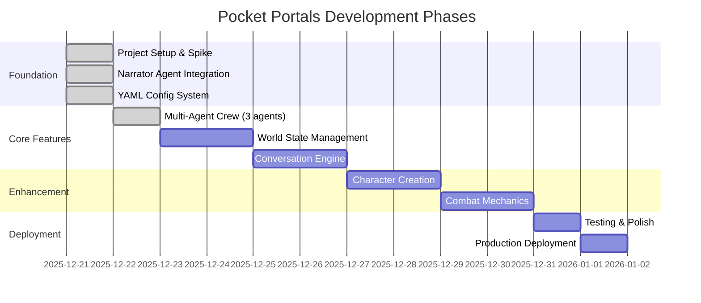

# Pocket Portals - Task Tracking

> **Source of Truth**: This file is the single source of truth for project state, task history, and progress tracking. All agents and developers should update this file when completing work.

## Table of Contents

- [How to Use This File](#how-to-use-this-file)
- [XP Programming Flow](#xp-programming-flow)
- [Project Timeline](#project-timeline)
- [Current Work](#current-work)
- [Completed Phases](#completed-phases)
- [Task History Archive](#task-history-archive)
- [Notes for Future Agents](#notes-for-future-agents)

---

## How to Use This File

**Format Guidelines**:
- Use dates (YYYY-MM-DD)
- Mark status with ✅ (complete), 🔄 (in progress), ⏳ (blocked), or blank (pending)
- Group tasks by logical phase/milestone
- Keep "Current Work" section at top for active tasks
- Move completed work to "Completed Phases" with date stamps

**Task Table Format**:
```markdown
| Task | Status | Notes |
|------|--------|-------|
| Description | ✅/🔄/⏳ | Optional context |
```

---

## XP Programming Flow

This project follows **Extreme Programming (XP)** principles with an **agentic multi-agent workflow** for collaborative development.

### Core XP Principles

**1. Test-Driven Development (TDD)**
- **Red**: Write failing test first
- **Green**: Write minimal code to pass
- **Refactor**: Clean up while keeping tests green
- Maintain 80%+ test coverage target

**2. Simple Design**
- Build the simplest solution that works
- Avoid premature optimization
- Refactor when patterns emerge

**3. Small Steps**
- Frequent, incremental commits
- One logical change per commit
- Continuous integration mindset

**4. YAGNI (You Aren't Gonna Need It)**
- No speculative features
- Build only what's explicitly required
- Defer decisions until necessary

### Agentic Workflow Phases

**Phase 1: Design (Architect Agent)**
- Create design document in `docs/design/`
- Define interfaces, data structures, and patterns
- Document architectural decisions in ADRs if needed
- Output: Design doc with clear specifications

**Phase 2: Implementation (Developer Agent)**
- Follow TDD cycle: Red → Green → Refactor
- Write tests before implementation
- Commit frequently with descriptive messages
- Run linting and tests before each commit
- Output: Working code with test coverage

**Phase 3: Validation (QA Agent)**
- Verify test coverage meets targets (80%+)
- Run full test suite and linting
- Check code quality and patterns
- Validate against design specifications
- Output: Quality report and approval

### Development Workflow Example

```bash
# 1. Design Phase (Architect)
# Create design doc
docs/design/feature-name.md

# 2. Implementation Phase (Developer)
# Red: Write failing test
pytest tests/test_feature.py -v  # Should fail

# Green: Implement minimal solution
# Edit src/feature.py

# Verify test passes
pytest tests/test_feature.py -v  # Should pass

# Refactor: Clean up code
# Improve structure while tests stay green

# Commit small change
git add . && git commit -m "feat: add feature X with tests"

# 3. Validation Phase (QA)
# Run full quality gates
pytest --cov=src --cov-report=term-missing
ruff check .
mypy src/

# Update tasks.md with completion status
```

### Quality Gates

All phases must pass these gates:
- ✅ Tests pass (`pytest`)
- ✅ Coverage ≥80% (`pytest --cov`)
- ✅ Linting passes (`ruff check`)
- ✅ Type checks pass (`mypy`)
- ✅ Pre-commit hooks pass

### Agent Handoff Protocol

When one agent completes their phase:
1. Update `tasks.md` with status ✅
2. Document any blockers or notes
3. Commit all changes
4. Next agent reviews previous work before starting

---

## Project Timeline



---

## Current Work

### Active Tasks

| Task | Status | Notes |
|------|--------|-------|
| No active tasks | - | Ready for next feature |

### Up Next

| Task | Status | Priority |
|------|--------|----------|
| Implement world state management | ⏳ | High |
| Add conversation engine | ⏳ | High |
| Character creation system | ⏳ | Medium |

### Recently Completed

| Task | Status | Notes |
|------|--------|-------|
| Add API endpoints for all agents | ✅ | `/innkeeper/quest`, `/keeper/resolve`, `/jester/complicate` |
| Refactor to Pydantic config loader | ✅ | `src/config/loader.py` with typed models |
| Add testing mocks reference guide | ✅ | `docs/reference/testing-mocks.md` |
| Fix CI/CD workflow | ✅ | Mocked LLM calls, proper env vars |
| Set up pre-commit hooks | ✅ | ruff, mypy, trailing whitespace, etc. |
| Add GitHub Actions CI/CD | ✅ | Lint + test jobs with 70% coverage gate |
| Add multi-agent crew (Innkeeper, Keeper, Jester) | ✅ | TDD implementation, 79% coverage, 36 tests |
| Create multi-agent design document | ✅ | `docs/design/2025-12-22-multi-agent-crew.md` |
| Update YAML configs for all agents | ✅ | Enhanced personalities per creative-writing.md |
| Create comprehensive spike crash course | ✅ | `docs/CRASH-COURSE.md` - 1091 lines covering architecture, patterns, lessons learned |
| Create design system documentation | ✅ | `docs/design/design.md` - colors, typography, spacing, components |
| Fix Render deployment issues | ✅ | Standard pip install, Python 3.12, README.md for hatchling |
| Add CHANGELOG.md | ✅ | Keep a Changelog format with all features |
| Improve UI readability and visual design | ✅ | Larger text, message cards, newline rendering, better spacing |
| Add Docker containerization | ✅ | Dockerfile, docker-compose.yml, Makefile targets |
| Add starter choices with shuffle | ✅ | `/start` endpoint with pool of 9 adventure hooks |
| Add retro RPG web UI | ✅ | NES.css styling, Begin Quest button, increased canvas |
| Update ONBOARDING.md for agent success | ✅ | Added Quick Start, Decision Trees, Pitfalls, Recovery, Metrics |
| Create Insomnia collection | ✅ | docs/insomnia-collection.json for API testing |
| Add choice system (3 options + free text) | ✅ | FR-07 & FR-08 from product.md |
| Document XP programming flow | ✅ | Added to tasks.md |
| Add conversation context passing | ✅ | LLM now receives history for continuity |

---

## Completed Phases

### Phase 1: Foundation (2025-12-21)

#### Spike/One-Turn Branch Setup

| Task | Status | Notes |
|------|--------|-------|
| Create spike branch and Python project structure | ✅ | Initial FastAPI + CrewAI setup |
| Set up git hooks (pre-commit, linting) | ✅ | Automated quality checks |
| Add CrewAI and FastAPI dependencies | ✅ | Core dependencies configured |
| Create minimal Narrator agent spike | ✅ | First working agent |
| Add Render.com deployment config | ✅ | Production-ready deployment |
| Run tests and lint to validate spike | ✅ | Quality gates passing |

**Artifacts Created**:
- `pyproject.toml` - Python dependencies and project metadata
- `.pre-commit-config.yaml` - Git hooks for code quality
- `render.yaml` - Deployment configuration for Render.com
- `docs/adr/001-agent-service-pattern.md` - Architecture decision record

---

#### Narrator Agent Integration

| Task | Status | Notes |
|------|--------|-------|
| Connect NarratorAgent to /action endpoint | ✅ | FastAPI endpoint working |
| Test live LLM call via Swagger UI | ✅ | Verified with OpenRouter |
| Add session-based context management | ✅ | Isolated user sessions |

**Verification Results**:
- Narrator initialized on app startup
- `/action` endpoint returns narrative with session_id
- Sessions isolated per user
- Test coverage: 7/7 tests passing, 73% coverage
- Files: `src/agents/narrator.py`, `src/api/main.py`, `tests/test_api.py`

---

#### YAML-Based Agent Config

| Task | Status | Notes |
|------|--------|-------|
| Convert agents to YAML-based config | ✅ | Declarative agent definitions |

**Implementation Details**:
- `src/config/agents.yaml` - Agent definitions (roles, goals, backstories)
- `src/config/tasks.yaml` - Task templates for agent workflows
- Using CrewAI's native `LLM` class (no langchain dependency)
- Simplified configuration management for multiple agents

---

### Phase 2: Multi-Agent Crew (2025-12-22)

#### Agent Implementation

| Task | Status | Notes |
|------|--------|-------|
| Create design document | ✅ | `docs/design/2025-12-22-multi-agent-crew.md` |
| Implement InnkeeperAgent with TDD | ✅ | Quest introduction, world-weary voice |
| Implement KeeperAgent with TDD | ✅ | Game mechanics, terse/numbers-first |
| Implement JesterAgent with TDD | ✅ | Meta-commentary, fourth-wall aware |
| Update YAML configs | ✅ | Enhanced per creative-writing.md |
| Add API endpoints for agents | ✅ | `/innkeeper/quest`, `/keeper/resolve`, `/jester/complicate` |
| Refactor to Pydantic config loader | ✅ | `src/config/loader.py` with typed models |
| Add GitHub Actions CI/CD | ✅ | Lint + test jobs with coverage gate |
| Set up pre-commit hooks | ✅ | ruff, mypy, formatting checks |
| Mock LLM calls for CI | ✅ | Tests work without real API key |
| Add testing mocks documentation | ✅ | `docs/reference/testing-mocks.md` |
| Run quality gates | ✅ | 36 tests passing, 79% coverage |

**Implementation Details**:
- All agents follow NarratorAgent pattern exactly
- Each agent has distinct LLM config (temperature, max_tokens)
- YAML-based configuration for personality and voice
- TDD cycle: Red → Green → Refactor for each agent
- Parallel sub-agent development workflow
- Pydantic models for type-safe config loading
- Mocked Task.execute_sync() for CI compatibility

**Files Created**:
- `src/agents/innkeeper.py` - InnkeeperAgent class
- `src/agents/keeper.py` - KeeperAgent class
- `src/agents/jester.py` - JesterAgent class
- `src/config/loader.py` - Pydantic config models
- `tests/test_innkeeper.py` - 3 tests
- `tests/test_keeper.py` - 2 tests
- `tests/test_jester.py` - 2 tests
- `tests/test_api.py` - 7 new endpoint tests
- `docs/design/2025-12-22-multi-agent-crew.md` - Design doc
- `docs/reference/testing-mocks.md` - Mocking guide
- `.github/workflows/ci.yml` - CI/CD workflow

**API Endpoints Added**:
| Endpoint | Method | Purpose |
|----------|--------|---------|
| `/innkeeper/quest?character=...` | GET | Quest introductions |
| `/keeper/resolve` | POST | Mechanical action resolution |
| `/jester/complicate` | POST | Meta-commentary |

**LLM Configuration per Agent**:
| Agent | Temperature | Max Tokens | Rationale |
|-------|-------------|------------|-----------|
| Narrator | 0.7 | 1024 | Creative, descriptive |
| Innkeeper | 0.6 | 512 | Direct, consistent |
| Keeper | 0.3 | 256 | Mechanical, precise |
| Jester | 0.8 | 256 | Playful, surprising |

---

## Task History Archive

### Session Log: 2025-12-21

**Session Focus**: Initial project setup and Narrator agent spike

**Key Decisions**:
1. Chose FastAPI over Flask for async support and modern API design
2. Selected CrewAI for agent orchestration framework
3. Implemented YAML-based config for maintainability
4. Set up Render.com for production deployment

**Blockers Resolved**:
- None

**Next Steps**:
- Define remaining agent roles (WorldBuilder, ChoiceMaker, etc.)
- Implement persistent world state storage
- Add conversation history tracking

---

## Notes for Future Agents

### Project State
- **Current Phase**: Multi-agent crew complete, ready for world state
- **Test Coverage**: 79% (36 tests passing)
- **CI/CD**: GitHub Actions with lint + test jobs
- **Pre-commit**: ruff, mypy, formatting hooks installed
- **Deployment**: Render.com (main branch)
- **Architecture**: ADR 001 documents agent service pattern

### Development Workflow
1. Check this file for current task status
2. Update table with 🔄 when starting a task
3. Mark ✅ when complete, add notes if needed
4. Move completed phases to "Completed Phases" section
5. Document key decisions and blockers
6. Run `uv run pre-commit install` to set up hooks
7. **Update documentation after every feature** - Update tasks.md, design docs, and README to prevent documentation drift

### Key Files to Review
- `docs/product.md` - Product vision and requirements
- `docs/reference/crewai.md` - CrewAI architecture and agent design
- `docs/reference/testing-mocks.md` - How to mock LLM calls in tests
- `docs/adr/` - Architecture decision records
- `docs/guides/CRASH-COURSE.md` - Comprehensive spike documentation
- `docs/guides/ONBOARDING.md` - Developer onboarding guide
- `src/config/agents.yaml` - Agent configurations
- `src/config/loader.py` - Pydantic config models
- `.github/workflows/ci.yml` - CI/CD workflow
