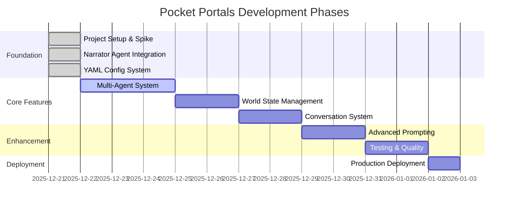

# Pocket Portals - Task Tracking

> **Source of Truth**: This file is the single source of truth for project state, task history, and progress tracking. All agents and developers should update this file when completing work.

## How to Use This File

**Format Guidelines**:
- Use dates only (YYYY-MM-DD), no timestamps
- Mark status with ✅ (complete), 🔄 (in progress), ⏳ (blocked), or blank (pending)
- Group tasks by logical phase/milestone
- Keep "Current Work" section at top for active tasks
- Move completed work to "Completed Phases" with date stamps

**Task Table Format**:
```markdown
| Task | Status | Notes |
|------|--------|-------|
| Description | ✅/🔄/⏳ | Optional context |
```

---

## Project Timeline



---

## Current Work

### Active Tasks

| Task | Status | Notes |
|------|--------|-------|
| No active tasks | - | Ready for next phase |

### Up Next

| Task | Status | Priority |
|------|--------|----------|
| Define remaining CrewAI agents | ⏳ | High |
| Implement world state management | ⏳ | High |

### Recently Completed

| Task | Status | Notes |
|------|--------|-------|
| Add conversation context passing | ✅ | LLM now receives history for continuity |

---

## Completed Phases

### Phase 1: Foundation (2025-12-21)

#### Spike/One-Turn Branch Setup

| Task | Status | Notes |
|------|--------|-------|
| Create spike branch and Python project structure | ✅ | Initial FastAPI + CrewAI setup |
| Set up git hooks (pre-commit, linting) | ✅ | Automated quality checks |
| Add CrewAI and FastAPI dependencies | ✅ | Core dependencies configured |
| Create minimal Narrator agent spike | ✅ | First working agent |
| Add Render.com deployment config | ✅ | Production-ready deployment |
| Run tests and lint to validate spike | ✅ | Quality gates passing |

**Artifacts Created**:
- `pyproject.toml` - Python dependencies and project metadata
- `.pre-commit-config.yaml` - Git hooks for code quality
- `render.yaml` - Deployment configuration for Render.com
- `docs/adr/001-agent-service-pattern.md` - Architecture decision record

---

#### Narrator Agent Integration

| Task | Status | Notes |
|------|--------|-------|
| Connect NarratorAgent to /action endpoint | ✅ | FastAPI endpoint working |
| Test live LLM call via Swagger UI | ✅ | Verified with OpenRouter |
| Add session-based context management | ✅ | Isolated user sessions |

**Verification Results**:
- Narrator initialized on app startup
- `/action` endpoint returns narrative with session_id
- Sessions isolated per user
- Test coverage: 7/7 tests passing, 73% coverage
- Files: `src/agents/narrator.py`, `src/api/main.py`, `tests/test_api.py`

---

#### YAML-Based Agent Config

| Task | Status | Notes |
|------|--------|-------|
| Convert agents to YAML-based config | ✅ | Declarative agent definitions |

**Implementation Details**:
- `src/config/agents.yaml` - Agent definitions (roles, goals, backstories)
- `src/config/tasks.yaml` - Task templates for agent workflows
- Using CrewAI's native `LLM` class (no langchain dependency)
- Simplified configuration management for multiple agents

---

## Task History Archive

### Session Log: 2025-12-21

**Session Focus**: Initial project setup and Narrator agent spike

**Key Decisions**:
1. Chose FastAPI over Flask for async support and modern API design
2. Selected CrewAI for agent orchestration framework
3. Implemented YAML-based config for maintainability
4. Set up Render.com for production deployment

**Blockers Resolved**:
- None

**Next Steps**:
- Define remaining agent roles (WorldBuilder, ChoiceMaker, etc.)
- Implement persistent world state storage
- Add conversation history tracking

---

## Notes for Future Agents

### Project State
- **Current Phase**: Foundation complete, ready for multi-agent expansion
- **Test Coverage**: 73% (target: 80%+)
- **Deployment**: Configured for Render.com, not yet deployed
- **Architecture**: ADR 001 documents agent service pattern

### Development Workflow
1. Check this file for current task status
2. Update table with 🔄 when starting a task
3. Mark ✅ when complete, add notes if needed
4. Move completed phases to "Completed Phases" section
5. Document key decisions and blockers

### Key Files to Review
- `product.md` - Product vision and requirements
- `crewai.md` - CrewAI architecture and agent design
- `docs/adr/` - Architecture decision records
- `src/config/agents.yaml` - Agent configurations
