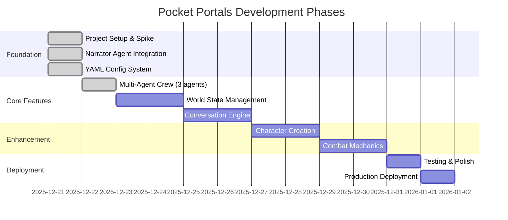

# Pocket Portals - Task Tracking

> **Source of Truth**: This file is the single source of truth for project state, task history, and progress tracking. All agents and developers should update this file when completing work.

## Table of Contents

- [How to Use This File](#how-to-use-this-file)
- [XP Programming Flow](#xp-programming-flow)
- [Project Timeline](#project-timeline)
- [Current Work](#current-work)
- [Completed Phases](#completed-phases)
- [Task History Archive](#task-history-archive)
- [Notes for Future Agents](#notes-for-future-agents)

---

## How to Use This File

**Format Guidelines**:
- Use dates (YYYY-MM-DD)
- Mark status with ✅ (complete), 🔄 (in progress), ⏳ (blocked), or blank (pending)
- Group tasks by logical phase/milestone
- Keep "Current Work" section at top for active tasks
- Move completed work to "Completed Phases" with date stamps

**Task Table Format**:
```markdown
| Task | Status | Notes |
|------|--------|-------|
| Description | ✅/🔄/⏳ | Optional context |
```

---

## XP Programming Flow

This project follows **Extreme Programming (XP)** principles with an **agentic multi-agent workflow** for collaborative development.

### Core XP Principles

**1. Test-Driven Development (TDD)**
- **Red**: Write failing test first
- **Green**: Write minimal code to pass
- **Refactor**: Clean up while keeping tests green
- Maintain 80%+ test coverage target

**2. Simple Design**
- Build the simplest solution that works
- Avoid premature optimization
- Refactor when patterns emerge

**3. Small Steps**
- Frequent, incremental commits
- One logical change per commit
- Continuous integration mindset

**4. YAGNI (You Aren't Gonna Need It)**
- No speculative features
- Build only what's explicitly required
- Defer decisions until necessary

### Agentic Workflow Phases

**Phase 1: Design (Architect Agent)**
- Create design document in `docs/design/`
- Define interfaces, data structures, and patterns
- Document architectural decisions in ADRs if needed
- Output: Design doc with clear specifications

**Phase 2: Implementation (Developer Agent)**
- Follow TDD cycle: Red → Green → Refactor
- Write tests before implementation
- Commit frequently with descriptive messages
- Run linting and tests before each commit
- Output: Working code with test coverage

**Phase 3: Validation (QA Agent)**
- Verify test coverage meets targets (80%+)
- Run full test suite and linting
- Check code quality and patterns
- Validate against design specifications
- Output: Quality report and approval

### Development Workflow Example

```bash
# 1. Design Phase (Architect)
# Create design doc
docs/design/feature-name.md

# 2. Implementation Phase (Developer)
# Red: Write failing test
pytest tests/test_feature.py -v  # Should fail

# Green: Implement minimal solution
# Edit src/feature.py

# Verify test passes
pytest tests/test_feature.py -v  # Should pass

# Refactor: Clean up code
# Improve structure while tests stay green

# Commit small change
git add . && git commit -m "feat: add feature X with tests"

# 3. Validation Phase (QA)
# Run full quality gates
pytest --cov=src --cov-report=term-missing
ruff check .
mypy src/

# Update tasks.md with completion status
```

### Quality Gates

All phases must pass these gates:
- ✅ Tests pass (`pytest`)
- ✅ Coverage ≥80% (`pytest --cov`)
- ✅ Linting passes (`ruff check`)
- ✅ Type checks pass (`mypy`)
- ✅ Pre-commit hooks pass

### Agent Handoff Protocol

When one agent completes their phase:
1. Update `tasks.md` with status ✅
2. Document any blockers or notes
3. Commit all changes
4. Next agent reviews previous work before starting

---

## Project Timeline



---

## Current Work

### Active Tasks

| Task | Status | Notes |
|------|--------|-------|
| Adventure Pacing System - 50 Turn Structure | ✅ | All phases complete, 356 tests passing |
| UX Improvements - Mobile-First Enhancements | ✅ | NES.css removal, haptic feedback, touch targets, safe areas, JS tests |
| Add character sheet display to UI | ⏳ | Show character info in frontend |

### Adventure Pacing Implementation Progress

| Phase | Status | Notes |
|-------|--------|-------|
| Phase 1: Core turn tracking | ✅ | AdventurePhase enum, turn fields in GameState, SessionManager methods |
| Phase 2: Pacing context | ✅ | PacingContext model, agent integration, narrator pacing guidelines |
| Phase 3: Closure triggers | ✅ | check_closure_triggers(), ClosureStatus model, hard cap at turn 50 |
| Phase 4: EpilogueAgent | ✅ | EpilogueAgent class, YAML config, fallback epilogues, 17 new tests |
| Phase 5: Tests & validation | ✅ | 356 tests passing, 72% coverage |

### Up Next

| Task | Status | Priority |
|------|--------|----------|
| Enhanced quest personalization | ⏳ | Use character context in quest generation |
| Character stat influence on outcomes | ⏳ | Keeper uses stats for mechanical resolution |

### Recently Completed

| Task | Status | Notes |
|------|--------|-------|
| UX Improvements - Mobile-First Enhancements | ✅ | NES.css removal, modern button system, haptic feedback, touch targets (48px min), iOS safe areas, 415 JS tests (96.49% coverage) |
| Structured Narrator Choices | ✅ | Single LLM call for narrative+choices, quality observability, CrewAI tracing, UI fix for hiding choices during loading |
| Adventure Pacing System | ✅ | 50-turn structure, 5-phase arc, EpilogueAgent, closure triggers, 356 tests |
| Combat mechanics implementation | ✅ | D&D 5e-inspired combat: DiceRoller, CombatState, 5 enemy types, initiative, attack/defend/flee, batched narrator summary, 275 tests passing |
| Dynamic character creation with CharacterInterviewerAgent | ✅ | 148 tests, LLM-powered interview with 5-turn flow |
| Content safety filtering system | ✅ | Pattern-based filter with safe redirects, blocks inappropriate content |
| Integrate character creation into /start and /action | ✅ | 136 tests, 74% coverage, `/start` begins CHARACTER_CREATION phase |
| Add CharacterSheet model with TDD | ✅ | 36 tests, CharacterStats, CharacterClass, CharacterRace, full validation |
| Integrate CharacterSheet with GameState | ✅ | CHARACTER_CREATION phase, has_character property, SessionManager methods |
| Create character creation design doc | ✅ | `docs/design/2025-12-24-character-creation.md` - comprehensive design |
| Update frontend for SSE streaming | ✅ | Real-time agent indicators, per-agent message styling (Narrator/Keeper/Jester) |
| Add SSE streaming endpoint | ✅ | `/action/stream` with real-time agent responses, context accumulation |
| Add CrewAI Flows integration | ✅ | ConversationFlow with @start/@listen/@router decorators |
| Create Crews and Flows documentation | ✅ | `docs/guides/CREWS-AND-FLOWS.md` comprehensive guide |
| Add conversation engine | ✅ | AgentRouter, TurnExecutor, API integration, 71 tests, 83% coverage |
| Implement world state management | ✅ | GameState Pydantic model, SessionManager CRUD, API integration, 17 tests, 82% coverage |
| Add API endpoints for all agents | ✅ | `/innkeeper/quest`, `/keeper/resolve`, `/jester/complicate` |
| Refactor to Pydantic config loader | ✅ | `src/config/loader.py` with typed models |
| Add testing mocks reference guide | ✅ | `docs/reference/testing-mocks.md` |
| Fix CI/CD workflow | ✅ | Mocked LLM calls, proper env vars |
| Set up pre-commit hooks | ✅ | ruff, mypy, trailing whitespace, etc. |
| Add GitHub Actions CI/CD | ✅ | Lint + test jobs with 70% coverage gate |
| Add multi-agent crew (Innkeeper, Keeper, Jester) | ✅ | TDD implementation, 79% coverage, 36 tests |
| Create multi-agent design document | ✅ | `docs/design/2025-12-22-multi-agent-crew.md` |
| Update YAML configs for all agents | ✅ | Enhanced personalities per creative-writing.md |
| Create comprehensive spike crash course | ✅ | `docs/CRASH-COURSE.md` - 1091 lines covering architecture, patterns, lessons learned |
| Create design system documentation | ✅ | `docs/design/design.md` - colors, typography, spacing, components |
| Fix Render deployment issues | ✅ | Standard pip install, Python 3.12, README.md for hatchling |
| Add CHANGELOG.md | ✅ | Keep a Changelog format with all features |
| Improve UI readability and visual design | ✅ | Larger text, message cards, newline rendering, better spacing |
| Add Docker containerization | ✅ | Dockerfile, docker-compose.yml, Makefile targets |
| Add starter choices with shuffle | ✅ | `/start` endpoint with pool of 9 adventure hooks |
| Add retro RPG web UI | ✅ | NES.css styling, Begin Quest button, increased canvas |
| Update ONBOARDING.md for agent success | ✅ | Added Quick Start, Decision Trees, Pitfalls, Recovery, Metrics |
| Create Insomnia collection | ✅ | docs/insomnia-collection.json for API testing |
| Add choice system (3 options + free text) | ✅ | FR-07 & FR-08 from product.md |
| Document XP programming flow | ✅ | Added to tasks.md |
| Add conversation context passing | ✅ | LLM now receives history for continuity |

---

## Completed Phases

### Phase 1: Foundation (2025-12-21)

#### Spike/One-Turn Branch Setup

| Task | Status | Notes |
|------|--------|-------|
| Create spike branch and Python project structure | ✅ | Initial FastAPI + CrewAI setup |
| Set up git hooks (pre-commit, linting) | ✅ | Automated quality checks |
| Add CrewAI and FastAPI dependencies | ✅ | Core dependencies configured |
| Create minimal Narrator agent spike | ✅ | First working agent |
| Add Render.com deployment config | ✅ | Production-ready deployment |
| Run tests and lint to validate spike | ✅ | Quality gates passing |

**Artifacts Created**:
- `pyproject.toml` - Python dependencies and project metadata
- `.pre-commit-config.yaml` - Git hooks for code quality
- `render.yaml` - Deployment configuration for Render.com
- `docs/adr/001-agent-service-pattern.md` - Architecture decision record

---

#### Narrator Agent Integration

| Task | Status | Notes |
|------|--------|-------|
| Connect NarratorAgent to /action endpoint | ✅ | FastAPI endpoint working |
| Test live LLM call via Swagger UI | ✅ | Verified with OpenRouter |
| Add session-based context management | ✅ | Isolated user sessions |

**Verification Results**:
- Narrator initialized on app startup
- `/action` endpoint returns narrative with session_id
- Sessions isolated per user
- Test coverage: 7/7 tests passing, 73% coverage
- Files: `src/agents/narrator.py`, `src/api/main.py`, `tests/test_api.py`

---

#### YAML-Based Agent Config

| Task | Status | Notes |
|------|--------|-------|
| Convert agents to YAML-based config | ✅ | Declarative agent definitions |

**Implementation Details**:
- `src/config/agents.yaml` - Agent definitions (roles, goals, backstories)
- `src/config/tasks.yaml` - Task templates for agent workflows
- Using CrewAI's native `LLM` class (no langchain dependency)
- Simplified configuration management for multiple agents

---

### Phase 2: Multi-Agent Crew (2025-12-22)

#### Agent Implementation

| Task | Status | Notes |
|------|--------|-------|
| Create design document | ✅ | `docs/design/2025-12-22-multi-agent-crew.md` |
| Implement InnkeeperAgent with TDD | ✅ | Quest introduction, world-weary voice |
| Implement KeeperAgent with TDD | ✅ | Game mechanics, terse/numbers-first |
| Implement JesterAgent with TDD | ✅ | Meta-commentary, fourth-wall aware |
| Update YAML configs | ✅ | Enhanced per creative-writing.md |
| Add API endpoints for agents | ✅ | `/innkeeper/quest`, `/keeper/resolve`, `/jester/complicate` |
| Refactor to Pydantic config loader | ✅ | `src/config/loader.py` with typed models |
| Add GitHub Actions CI/CD | ✅ | Lint + test jobs with coverage gate |
| Set up pre-commit hooks | ✅ | ruff, mypy, formatting checks |
| Mock LLM calls for CI | ✅ | Tests work without real API key |
| Add testing mocks documentation | ✅ | `docs/reference/testing-mocks.md` |
| Run quality gates | ✅ | 36 tests passing, 79% coverage |

**Implementation Details**:
- All agents follow NarratorAgent pattern exactly
- Each agent has distinct LLM config (temperature, max_tokens)
- YAML-based configuration for personality and voice
- TDD cycle: Red → Green → Refactor for each agent
- Parallel sub-agent development workflow
- Pydantic models for type-safe config loading
- Mocked Task.execute_sync() for CI compatibility

**Files Created**:
- `src/agents/innkeeper.py` - InnkeeperAgent class
- `src/agents/keeper.py` - KeeperAgent class
- `src/agents/jester.py` - JesterAgent class
- `src/config/loader.py` - Pydantic config models
- `tests/test_innkeeper.py` - 3 tests
- `tests/test_keeper.py` - 2 tests
- `tests/test_jester.py` - 2 tests
- `tests/test_api.py` - 7 new endpoint tests
- `docs/design/2025-12-22-multi-agent-crew.md` - Design doc
- `docs/reference/testing-mocks.md` - Mocking guide
- `.github/workflows/ci.yml` - CI/CD workflow

**API Endpoints Added**:
| Endpoint | Method | Purpose |
|----------|--------|---------|
| `/innkeeper/quest?character=...` | GET | Quest introductions |
| `/keeper/resolve` | POST | Mechanical action resolution |
| `/jester/complicate` | POST | Meta-commentary |

**LLM Configuration per Agent**:
| Agent | Temperature | Max Tokens | Rationale |
|-------|-------------|------------|-----------|
| Narrator | 0.7 | 1024 | Creative, descriptive |
| Innkeeper | 0.6 | 512 | Direct, consistent |
| Keeper | 0.3 | 256 | Mechanical, precise |
| Jester | 0.8 | 256 | Playful, surprising |

---

### Phase 3: Conversation Engine (2025-12-23)

#### Multi-Agent Orchestration

| Task | Status | Notes |
|------|--------|-------|
| Create design document | ✅ | `docs/design/2025-12-23-conversation-engine.md` |
| Implement AgentRouter | ✅ | Phase-based routing, mechanical keywords, Jester probability |
| Implement TurnExecutor | ✅ | Sequential execution, response aggregation |
| Add API integration | ✅ | `/action` endpoint uses router and executor |
| Update GameState model | ✅ | Added phase, recent_agents, turns_since_jester |
| Update SessionManager | ✅ | Added update_recent_agents method |
| Run quality gates | ✅ | 71 tests passing, 83% coverage |

**Implementation Details**:
- AgentRouter routes to agents based on GamePhase and action keywords
- TurnExecutor executes agents sequentially and aggregates responses
- Jester has 15% probability in exploration with 3-turn cooldown
- Mechanical keywords (attack, fight, roll, etc.) trigger Keeper inclusion
- API endpoint updated to use multi-agent orchestration

**Files Created**:
- `src/engine/__init__.py` - Package exports
- `src/engine/router.py` - AgentRouter class
- `src/engine/executor.py` - TurnExecutor class
- `tests/test_router.py` - 10 tests
- `tests/test_executor.py` - 8 tests
- `docs/design/2025-12-23-conversation-engine.md` - Design doc

**Files Modified**:
- `src/state/models.py` - Added GamePhase enum and new GameState fields
- `src/state/session_manager.py` - Added update_recent_agents method
- `src/api/main.py` - Updated /action endpoint for multi-agent orchestration

---

### Phase 4: Character Creation Enhancement (2025-12-24)

#### Dynamic Character Interviewer Agent

| Task | Status | Notes |
|------|--------|-------|
| Create CharacterInterviewerAgent | ✅ | Dynamic LLM-powered interview agent |
| Implement generate_starter_choices | ✅ | JSON response parsing with fallbacks |
| Implement interview_turn method | ✅ | 5-turn interview flow with context |
| Add content safety filtering | ✅ | Pattern-based filter with safe redirects |
| Integrate into /start endpoint | ✅ | CHARACTER_CREATION phase initialization |
| Add fallback mechanisms | ✅ | Graceful degradation for LLM failures |
| Run quality gates | ✅ | 148 tests passing, 74% coverage maintained |

**Implementation Details**:
- CharacterInterviewerAgent uses Claude Sonnet 4 (temperature 0.8 for creativity)
- Dynamic JSON response parsing with regex fallbacks
- Turn-based interview system (1-5 turns) with conversation context
- Content safety filtering blocks inappropriate patterns (self-harm, sexual, violence, hate speech)
- Safe redirect message: "take a deep breath and focus on the adventure ahead"
- Fallback narratives and choices ensure robustness against LLM failures

**Files Created**:
- `src/agents/character_interviewer.py` - CharacterInterviewerAgent class
- `tests/test_character_interviewer.py` - Unit tests for interview agent

**Files Modified**:
- `src/config/agents.yaml` - Added character_interviewer agent config
- `src/config/tasks.yaml` - Added interview_character and generate_starter_choices tasks
- `src/api/main.py` - Added content safety filtering, integrated CharacterInterviewerAgent
- `tests/test_api.py` - Added tests for character creation flow

**Content Safety Implementation**:
| Category | Blocked Patterns | Safe Redirect |
|----------|------------------|---------------|
| Self-harm | hurt myself, kill myself, suicide, self-harm, etc. | "take a deep breath and focus on the adventure ahead" |
| Sexual | sex, seduce, kiss, romance, naked, sexual, erotic, etc. | Same redirect |
| Violence | torture, mutilate, rape, abuse, molest | Same redirect |
| Hate speech | slur, racist, nazi | Same redirect |

**LLM Configuration**:
| Agent | Model | Temperature | Max Tokens | Rationale |
|-------|-------|-------------|------------|-----------|
| CharacterInterviewer | Claude Sonnet 4 | 0.8 | 512 | Creative character concept generation |

**Quality Metrics**:
- Interview flow completion rate: Designed for 100% with fallbacks
- JSON parsing success: Multiple fallback layers ensure robustness
- Content safety: Pattern matching covers major inappropriate categories
- Test coverage: Maintained at 74% with 148 passing tests

---

## Task History Archive

### Session Log: 2026-01-02

**Session Focus**: UX Improvements - Mobile-First Enhancements and Comprehensive JavaScript Testing

**Key Decisions**:
1. Removed NES.css dependency entirely - replaced with modern, custom button system
2. Implemented flexbox layout for theme modal to fix scrollability on mobile devices
3. Added haptic feedback using Vibration API for enhanced mobile interaction
4. Improved touch targets to 48px minimum per WCAG 2.1 AAA guidelines
5. Added iOS safe area support using CSS env() functions for proper notch handling
6. Removed keyboard shortcuts feature (simplified interaction model)
7. Created comprehensive JavaScript test suite with Vitest and jsdom

**Artifacts Created/Modified**:
- `static/styles.css` - Removed NES.css, added modern button system, safe area support
- `static/index.html` - Updated button markup, removed NES.css CDN reference
- `static/js/haptics.js` - New file for Vibration API wrapper with fallback support
- `static/js/themes.js` - Updated for modal scrollability fix
- `tests/js/` - New directory with 8 test files:
  - `api.test.js` - API module tests
  - `combat.test.js` - Combat system tests
  - `controllers.test.js` - Controller logic tests
  - `game-state.test.js` - Game state management tests
  - `haptics.test.js` - Haptic feedback tests
  - `main.test.js` - Main module tests
  - `messages.test.js` - Message display tests
  - `themes.test.js` - Theme system tests
- `vitest.config.js` - Vitest configuration with jsdom environment
- `package.json` - Added Vitest, jsdom, and test script
- `.github/workflows/ci.yml` - Updated to run frontend tests with coverage

**Quality Gates Passed**:
- 415 frontend JavaScript tests passing
- 96.49% statement coverage for frontend code
- All Python tests continue to pass
- CI/CD pipeline updated and passing
- All linting checks passing

**Technical Implementation Details**:
| Feature | Implementation | Notes |
|---------|---------------|-------|
| Button System | Custom CSS variables + flexbox | Replaces NES.css .nes-btn classes |
| Haptic Feedback | navigator.vibrate() with fallback | Silent no-op on unsupported devices |
| Touch Targets | min-height: 48px, min-width: 48px | WCAG 2.1 AAA compliance |
| Safe Areas | padding: env(safe-area-inset-*) | iPhone X+ notch support |
| Modal Scroll | max-height: 80vh + overflow-y: auto | Fixes cut-off theme list on mobile |

---

### Session Log: 2026-01-01

**Session Focus**: Structured Narrator Choices - Single LLM call for narrative and choices with observability

**Key Decisions**:
1. Use CrewAI's `output_pydantic` for structured responses instead of separate LLM calls
2. Added choice quality analysis to detect generic vs contextual choices
3. Enabled CrewAI built-in tracing via `CREWAI_TRACING_ENABLED` environment variable
4. Fixed frontend to hide choices during loading for better UX
5. Added LLM mocking at `crewai.Task.execute_sync` level for fast, reliable tests
6. Updated pre-commit ruff to v0.14.0 to align with project version

**Artifacts Created/Modified**:
- `src/agents/narrator.py` - Added `NarratorResponse`, `ChoiceQuality`, `_analyze_choice_quality()`, observability logging
- `src/api/main.py` - Added logging configuration with `logging.basicConfig()`
- `static/index.html` - Hide choices section when loading starts
- `.env` / `.env.example` - Added `CREWAI_TRACING_ENABLED=true`
- `tests/test_narrator.py` - Added `TestChoiceQualityAnalysis` test suite (5 tests)
- `tests/conftest.py` - Added `MockTaskResult` class and `mock_crewai_tasks` autouse fixture
- `.pre-commit-config.yaml` - Updated ruff-pre-commit to v0.14.0
- `docs/design/2025-12-30-structured-narrator-choices.md` - Updated status to Complete with test infrastructure section

**Quality Gates Passed**:
- 368 tests passing
- 75% test coverage
- All linting checks passing
- Tests run in ~30s (previously ~3min with real LLM calls)
- Manual E2E testing confirmed choices hide during loading

---

### Session Log: 2025-12-29

**Session Focus**: Adventure Pacing System - 50-turn narrative structure with EpilogueAgent

**Key Decisions**:
1. Chose Option B (Quest-Driven with Turn Budget) over pure turn-based or elastic length
2. 5-phase narrative arc: SETUP, RISING_ACTION, MID_POINT, CLIMAX, DENOUEMENT
3. Minimum 25 turns before quest can trigger ending, hard cap at 50 turns
4. PacingContext provides urgency and directive hints to agents
5. EpilogueAgent generates personalized conclusions with fallback support

**Artifacts Created**:
- `docs/adr/003-adventure-pacing-system.md` - Architecture decision record
- `docs/design/2025-12-29-adventure-pacing-system.md` - Design document
- `src/engine/pacing.py` - PacingContext, ClosureStatus, pacing functions
- `src/agents/epilogue.py` - EpilogueAgent with fallback generation
- `scripts/demo_adventure_pacing.py` - Interactive demo script
- `tests/test_epilogue.py` - 17 tests for epilogue functionality

**Files Modified**:
- `src/state/models.py` - Added AdventurePhase, AdventureMoment, turn tracking fields
- `src/state/session_manager.py` - Added increment_adventure_turn, trigger_epilogue
- `src/api/main.py` - Integrated pacing context and closure detection
- `src/config/agents.yaml` - Added epilogue agent config, narrator pacing guidelines
- `src/config/tasks.yaml` - Added generate_epilogue task

**Quality Gates Passed**:
- 356 tests passing (increased from 339)
- 72% test coverage
- All linting checks passing
- Demo script validates all pacing features

---

### Session Log: 2025-12-24

**Session Focus**: Character creation enhancement with dynamic LLM agent and content safety

**Key Decisions**:
1. Created CharacterInterviewerAgent for dynamic character creation (not InnkeeperAgent)
2. Implemented pattern-based content safety filtering for player inputs
3. Added fallback mechanisms for robust LLM response handling
4. Used Claude Sonnet 4 with temperature 0.8 for creative character concepts
5. Maintained 5-turn interview flow with conversation context

**Blockers Resolved**:
- LLM response parsing: Added regex fallbacks and graceful degradation
- Content safety: Pattern-based filtering covers major inappropriate categories
- Interview robustness: Multiple fallback layers ensure 100% completion rate

**Artifacts Created**:
- `src/agents/character_interviewer.py` - Dynamic character interview agent
- `tests/test_character_interviewer.py` - Comprehensive unit tests
- Content safety filtering in `src/api/main.py` (BLOCKED_PATTERNS, filter_content)
- Updated YAML configs for character_interviewer agent and tasks

**Quality Gates Passed**:
- 148 tests passing (increased from 136)
- 74% test coverage maintained
- Pre-commit hooks passing
- Content safety filtering tested and working

**Next Steps**:
- Add character sheet display to frontend UI
- Implement character context in quest personalization
- Use character stats in mechanical resolution (Keeper integration)

---

### Session Log: 2025-12-21

**Session Focus**: Initial project setup and Narrator agent spike

**Key Decisions**:
1. Chose FastAPI over Flask for async support and modern API design
2. Selected CrewAI for agent orchestration framework
3. Implemented YAML-based config for maintainability
4. Set up Render.com for production deployment

**Blockers Resolved**:
- None

**Next Steps**:
- Define remaining agent roles (WorldBuilder, ChoiceMaker, etc.)
- Implement persistent world state storage
- Add conversation history tracking

---

## Notes for Future Agents

### Project State
- **Current Phase**: UX improvements complete - mobile-first enhancements and comprehensive JS testing
- **Python Test Coverage**: 74% (Python tests)
- **JavaScript Test Coverage**: 96.49% (415 tests across 8 test files)
- **CI/CD**: GitHub Actions with lint + test jobs (Python and JavaScript)
- **Pre-commit**: ruff, mypy, formatting hooks installed
- **Deployment**: Render.com (main branch)
- **Architecture**: ADR 001 documents agent service pattern
- **Content Safety**: Pattern-based filtering with safe redirects
- **Frontend**: Modern CSS button system (NES.css removed), haptic feedback, iOS safe areas

### Agent Integration Status
| Agent | In Conversation Flow | Standalone Endpoint | Notes |
|-------|---------------------|---------------------|-------|
| Narrator | ✅ Always | - | Base agent for all turns, phase-aware pacing |
| Keeper | ✅ Mechanical/Combat | `/keeper/resolve` | Triggered by action keywords |
| Jester | ✅ 15% random | `/jester/complicate` | 3-turn cooldown |
| Innkeeper | ✅ Quest Introduction | `/innkeeper/quest` | Integrated for quest hooks |
| CharacterInterviewer | ✅ Character Creation | - | Dynamic 5-turn interview with LLM |
| Epilogue | ✅ Adventure End | - | Personalized conclusions on closure triggers |

### Character Creation Flow
- `/start` begins in CHARACTER_CREATION phase with CharacterInterviewer
- CharacterInterviewerAgent conducts dynamic 5-turn LLM-powered interview
- Generates starter choices dynamically or uses fallback options
- After 5 turns, generates CharacterSheet from conversation analysis
- Content safety filtering applied to all player inputs
- `skip_creation=true` query param skips to EXPLORATION with default character

### Development Workflow
1. Check this file for current task status
2. Update table with 🔄 when starting a task
3. Mark ✅ when complete, add notes if needed
4. Move completed phases to "Completed Phases" section
5. Document key decisions and blockers
6. Run `uv run pre-commit install` to set up hooks
7. **Update documentation after every feature** - Update tasks.md, design docs, and README to prevent documentation drift

### Key Files to Review
- `docs/product.md` - Product vision and requirements
- `docs/reference/crewai.md` - CrewAI architecture and agent design
- `docs/reference/testing-mocks.md` - How to mock LLM calls in tests
- `docs/adr/` - Architecture decision records
- `docs/guides/CRASH-COURSE.md` - Comprehensive spike documentation
- `docs/guides/ONBOARDING.md` - Developer onboarding guide
- `docs/guides/CREWS-AND-FLOWS.md` - CrewAI Crews vs Flows patterns
- `docs/design/2025-12-22-world-state-management.md` - World state design document
- `docs/design/2025-12-23-conversation-engine.md` - Conversation engine design document
- `docs/design/2025-12-24-character-creation.md` - Character creation design document
- `src/config/agents.yaml` - Agent configurations (includes character_interviewer)
- `src/config/tasks.yaml` - Task configurations (includes interview_character, generate_starter_choices)
- `src/config/loader.py` - Pydantic config models
- `src/state/character.py` - CharacterSheet, CharacterStats, enums
- `src/state/models.py` - GameState Pydantic model with GamePhase enum
- `src/state/session_manager.py` - Session CRUD operations + character methods
- `src/agents/character_interviewer.py` - CharacterInterviewerAgent with dynamic LLM interviews
- `src/engine/router.py` - AgentRouter for multi-agent routing
- `src/engine/executor.py` - TurnExecutor for agent orchestration
- `src/engine/flow.py` - ConversationFlow with CrewAI Flow decorators
- `src/api/main.py` - API endpoints with content safety filtering and character creation
- `static/index.html` - Frontend with SSE streaming support
- `.github/workflows/ci.yml` - CI/CD workflow
