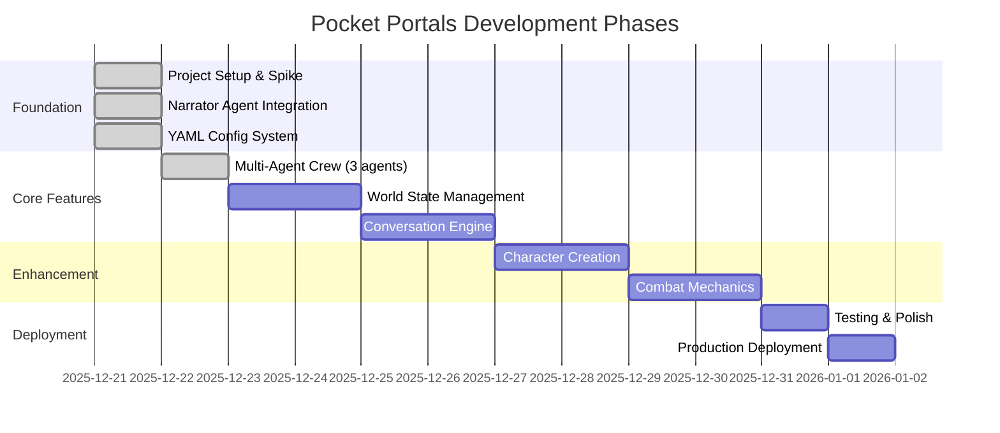

# Pocket Portals - Task Tracking

> **Source of Truth**: This file is the single source of truth for project state, task history, and progress tracking. All agents and developers should update this file when completing work.

## Table of Contents

- [How to Use This File](#how-to-use-this-file)
- [XP Programming Flow](#xp-programming-flow)
- [Project Timeline](#project-timeline)
- [Current Work](#current-work)
- [Completed Phases](#completed-phases)
- [Task History Archive](#task-history-archive)
- [Notes for Future Agents](#notes-for-future-agents)

---

## How to Use This File

**Format Guidelines**:
- Use dates (YYYY-MM-DD)
- Mark status with ✅ (complete), 🔄 (in progress), ⏳ (blocked), or blank (pending)
- Group tasks by logical phase/milestone
- Keep "Current Work" section at top for active tasks
- Move completed work to "Completed Phases" with date stamps

**Task Table Format**:
```markdown
| Task | Status | Notes |
|------|--------|-------|
| Description | ✅/🔄/⏳ | Optional context |
```

---

## XP Programming Flow

This project follows **Extreme Programming (XP)** principles with an **agentic multi-agent workflow** for collaborative development.

### Core XP Principles

**1. Test-Driven Development (TDD)**
- **Red**: Write failing test first
- **Green**: Write minimal code to pass
- **Refactor**: Clean up while keeping tests green
- Maintain 80%+ test coverage target

**2. Simple Design**
- Build the simplest solution that works
- Avoid premature optimization
- Refactor when patterns emerge

**3. Small Steps**
- Frequent, incremental commits
- One logical change per commit
- Continuous integration mindset

**4. YAGNI (You Aren't Gonna Need It)**
- No speculative features
- Build only what's explicitly required
- Defer decisions until necessary

### Agentic Workflow Phases

**Phase 1: Design (Architect Agent)**
- Create design document in `docs/design/`
- Define interfaces, data structures, and patterns
- Document architectural decisions in ADRs if needed
- Output: Design doc with clear specifications

**Phase 2: Implementation (Developer Agent)**
- Follow TDD cycle: Red → Green → Refactor
- Write tests before implementation
- Commit frequently with descriptive messages
- Run linting and tests before each commit
- Output: Working code with test coverage

**Phase 3: Validation (QA Agent)**
- Verify test coverage meets targets (80%+)
- Run full test suite and linting
- Check code quality and patterns
- Validate against design specifications
- Output: Quality report and approval

### Development Workflow Example

```bash
# 1. Design Phase (Architect)
# Create design doc
docs/design/feature-name.md

# 2. Implementation Phase (Developer)
# Red: Write failing test
pytest tests/test_feature.py -v  # Should fail

# Green: Implement minimal solution
# Edit src/feature.py

# Verify test passes
pytest tests/test_feature.py -v  # Should pass

# Refactor: Clean up code
# Improve structure while tests stay green

# Commit small change
git add . && git commit -m "feat: add feature X with tests"

# 3. Validation Phase (QA)
# Run full quality gates
pytest --cov=src --cov-report=term-missing
ruff check .
mypy src/

# Update tasks.md with completion status
```

### Quality Gates

All phases must pass these gates:
- ✅ Tests pass (`pytest`)
- ✅ Coverage ≥80% (`pytest --cov`)
- ✅ Linting passes (`ruff check`)
- ✅ Type checks pass (`mypy`)
- ✅ Pre-commit hooks pass

### Agent Handoff Protocol

When one agent completes their phase:
1. Update `tasks.md` with status ✅
2. Document any blockers or notes
3. Commit all changes
4. Next agent reviews previous work before starting

---

## Project Timeline



---

## Current Work

### Active Tasks

| Task | Status | Notes |
|------|--------|-------|
| Quest data SSE event for active quest display | ⏳ | Character sheet shows "No active quest" after selection |

### Up Next - Priority Tasks (from Codebase Analysis 2026-01-03)

#### 🔴 Critical (Immediate)

| Task | Status | Priority | Notes |
|------|--------|----------|-------|
| Split main.py into smaller modules | ✅ | Critical | Done 2026-01-03: main.py 2133→5 lines. Created routes/, handlers/, models/, app.py, dependencies.py, constants.py, content_safety.py |
| Add rate limiting to API | ✅ | Critical | Done 2026-01-03: Privacy-first rate limiting using session_id only (no IP tracking). 3 tiers: 20/60/100 per minute. 35 tests. |
| Fix production CORS configuration | ✅ | Critical | Done 2026-01-03: CORS now configurable via settings. Permissive in dev, restrictive in prod. |
| Improve content filter (word boundaries) | ✅ | Critical | Done 2026-01-10: Replaced pattern-based filter with agent semantic moderation via content_safe field |

#### 🟠 High Priority (Next Sprint)

| Task | Status | Priority | Notes |
|------|--------|----------|-------|
| Fix Jester duplicate config loaders | ✅ | High | Task 1.1 - Already complete (verified 2026-01-09) |
| Centralize LLM config in YAML | ✅ | High | Task 1.2 - Already complete (verified 2026-01-09) |
| Implement Redis session persistence | | High | Task 2.1 - sessions lost on restart |
| Add structured output schemas with guardrails | ✅ | High | Task 2.3 - Done 2026-01-09: Pydantic schemas + output_pydantic |
| Refactor SessionManager (28+ methods) | | High | Split into session_crud.py, character_manager.py, quest_manager.py |

#### 🟡 Medium Priority (This Quarter)

| Task | Status | Priority | Notes |
|------|--------|----------|-------|
| Add execution hooks for observability | | Medium | Task 2.2 - no LLM call visibility |
| Enable agent memory system | | Medium | Task 3.1 - narrator forgets story details |
| Add D&D knowledge sources | | Medium | Task 3.2 - agents lack rule references |
| Create custom agent tools | | Medium | Task 3.3 - DiceRoller called directly |
| Make AgentRouter random seedable | | Medium | Uses `random.random()` directly - not testable |
| Add Playwright E2E tests for critical flows | | Medium | Extend test coverage beyond unit tests |
| Add authentication layer | | Medium | Sessions are UUID-based only, no auth |

#### 🟢 Existing Backlog

| Task | Status | Priority | Notes |
|------|--------|----------|-------|
| Character stat influence on outcomes | ⏳ | Medium | Keeper uses stats for mechanical resolution |
| Export adventure log | ⏳ | Low | Downloadable adventure summary |
| Quest completion → new quest loop | ⏳ | Medium | After completing quest, return to QUEST_SELECTION |

### Recently Completed (January 2026)

| Task | Status | Notes |
|------|--------|-------|
| Agent-based content moderation | ✅ | Branch: feature/agent-content-filter. Replaced pattern-based filter with LLM semantic understanding via content_safe field. Zero additional LLM calls. |
| Structured output schemas with guardrails | ✅ | Branch: feature/config-improvements. Pydantic schemas for CharacterInterviewer, 55 new tests, ~15% → ~0% JSON parse failures |
| Backend improvements - modular API | ✅ | main.py 2133→5 lines. Branch: backend-improvements, Commit: 778ebb0 |
| Backend improvements - rate limiting | ✅ | Privacy-first (session_id only). 3 tiers: LLM 20/min, Combat 60/min, Default 100/min |
| Backend improvements - CORS config | ✅ | Configurable via settings.py. Permissive in dev, restrictive in prod |
| CharacterBuilderAgent implementation | ✅ | LLM-powered stat generation from interview using CrewAI Pydantic output |
| Character sheet API integration | ✅ | `CharacterSheetData` model, SSE `game_state` event after character creation |
| Skip character creation fixes | ✅ | Both `/start?skip_creation=true` and typing "skip" return character_sheet |
| Character sheet E2E tests | ✅ | Tests 11-14 passing: display, collapse, themes, mobile |
| Quest selection flow | ✅ | QUEST_SELECTION phase with 3 personalized options |
| Quest progress tracking | ✅ | `check_quest_progress()` integrated in action loop |
| Quest personalization | ✅ | Class-specific quests using CLASS_STRENGTHS mapping |
| Quest variety generation | ✅ | Shuffled pool ensures diverse options each game |
| E2E test validation | ✅ | Playwright tests for quest selection flow |
| Dynamic character starter generation | ✅ | Agent generates 9 diverse choices across genres (fantasy/sci-fi/modern), shuffles and returns 3 random ones per game |
| Fix ES6 module loading | ✅ | Added `type="module"` to all script tags in index.html |
| Playwright E2E Test Suite | ✅ | 14 test scenarios documented in `docs/playwright-e2e-suite.md` |
| UX Improvements - Mobile-First Enhancements | ✅ | NES.css removal, modern button system, haptic feedback, touch targets (48px min), iOS safe areas, 415 JS tests (96.49% coverage) |
| Structured Narrator Choices | ✅ | Single LLM call for narrative+choices, quality observability, CrewAI tracing, UI fix for hiding choices during loading |
| Adventure Pacing System | ✅ | 50-turn structure, 5-phase arc, EpilogueAgent, closure triggers, 368 tests passing, 75% coverage |
| Combat mechanics implementation | ✅ | D&D 5e-inspired combat: DiceRoller, CombatState, 5 enemy types, initiative, attack/defend/flee, batched narrator summary |
| Dynamic character creation with CharacterInterviewerAgent | ✅ | LLM-powered interview with 5-turn flow |
| Content safety filtering system | ✅ | Pattern-based filter with safe redirects, blocks inappropriate content |

---

## Completed Phases

### Phase 1: Foundation (2025-12-21)

#### Spike/One-Turn Branch Setup

| Task | Status | Notes |
|------|--------|-------|
| Create spike branch and Python project structure | ✅ | Initial FastAPI + CrewAI setup |
| Set up git hooks (pre-commit, linting) | ✅ | Automated quality checks |
| Add CrewAI and FastAPI dependencies | ✅ | Core dependencies configured |
| Create minimal Narrator agent spike | ✅ | First working agent |
| Add Render.com deployment config | ✅ | Production-ready deployment |
| Run tests and lint to validate spike | ✅ | Quality gates passing |

**Artifacts Created**:
- `pyproject.toml` - Python dependencies and project metadata
- `.pre-commit-config.yaml` - Git hooks for code quality
- `render.yaml` - Deployment configuration for Render.com
- `docs/adr/001-agent-service-pattern.md` - Architecture decision record

---

#### Narrator Agent Integration

| Task | Status | Notes |
|------|--------|-------|
| Connect NarratorAgent to /action endpoint | ✅ | FastAPI endpoint working |
| Test live LLM call via Swagger UI | ✅ | Verified with OpenRouter |
| Add session-based context management | ✅ | Isolated user sessions |

**Verification Results**:
- Narrator initialized on app startup
- `/action` endpoint returns narrative with session_id
- Sessions isolated per user
- Test coverage: 7/7 tests passing, 73% coverage
- Files: `src/agents/narrator.py`, `src/api/main.py`, `tests/test_api.py`

---

#### YAML-Based Agent Config

| Task | Status | Notes |
|------|--------|-------|
| Convert agents to YAML-based config | ✅ | Declarative agent definitions |

**Implementation Details**:
- `src/config/agents.yaml` - Agent definitions (roles, goals, backstories)
- `src/config/tasks.yaml` - Task templates for agent workflows
- Using CrewAI's native `LLM` class (no langchain dependency)
- Simplified configuration management for multiple agents

---

### Phase 2: Multi-Agent Crew (2025-12-22)

#### Agent Implementation

| Task | Status | Notes |
|------|--------|-------|
| Create design document | ✅ | `docs/design/2025-12-22-multi-agent-crew.md` |
| Implement InnkeeperAgent with TDD | ✅ | Quest introduction, world-weary voice |
| Implement KeeperAgent with TDD | ✅ | Game mechanics, terse/numbers-first |
| Implement JesterAgent with TDD | ✅ | Meta-commentary, fourth-wall aware |
| Update YAML configs | ✅ | Enhanced per creative-writing.md |
| Add API endpoints for agents | ✅ | `/innkeeper/quest`, `/keeper/resolve`, `/jester/complicate` |
| Refactor to Pydantic config loader | ✅ | `src/config/loader.py` with typed models |
| Add GitHub Actions CI/CD | ✅ | Lint + test jobs with coverage gate |
| Set up pre-commit hooks | ✅ | ruff, mypy, formatting checks |
| Mock LLM calls for CI | ✅ | Tests work without real API key |
| Add testing mocks documentation | ✅ | `docs/reference/testing-mocks.md` |
| Run quality gates | ✅ | 36 tests passing, 79% coverage |

**Implementation Details**:
- All agents follow NarratorAgent pattern exactly
- Each agent has distinct LLM config (temperature, max_tokens)
- YAML-based configuration for personality and voice
- TDD cycle: Red → Green → Refactor for each agent
- Parallel sub-agent development workflow
- Pydantic models for type-safe config loading
- Mocked Task.execute_sync() for CI compatibility

**Files Created**:
- `src/agents/innkeeper.py` - InnkeeperAgent class
- `src/agents/keeper.py` - KeeperAgent class
- `src/agents/jester.py` - JesterAgent class
- `src/config/loader.py` - Pydantic config models
- `tests/test_innkeeper.py` - 3 tests
- `tests/test_keeper.py` - 2 tests
- `tests/test_jester.py` - 2 tests
- `tests/test_api.py` - 7 new endpoint tests
- `docs/design/2025-12-22-multi-agent-crew.md` - Design doc
- `docs/reference/testing-mocks.md` - Mocking guide
- `.github/workflows/ci.yml` - CI/CD workflow

**API Endpoints Added**:
| Endpoint | Method | Purpose |
|----------|--------|---------|
| `/innkeeper/quest?character=...` | GET | Quest introductions |
| `/keeper/resolve` | POST | Mechanical action resolution |
| `/jester/complicate` | POST | Meta-commentary |

**LLM Configuration per Agent**:
| Agent | Temperature | Max Tokens | Rationale |
|-------|-------------|------------|-----------|
| Narrator | 0.7 | 1024 | Creative, descriptive |
| Innkeeper | 0.6 | 512 | Direct, consistent |
| Keeper | 0.3 | 256 | Mechanical, precise |
| Jester | 0.8 | 256 | Playful, surprising |

---

### Phase 3: Conversation Engine (2025-12-23)

#### Multi-Agent Orchestration

| Task | Status | Notes |
|------|--------|-------|
| Create design document | ✅ | `docs/design/2025-12-23-conversation-engine.md` |
| Implement AgentRouter | ✅ | Phase-based routing, mechanical keywords, Jester probability |
| Implement TurnExecutor | ✅ | Sequential execution, response aggregation |
| Add API integration | ✅ | `/action` endpoint uses router and executor |
| Update GameState model | ✅ | Added phase, recent_agents, turns_since_jester |
| Update SessionManager | ✅ | Added update_recent_agents method |
| Run quality gates | ✅ | 71 tests passing, 83% coverage |

**Implementation Details**:
- AgentRouter routes to agents based on GamePhase and action keywords
- TurnExecutor executes agents sequentially and aggregates responses
- Jester has 15% probability in exploration with 3-turn cooldown
- Mechanical keywords (attack, fight, roll, etc.) trigger Keeper inclusion
- API endpoint updated to use multi-agent orchestration

**Files Created**:
- `src/engine/__init__.py` - Package exports
- `src/engine/router.py` - AgentRouter class
- `src/engine/executor.py` - TurnExecutor class
- `tests/test_router.py` - 10 tests
- `tests/test_executor.py` - 8 tests
- `docs/design/2025-12-23-conversation-engine.md` - Design doc

**Files Modified**:
- `src/state/models.py` - Added GamePhase enum and new GameState fields
- `src/state/session_manager.py` - Added update_recent_agents method
- `src/api/main.py` - Updated /action endpoint for multi-agent orchestration

---

### Phase 4: Character Creation Enhancement (2025-12-24)

#### Dynamic Character Interviewer Agent

| Task | Status | Notes |
|------|--------|-------|
| Create CharacterInterviewerAgent | ✅ | Dynamic LLM-powered interview agent |
| Implement generate_starter_choices | ✅ | JSON response parsing with fallbacks |
| Implement interview_turn method | ✅ | 5-turn interview flow with context |
| Add content safety filtering | ✅ | Pattern-based filter with safe redirects |
| Integrate into /start endpoint | ✅ | CHARACTER_CREATION phase initialization |
| Add fallback mechanisms | ✅ | Graceful degradation for LLM failures |
| Run quality gates | ✅ | 148 tests passing, 74% coverage maintained |

**Implementation Details**:
- CharacterInterviewerAgent uses Claude Sonnet 4 (temperature 0.8 for creativity)
- Dynamic JSON response parsing with regex fallbacks
- Turn-based interview system (1-5 turns) with conversation context
- Content safety filtering blocks inappropriate patterns (self-harm, sexual, violence, hate speech)
- Safe redirect message: "take a deep breath and focus on the adventure ahead"
- Fallback narratives and choices ensure robustness against LLM failures

**Files Created**:
- `src/agents/character_interviewer.py` - CharacterInterviewerAgent class
- `tests/test_character_interviewer.py` - Unit tests for interview agent

**Files Modified**:
- `src/config/agents.yaml` - Added character_interviewer agent config
- `src/config/tasks.yaml` - Added interview_character and generate_starter_choices tasks
- `src/api/main.py` - Added content safety filtering, integrated CharacterInterviewerAgent
- `tests/test_api.py` - Added tests for character creation flow

**Content Safety Implementation** (Updated 2026-01-10):
| Approach | Implementation | Notes |
|----------|---------------|-------|
| Agent Semantic Moderation | `content_safe` field in NarratorResponse and InterviewResponse | LLM uses semantic understanding instead of pattern matching |
| Safe Words | "assassin", "therapist", "Scunthorpe" | No longer incorrectly blocked |
| Blocked Content | Self-harm, explicit sexual, graphic torture, hate speech | Agent writes gentle redirect narrative |
| Zero Additional Calls | Moderation happens within existing agent LLM calls | No performance overhead |

**LLM Configuration**:
| Agent | Model | Temperature | Max Tokens | Rationale |
|-------|-------|-------------|------------|-----------|
| CharacterInterviewer | Claude Sonnet 4 | 0.8 | 512 | Creative character concept generation |

**Quality Metrics**:
- Interview flow completion rate: Designed for 100% with fallbacks
- JSON parsing success: Multiple fallback layers ensure robustness
- Content safety: Pattern matching covers major inappropriate categories
- Test coverage: Maintained at 74% with 148 passing tests

---

## Task History Archive

### Session Log: 2026-01-10

**Session Focus**: Content Filter Improvement - Replace Pattern Matching with Agent Semantic Moderation

**Key Decisions**:
1. Moved content moderation from pattern-based filtering to LLM semantic understanding
2. Added `content_safe` boolean field to NarratorResponse and InterviewResponse schemas
3. Removed `filter_content` calls from adventure API endpoints entirely
4. Zero additional LLM calls - moderation happens within existing agent calls
5. Added CONTENT MODERATION instructions to narrator and character_interviewer agents

**Branch**: `feature/agent-content-filter`
**Commit**: `322e06c`

**Problem Solved**:
- The "Scunthorpe problem" - innocent words like "assassin" were incorrectly blocked due to substring matching
- Pattern-based filtering had false positives: "therapist" → "the**rapist**", "assassin" → "**ass**assin"

**Implementation Details**:
- `content_safe: bool` field defaults to True
- When LLM detects genuinely inappropriate content, sets `content_safe=false` and writes a gentle redirect
- Agent YAML configs include explicit SAFE examples ("assassin", "therapist", "Scunthorpe") and BLOCK examples
- Logging added for content moderation blocks

**Artifacts Modified**:
- `src/agents/narrator.py` - Added content_safe field to NarratorResponse, added logging
- `src/agents/schemas.py` - Added content_safe field to InterviewResponse
- `src/config/agents.yaml` - Added CONTENT MODERATION sections to narrator and character_interviewer
- `src/api/routes/adventure.py` - Removed filter_content calls
- `src/api/content_safety.py` - Updated with regex word boundaries (fallback)
- `tests/test_narrator.py` - Added TestNarratorResponseSchema with 5 new tests
- `tests/test_schemas.py` - Added TestContentSafeField with 6 new tests

**Quality Gates Passed**:
- 529 Python tests passing
- 76% test coverage
- All linting/type checks passing
- Pre-commit hooks passing

---

### Session Log: 2026-01-03

**Session Focus**: Backend Improvements - Modular API, Rate Limiting, CORS

**Key Decisions**:
1. Split 2133-line main.py into modular structure using FastAPI app factory pattern
2. Implemented privacy-first rate limiting using session_id only (NO IP tracking)
3. Made CORS configurable via settings (permissive dev, restrictive prod)
4. Used APIRouter for modular route organization

**Branch**: `backend-improvements`
**Commit**: `778ebb0`

**Artifacts Created**:
- `src/api/app.py` - App factory with lifespan and middleware (143 lines)
- `src/api/rate_limiting.py` - Privacy-first rate limiter (153 lines)
- `src/api/dependencies.py` - Shared dependencies (87 lines)
- `src/api/constants.py` - Narrative text and choices (38 lines)
- `src/api/content_safety.py` - Content filtering (142 lines)
- `src/api/models/` - Request/response models package
- `src/api/routes/` - Route modules (adventure, combat, agents, health)
- `src/api/handlers/` - Business logic handlers (character, quest, combat)
- `tests/test_rate_limiting.py` - 35 rate limiting tests
- `docs/design/2026-01-03-backend-improvements.md` - Design document

**Files Modified**:
- `src/api/main.py` - Reduced from 2133 to 5 lines
- `src/config/settings.py` - Added rate limit and CORS settings
- `pyproject.toml` - Added ratelimit>=2.2.1 dependency
- `tests/conftest.py` - Fixed import noqa comments
- `tests/test_api_quest_progress.py` - Fixed imports for new module structure

**Rate Limiting Implementation**:
| Tier | Limit | Endpoints |
|------|-------|-----------|
| LLM | 20/min | /action, /action/stream, /keeper/resolve, /jester/complicate |
| Combat | 60/min | /combat/start, /combat/action |
| Default | 100/min | /start, /health |

**API Module Structure**:
```
src/api/
├── main.py          # 5 lines - entry point
├── app.py           # App factory, lifespan, CORS
├── rate_limiting.py # Privacy-first rate limiter
├── dependencies.py  # get_session_manager, build_context
├── constants.py     # Narrative text
├── content_safety.py# BLOCKED_PATTERNS, filter_content
├── models/          # Pydantic request/response models
├── routes/          # APIRouter modules
└── handlers/        # Business logic
```

**Quality Gates Passed**:
- 444 Python tests passing (was 409)
- 35 new rate limiting tests
- 8 E2E Playwright tests passing
- All linting/type checks passing

---

### Session Log: 2026-01-02 (Afternoon)

**Session Focus**: ES6 Module Fix and Playwright E2E Documentation

**Key Decisions**:
1. Fixed ES6 module loading error by adding `type="module"` to all script tags
2. Created comprehensive Playwright E2E test suite documentation
3. Verified XP practices are actively being used in the project

**Artifacts Created/Modified**:
- `static/index.html` - Added `type="module"` attribute to all JS script tags
- `docs/playwright-e2e-suite.md` - New comprehensive E2E test documentation
- `docs/e2e-screenshots/` - 8 screenshots documenting test scenarios:
  - `01-homepage.png` - Initial page load
  - `02-quest-started.png` - After clicking Begin Quest
  - `03-turn-2-choices.png` - Second turn with new choices
  - `04-theme-modal.png` - Theme selector opened
  - `05-midnight-theme.png` - Midnight theme applied
  - `06-mobile-view.png` - Mobile viewport (390x844)
  - `07-mobile-bottom-sheet-expanded.png` - Bottom sheet expanded
  - `08-custom-input.png` - Custom action input

**E2E Test Scenarios**:
| Test | Status | Notes |
|------|--------|-------|
| Homepage Load | ✅ | All elements render, JS initializes |
| Quest Start | ✅ | Narrative streams, choices appear |
| Choice Selection | ✅ | Game progresses, turn counter updates |
| Theme Modal | ✅ | Opens correctly, all themes listed |
| Theme Switching | ✅ | Midnight theme applies immediately |
| Mobile Responsive | ✅ | Bottom sheet pattern works |
| Bottom Sheet Expansion | ✅ | Expands to show choices |
| Custom Action Input | ✅ | Text input functional |

**XP Practices Verification**:
- Pre-commit hooks configured (ruff, mypy, formatting)
- 368 Python tests, 75% coverage
- 415 JavaScript tests, 96.49% coverage
- Conventional commit messages (feat, fix, test, refactor, docs, chore)
- Small, incremental commits
- CI/CD pipeline enforces quality gates

---

### Session Log: 2026-01-02 (Morning)

**Session Focus**: UX Improvements - Mobile-First Enhancements and Comprehensive JavaScript Testing

**Key Decisions**:
1. Removed NES.css dependency entirely - replaced with modern, custom button system
2. Implemented flexbox layout for theme modal to fix scrollability on mobile devices
3. Added haptic feedback using Vibration API for enhanced mobile interaction
4. Improved touch targets to 48px minimum per WCAG 2.1 AAA guidelines
5. Added iOS safe area support using CSS env() functions for proper notch handling
6. Removed keyboard shortcuts feature (simplified interaction model)
7. Created comprehensive JavaScript test suite with Vitest and jsdom

**Artifacts Created/Modified**:
- `static/styles.css` - Removed NES.css, added modern button system, safe area support
- `static/index.html` - Updated button markup, removed NES.css CDN reference
- `static/js/haptics.js` - New file for Vibration API wrapper with fallback support
- `static/js/themes.js` - Updated for modal scrollability fix
- `tests/js/` - New directory with 8 test files:
  - `api.test.js` - API module tests
  - `combat.test.js` - Combat system tests
  - `controllers.test.js` - Controller logic tests
  - `game-state.test.js` - Game state management tests
  - `haptics.test.js` - Haptic feedback tests
  - `main.test.js` - Main module tests
  - `messages.test.js` - Message display tests
  - `themes.test.js` - Theme system tests
- `vitest.config.js` - Vitest configuration with jsdom environment
- `package.json` - Added Vitest, jsdom, and test script
- `.github/workflows/ci.yml` - Updated to run frontend tests with coverage

**Quality Gates Passed**:
- 415 frontend JavaScript tests passing
- 96.49% statement coverage for frontend code
- All Python tests continue to pass
- CI/CD pipeline updated and passing
- All linting checks passing

**Technical Implementation Details**:
| Feature | Implementation | Notes |
|---------|---------------|-------|
| Button System | Custom CSS variables + flexbox | Replaces NES.css .nes-btn classes |
| Haptic Feedback | navigator.vibrate() with fallback | Silent no-op on unsupported devices |
| Touch Targets | min-height: 48px, min-width: 48px | WCAG 2.1 AAA compliance |
| Safe Areas | padding: env(safe-area-inset-*) | iPhone X+ notch support |
| Modal Scroll | max-height: 80vh + overflow-y: auto | Fixes cut-off theme list on mobile |

---

### Session Log: 2026-01-01

**Session Focus**: Structured Narrator Choices - Single LLM call for narrative and choices with observability

**Key Decisions**:
1. Use CrewAI's `output_pydantic` for structured responses instead of separate LLM calls
2. Added choice quality analysis to detect generic vs contextual choices
3. Enabled CrewAI built-in tracing via `CREWAI_TRACING_ENABLED` environment variable
4. Fixed frontend to hide choices during loading for better UX
5. Added LLM mocking at `crewai.Task.execute_sync` level for fast, reliable tests
6. Updated pre-commit ruff to v0.14.0 to align with project version

**Artifacts Created/Modified**:
- `src/agents/narrator.py` - Added `NarratorResponse`, `ChoiceQuality`, `_analyze_choice_quality()`, observability logging
- `src/api/main.py` - Added logging configuration with `logging.basicConfig()`
- `static/index.html` - Hide choices section when loading starts
- `.env` / `.env.example` - Added `CREWAI_TRACING_ENABLED=true`
- `tests/test_narrator.py` - Added `TestChoiceQualityAnalysis` test suite (5 tests)
- `tests/conftest.py` - Added `MockTaskResult` class and `mock_crewai_tasks` autouse fixture
- `.pre-commit-config.yaml` - Updated ruff-pre-commit to v0.14.0
- `docs/design/2025-12-30-structured-narrator-choices.md` - Updated status to Complete with test infrastructure section

**Quality Gates Passed**:
- 368 tests passing
- 75% test coverage
- All linting checks passing
- Tests run in ~30s (previously ~3min with real LLM calls)
- Manual E2E testing confirmed choices hide during loading

---

### Session Log: 2025-12-29

**Session Focus**: Adventure Pacing System - 50-turn narrative structure with EpilogueAgent

**Key Decisions**:
1. Chose Option B (Quest-Driven with Turn Budget) over pure turn-based or elastic length
2. 5-phase narrative arc: SETUP, RISING_ACTION, MID_POINT, CLIMAX, DENOUEMENT
3. Minimum 25 turns before quest can trigger ending, hard cap at 50 turns
4. PacingContext provides urgency and directive hints to agents
5. EpilogueAgent generates personalized conclusions with fallback support

**Artifacts Created**:
- `docs/adr/003-adventure-pacing-system.md` - Architecture decision record
- `docs/design/2025-12-29-adventure-pacing-system.md` - Design document
- `src/engine/pacing.py` - PacingContext, ClosureStatus, pacing functions
- `src/agents/epilogue.py` - EpilogueAgent with fallback generation
- `scripts/demo_adventure_pacing.py` - Interactive demo script
- `tests/test_epilogue.py` - 17 tests for epilogue functionality

**Files Modified**:
- `src/state/models.py` - Added AdventurePhase, AdventureMoment, turn tracking fields
- `src/state/session_manager.py` - Added increment_adventure_turn, trigger_epilogue
- `src/api/main.py` - Integrated pacing context and closure detection
- `src/config/agents.yaml` - Added epilogue agent config, narrator pacing guidelines
- `src/config/tasks.yaml` - Added generate_epilogue task

**Quality Gates Passed**:
- 356 tests passing (increased from 339)
- 72% test coverage
- All linting checks passing
- Demo script validates all pacing features

---

### Session Log: 2025-12-24

**Session Focus**: Character creation enhancement with dynamic LLM agent and content safety

**Key Decisions**:
1. Created CharacterInterviewerAgent for dynamic character creation (not InnkeeperAgent)
2. Implemented pattern-based content safety filtering for player inputs
3. Added fallback mechanisms for robust LLM response handling
4. Used Claude Sonnet 4 with temperature 0.8 for creative character concepts
5. Maintained 5-turn interview flow with conversation context

**Blockers Resolved**:
- LLM response parsing: Added regex fallbacks and graceful degradation
- Content safety: Pattern-based filtering covers major inappropriate categories
- Interview robustness: Multiple fallback layers ensure 100% completion rate

**Artifacts Created**:
- `src/agents/character_interviewer.py` - Dynamic character interview agent
- `tests/test_character_interviewer.py` - Comprehensive unit tests
- Content safety filtering in `src/api/main.py` (BLOCKED_PATTERNS, filter_content)
- Updated YAML configs for character_interviewer agent and tasks

**Quality Gates Passed**:
- 148 tests passing (increased from 136)
- 74% test coverage maintained
- Pre-commit hooks passing
- Content safety filtering tested and working

**Next Steps**:
- Add character sheet display to frontend UI
- Implement character context in quest personalization
- Use character stats in mechanical resolution (Keeper integration)

---

### Session Log: 2025-12-21

**Session Focus**: Initial project setup and Narrator agent spike

**Key Decisions**:
1. Chose FastAPI over Flask for async support and modern API design
2. Selected CrewAI for agent orchestration framework
3. Implemented YAML-based config for maintainability
4. Set up Render.com for production deployment

**Blockers Resolved**:
- None

**Next Steps**:
- Define remaining agent roles (WorldBuilder, ChoiceMaker, etc.)
- Implement persistent world state storage
- Add conversation history tracking

---

## Notes for Future Agents

### Project State
- **Current Phase**: Phase 9 Polish - character sheet UI and export features
- **Python Test Coverage**: 75% (444 tests)
- **JavaScript Test Coverage**: 96.49% (415 tests across 8 test files)
- **E2E Testing**: Playwright MCP with 8 documented scenarios
- **CI/CD**: GitHub Actions with lint + test jobs (Python and JavaScript)
- **Pre-commit**: ruff, mypy, formatting hooks installed
- **XP Practices**: TDD, small commits, CI, quality gates enforced
- **Deployment**: Render.com (main branch)
- **Architecture**: ADR 001 documents agent service pattern
- **Content Safety**: Agent semantic moderation via content_safe field (replaced pattern matching)
- **Frontend**: Modern CSS (ES6 modules), haptic feedback, iOS safe areas, bottom sheet
- **API Structure**: Modular (routes/, handlers/, models/), app factory pattern
- **Rate Limiting**: Privacy-first (session_id only), 3 tiers (20/60/100 per min)
- **CORS**: Configurable via settings (permissive dev, restrictive prod)

### Agent Integration Status
| Agent | In Conversation Flow | Standalone Endpoint | Notes |
|-------|---------------------|---------------------|-------|
| Narrator | ✅ Always | - | Base agent for all turns, phase-aware pacing |
| Keeper | ✅ Mechanical/Combat | `/keeper/resolve` | Triggered by action keywords |
| Jester | ✅ 15% random | `/jester/complicate` | 3-turn cooldown |
| Innkeeper | ✅ Quest Introduction | `/innkeeper/quest` | Integrated for quest hooks |
| CharacterInterviewer | ✅ Character Creation | - | Dynamic 5-turn interview with LLM |
| CharacterBuilder | ✅ Post-Interview | - | Generates intelligent stats from interview via Pydantic output |
| Epilogue | ✅ Adventure End | - | Personalized conclusions on closure triggers |

### Character Creation Flow
- `/start` begins in CHARACTER_CREATION phase with CharacterInterviewer
- CharacterInterviewerAgent conducts dynamic 5-turn LLM-powered interview
- Generates starter choices dynamically or uses fallback options
- After 5 turns, CharacterBuilderAgent generates intelligent stats from conversation
- CharacterSheetData returned in API response and via SSE `game_state` event
- Content safety filtering applied to all player inputs
- `skip_creation=true` query param skips to EXPLORATION with default character
- Typing "skip" during creation also returns character_sheet data

### Development Workflow
1. Check this file for current task status
2. Update table with 🔄 when starting a task
3. Mark ✅ when complete, add notes if needed
4. Move completed phases to "Completed Phases" section
5. Document key decisions and blockers
6. Run `uv run pre-commit install` to set up hooks
7. **Update documentation after every feature** - Update tasks.md, design docs, and README to prevent documentation drift

### Key Files to Review
- `docs/product.md` - Product vision and requirements
- `docs/xp.md` - Extreme Programming practices guide
- `docs/playwright-e2e-suite.md` - E2E test scenarios and documentation
- `docs/reference/crewai.md` - CrewAI architecture and agent design
- `docs/reference/testing-mocks.md` - How to mock LLM calls in tests
- `docs/adr/` - Architecture decision records
- `docs/guides/CRASH-COURSE.md` - Comprehensive spike documentation
- `docs/guides/ONBOARDING.md` - Developer onboarding guide
- `docs/guides/CREWS-AND-FLOWS.md` - CrewAI Crews vs Flows patterns
- `docs/design/2025-12-22-world-state-management.md` - World state design document
- `docs/design/2025-12-23-conversation-engine.md` - Conversation engine design document
- `docs/design/2025-12-24-character-creation.md` - Character creation design document
- `src/config/agents.yaml` - Agent configurations (includes character_interviewer, epilogue)
- `src/config/tasks.yaml` - Task configurations
- `src/config/loader.py` - Pydantic config models
- `src/state/character.py` - CharacterSheet, CharacterStats, enums
- `src/state/models.py` - GameState Pydantic model with GamePhase, AdventurePhase enums
- `src/state/session_manager.py` - Session CRUD operations + character methods
- `src/agents/character_interviewer.py` - CharacterInterviewerAgent with dynamic LLM interviews
- `src/agents/character_builder.py` - CharacterBuilderAgent for intelligent stat generation
- `src/agents/epilogue.py` - EpilogueAgent for personalized conclusions
- `src/engine/router.py` - AgentRouter for multi-agent routing
- `src/engine/executor.py` - TurnExecutor for agent orchestration
- `src/engine/pacing.py` - PacingContext, ClosureStatus, 50-turn arc management
- `src/engine/flow.py` - ConversationFlow with CrewAI Flow decorators
- `src/api/main.py` - Entry point (5 lines), imports app from app.py
- `src/api/app.py` - App factory with lifespan, CORS middleware
- `src/api/rate_limiting.py` - Privacy-first rate limiter (session_id only)
- `src/api/dependencies.py` - Shared dependencies (get_session_manager, build_context)
- `src/api/routes/` - Route modules (adventure.py, combat.py, agents.py, health.py)
- `src/api/handlers/` - Business logic (character.py, quest.py, combat.py)
- `src/api/models/` - Request/response Pydantic models
- `static/index.html` - Frontend with ES6 modules and SSE streaming
- `static/js/*.js` - JavaScript modules (api, combat, controllers, game-state, haptics, messages, themes, main)
- `.github/workflows/ci.yml` - CI/CD workflow (Python + JavaScript tests)
